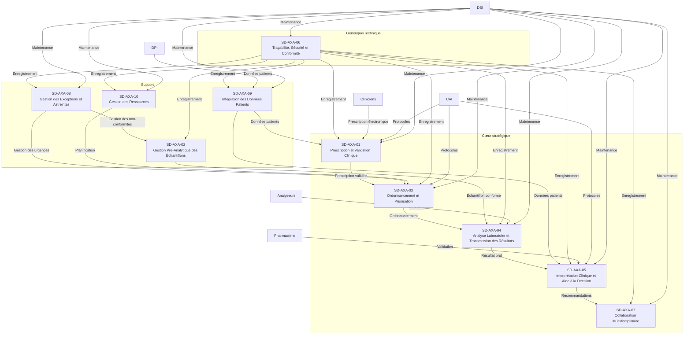

```mermaid
flowchart TD
    subgraph "Cœur stratégique"
        SD01[SD-AXA-01\nPrescription et Validation Clinique] -->|Prescription validée| SD03[SD-AXA-03\nOrdonnancement et Priorisation]
        SD03 -->|Ordonnancement| SD04[SD-AXA-04\nAnalyse Laboratoire et Transmission des Résultats]
        SD04 -->|Résultat brut| SD05[SD-AXA-05\nInterprétation Clinique et Aide à la Décision]
        SD05 -->|Recommandations| SD07[SD-AXA-07\nCollaboration Multidisciplinaire]
    end

    subgraph "Support"
        SD02[SD-AXA-02\nGestion Pré-Analytique des Échantillons] -->|Échantillon conforme| SD04
        SD08[SD-AXA-08\nGestion des Exceptions et Astreintes] -->|Gestion des non-conformités| SD02
        SD08 -->|Gestion des urgences| SD03
        SD09[SD-AXA-09\nIntégration des Données Patients] -->|Données patients| SD01
        SD09 -->|Données patients| SD05
        SD10[SD-AXA-10\nGestion des Ressources] -->|Planification| SD03
    end

    subgraph "Générique/Technique"
        SD06[SD-AXA-06\nTraçabilité, Sécurité et Conformité] -->|Enregistrement| SD01
        SD06 -->|Enregistrement| SD02
        SD06 -->|Enregistrement| SD03
        SD06 -->|Enregistrement| SD04
        SD06 -->|Enregistrement| SD05
        SD06 -->|Enregistrement| SD07
        SD06 -->|Enregistrement| SD08
        SD06 -->|Enregistrement| SD09
        SD06 -->|Enregistrement| SD10
    end

    Cliniciens -->|Prescription électronique| SD01
    DPI -->|Données patients| SD09
    Analyseurs -->|Résultats| SD04
    Pharmaciens -->|Validation| SD05
    CAI -->|Protocoles| SD01
    CAI -->|Protocoles| SD03
    CAI -->|Protocoles| SD05
    DSI -->|Maintenance| SD01
    DSI -->|Maintenance| SD03
    DSI -->|Maintenance| SD04
    DSI -->|Maintenance| SD05
    DSI -->|Maintenance| SD06
    DSI -->|Maintenance| SD07
    DSI -->|Maintenance| SD08
    DSI -->|Maintenance| SD09
    DSI -->|Maintenance| SD10
```