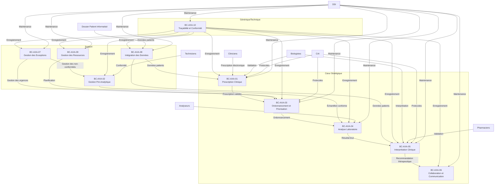

```mermaid
flowchart TD
    subgraph "Cœur Stratégique"
        BC01[BC-AXA-01\nPrescription Clinique] -->|Prescription validée| BC03[BC-AXA-03\nOrdonnancement et Priorisation]
        BC03 -->|Ordonnancement| BC04[BC-AXA-04\nAnalyse Laboratoire]
        BC04 -->|Résultat brut| BC05[BC-AXA-05\nInterprétation Clinique]
        BC05 -->|Recommandation thérapeutique| BC06[BC-AXA-06\nCollaboration et Communication]
    end

    subgraph "Support"
        BC02[BC-AXA-02\nGestion Pré-Analytique] -->|Échantillon conforme| BC04
        BC07[BC-AXA-07\nGestion des Exceptions] -->|Gestion des non-conformités| BC02
        BC07 -->|Gestion des urgences| BC03
        BC08[BC-AXA-08\nIntégration des Données] -->|Données patients| BC01
        BC08 -->|Données patients| BC05
        BC09[BC-AXA-09\nGestion des Ressources] -->|Planification| BC03
    end

    subgraph "Générique/Technique"
        BC10[BC-AXA-10\nTraçabilité et Conformité] -->|Enregistrement| BC01
        BC10 -->|Enregistrement| BC02
        BC10 -->|Enregistrement| BC03
        BC10 -->|Enregistrement| BC04
        BC10 -->|Enregistrement| BC05
        BC10 -->|Enregistrement| BC06
        BC10 -->|Enregistrement| BC07
        BC10 -->|Enregistrement| BC08
        BC10 -->|Enregistrement| BC09
    end

    Cliniciens -->|Prescription électronique| BC01
    DPI[Dossier Patient Informatisé] -->|Données patients| BC08
    Analyseurs -->|Résultats bruts| BC04
    Biologistes -->|Validation| BC01
    Biologistes -->|Interprétation| BC05
    Techniciens -->|Conformité| BC02
    Pharmaciens -->|Validation| BC05
    CAI -->|Protocoles| BC01
    CAI -->|Protocoles| BC03
    CAI -->|Protocoles| BC05
    DSI -->|Maintenance| BC01
    DSI -->|Maintenance| BC03
    DSI -->|Maintenance| BC04
    DSI -->|Maintenance| BC05
    DSI -->|Maintenance| BC06
    DSI -->|Maintenance| BC07
    DSI -->|Maintenance| BC08
    DSI -->|Maintenance| BC09
    DSI -->|Maintenance| BC10
```