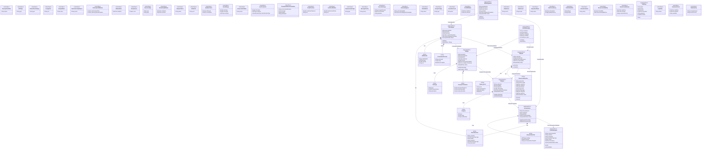

```mermaid
classDiagram
    %% ======================
    %% BC-AXA-01 : Prescription Clinique
    %% ======================
    class Prescription {
        <<AggregateRoot>>
        +String prescriptionId
        +String patientId
        +String clinicianId
        +DateTime creationTimestamp
        +DateTime lastUpdateTimestamp
        +PrescriptionStatus status
        +validate()
        +reject(reason: String)
    }

    class ClinicalContext {
        <<Entity>>
        +String contextId
        +ClinicalContextType type
        +String details
    }

    class AODDetails {
        <<Entity>>
        +String aodDetailsId
        +AODType type
        +Double dosage
        +String unit
    }

    class PrescriptionProtocol {
        <<Entity>>
        +String protocolId
        +String name
        +Boolean isCompliant
    }

    class PrescriptionStatus {
        <<ValueObject>>
        +String status
    }

    class AODType {
        <<ValueObject>>
        +String type
    }

    class ClinicalContextType {
        <<ValueObject>>
        +String type
    }

    class DosageUnit {
        <<ValueObject>>
        +String unit
    }

    Prescription "1" *-- "1" ClinicalContext : has
    Prescription "1" *-- "1" AODDetails : has
    Prescription "1" *-- "1" PrescriptionProtocol : follows

    %% ======================
    %% BC-AXA-02 : Gestion Pré-Analytique
    %% ======================
    class Sample {
        <<AggregateRoot>>
        +String sampleId
        +String prescriptionId
        +String patientId
        +TubeType tubeType
        +Double volume
        +DateTime transportTimestamp
        +DateTime receptionTimestamp
        +SampleStatus status
        +verifyConformity()
        +reject(reason: String)
    }

    class TubeType {
        <<Entity>>
        +String type
        +Double minimalVolume
        +String description
    }

    class TransportConditions {
        <<Entity>>
        +Double transportTimeHours
        +Double temperatureMin
        +Double temperatureMax
    }

    class SampleStatus {
        <<ValueObject>>
        +String status
    }

    class NonConformityReason {
        <<ValueObject>>
        +String reason
    }

    class PreAnalyticalWindow {
        <<ValueObject>>
        +Double maxTransportTime
        +Double maxTemperatureDeviation
    }

    Sample "1" *-- "1" TubeType : uses
    Sample "1" *-- "1" TransportConditions : has

    %% ======================
    %% BC-AXA-03 : Ordonnancement et Priorisation
    %% ======================
    class Request {
        <<AggregateRoot>>
        +String requestId
        +String prescriptionId
        +UrgencyLevel urgencyLevel
        +DateTime maxDeadline
        +RequestStatus status
        +prioritize()
        +schedule()
    }

    class UrgencyLevel {
        <<Entity>>
        +String level
        +Integer priorityScore
        +String description
    }

    class ResourceAllocation {
        <<Entity>>
        +String resourceId
        +String resourceType
        +DateTime startTime
        +DateTime endTime
    }

    class UrgencyLevel {
        <<ValueObject>>
        +String level
    }

    class MaxDeadline {
        <<ValueObject>>
        +DateTime deadline
    }

    class PriorityScore {
        <<ValueObject>>
        +Integer score
    }

    class ResourceType {
        <<ValueObject>>
        +String type
    }

    class SchedulingWindow {
        <<ValueObject>>
        +DateTime startTime
        +DateTime endTime
    }

    Request "1" *-- "1" UrgencyLevel : has
    Request "1" *-- "1" ResourceAllocation : has

    %% ======================
    %% BC-AXA-04 : Analyse Laboratoire
    %% ======================
    class Analysis {
        <<AggregateRoot>>
        +String analysisId
        +String sampleId
        +String analyzerId
        +Double antiXaValue
        +DateTime analysisTimestamp
        +AnalysisStatus status
        +validateAnalytical()
        +validateBiological()
    }

    class Analyzer {
        <<Entity>>
        +String id
        +String model
        +String serialNumber
    }

    class AnalysisStatus {
        <<ValueObject>>
        +String status
    }

    class AntiXaUnit {
        <<ValueObject>>
        +String unit
    }

    class QualityControl {
        <<ValueObject>>
        +Boolean isPassed
        +Double controlValue
    }

    class ResultRange {
        <<ValueObject>>
        +Double minValue
        +Double maxValue
        +AODType aodType
    }

    Analysis "1" *-- "1" Analyzer : uses

    %% ======================
    %% BC-AXA-05 : Interprétation Clinique
    %% ======================
    class Interpretation {
        <<AggregateRoot>>
        +String interpretationId
        +String analysisId
        +String patientId
        +Double interpretedValue
        +InterpretationStatus status
        +applyInterpretationGrid()
        +validatePharmaceutical()
    }

    class InterpretationGrid {
        <<Entity>>
        +AODType aodType
        +Double threshold
        +String recommendationTemplate
    }

    class ClinicalContext {
        <<Entity>>
        +String contextId
        +ClinicalContextType type
        +String description
    }

    class InterpretationStatus {
        <<ValueObject>>
        +String status
    }

    class AlertThreshold {
        <<ValueObject>>
        +Double threshold
        +AODType aodType
        +ClinicalContextType clinicalContextType
    }

    class TherapeuticRecommendation {
        <<ValueObject>>
        +String recommendationType
        +Double dosage
        +String duration
        +String justification
    }

    class RenalFunction {
        <<ValueObject>>
        +Double creatinineClearance
        +String unit
    }

    class LastDoseWindow {
        <<ValueObject>>
        +Double timeSinceLastDose
        +String unit
    }

    Interpretation "1" *-- "1" InterpretationGrid : uses
    Interpretation "1" *-- "1" ClinicalContext : has

    %% ======================
    %% BC-AXA-06 : Collaboration et Communication
    %% ======================
    class Communication {
        <<AggregateRoot>>
        +String communicationId
        +String senderId
        +String recipientId
        +CommunicationType type
        +String content
        +DateTime timestamp
        +CommunicationStatus status
        +send()
        +acknowledge()
    }

    class CommunicationType {
        <<ValueObject>>
        +String type
    }

    class MessagePriority {
        <<ValueObject>>
        +String priority
    }

    class SecureMessage {
        <<ValueObject>>
        +String encryptedContent
        +DateTime timestamp
        +String signature
    }

    class Acknowledgment {
        <<ValueObject>>
        +String acknowledgedBy
        +DateTime acknowledgmentTimestamp
    }

    %% ======================
    %% BC-AXA-07 : Gestion des Exceptions
    %% ======================
    class OnCallSchedule {
        <<AggregateRoot>>
        +String scheduleId
        +String biologistId
        +DateTime startDate
        +DateTime endDate
        +OnCallStatus status
        +activate()
        +deactivate()
    }

    class OnCallStatus {
        <<ValueObject>>
        +String status
    }

    class ExceptionType {
        <<ValueObject>>
        +String type
    }

    class EscalationLevel {
        <<ValueObject>>
        +String level
    }

    class OnCallWindow {
        <<ValueObject>>
        +DateTime startTime
        +DateTime endTime
    }

    %% ======================
    %% BC-AXA-08 : Intégration des Données
    %% ======================
    class DataIntegration {
        <<AggregateRoot>>
        +String integrationId
        +DataSource source
        +DataFormat format
        +String rawData
        +DateTime integrationTimestamp
        +IntegrationStatus status
        +validate()
        +transform()
    }

    class DataSource {
        <<ValueObject>>
        +String source
    }

    class DataFormat {
        <<ValueObject>>
        +String format
    }

    class IntegrationStatus {
        <<ValueObject>>
        +String status
    }

    class DataConsistency {
        <<ValueObject>>
        +Boolean isConsistent
        +String[] validationErrors
    }

    class PatientIdentifier {
        <<ValueObject>>
        +String idType
        +String idValue
    }

    %% ======================
    %% BC-AXA-09 : Gestion des Ressources
    %% ======================
    class ResourceAllocation {
        <<AggregateRoot>>
        +String allocationId
        +String resourceId
        +ResourceType type
        +DateTime startTime
        +DateTime endTime
        +AllocationStatus status
        +allocate()
        +release()
    }

    class ResourceType {
        <<ValueObject>>
        +String type
    }

    class AllocationStatus {
        <<ValueObject>>
        +String status
    }

    class ResourceAvailability {
        <<ValueObject>>
        +Boolean isAvailable
        +DateTime nextAvailableTime
    }

    class PeakActivityWindow {
        <<ValueObject>>
        +DateTime startTime
        +DateTime endTime
        +Integer expectedVolume
    }

    %% ======================
    %% BC-AXA-10 : Traçabilité et Conformité
    %% ======================
    class AuditLog {
        <<AggregateRoot>>
        +String logId
        +String action
        +String userId
        +DateTime timestamp
        +String signature
        +LogStatus status
        +sign()
    }

    class LogStatus {
        <<ValueObject>>
        +String status
    }

    class RetentionPeriod {
        <<ValueObject>>
        +DateTime startDate
        +DateTime endDate
        +String regulation
    }

    class DataSecurity {
        <<ValueObject>>
        +String encryptionLevel
        +String accessControl
    }

    %% ======================
    %% Relations entre BCs
    %% ======================
    Prescription --> Sample : PrescriptionValidated
    Prescription --> Request : PrescriptionValidated
    Sample --> Analysis : SampleConformityVerified
    Request --> Analysis : RequestScheduled
    Analysis --> Interpretation : AnalysisCompleted
    Interpretation --> Communication : RecommendationValidated
    OnCallSchedule --> Sample : ExceptionDetected
    OnCallSchedule --> Request : OnCallActivated
    DataIntegration --> Prescription : PatientIdentifier
    DataIntegration --> Interpretation : PatientIdentifier
    ResourceAllocation --> Request : ResourceAllocation
```