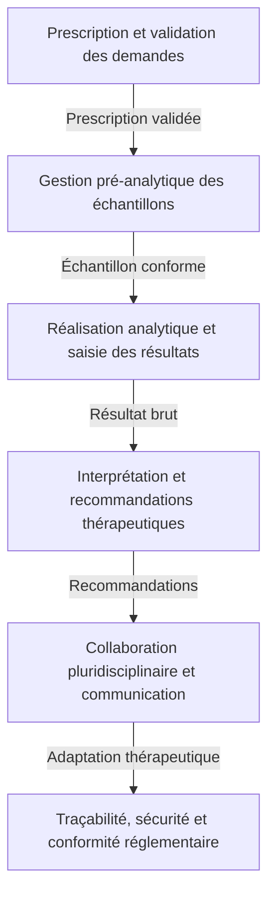
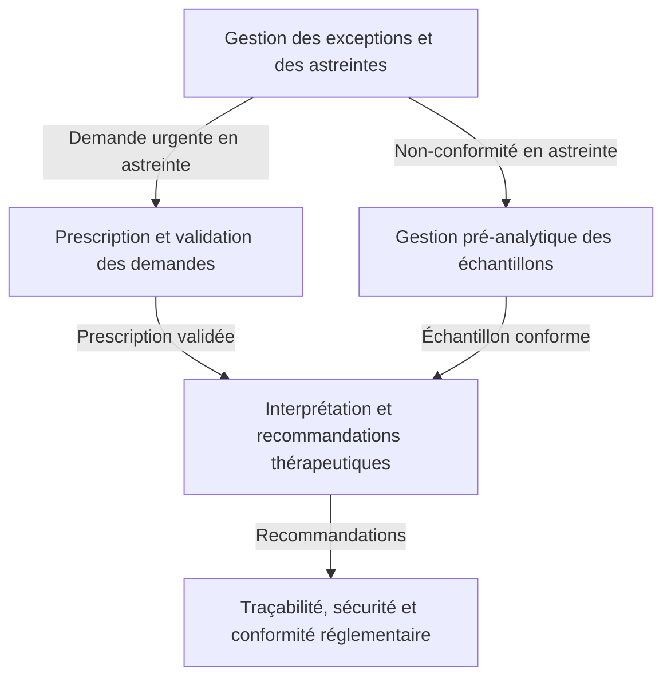
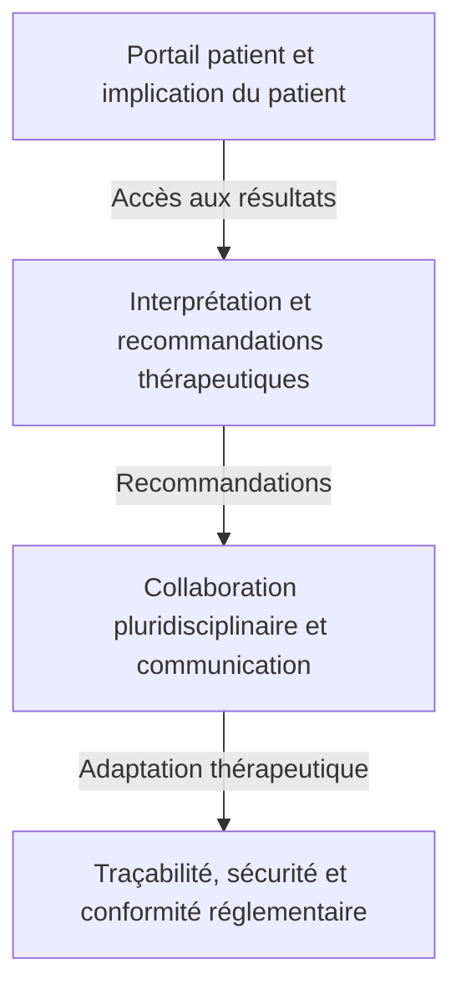

```markdown
# Zones fonctionnelles du domaine
**Gestion des demandes urgentes de dosage anti-Xa dans le SIL**
**Date** : [À compléter]
**Version** : 1.0
**Auteurs** : Analyste DDD
**Sources** : Livrables étape 1 et 2 (01_reformulation_du_besoin.md, 02_acteurs_du_domaine.md, 03_concepts_metier_initiaux.md, 04_contraintes_et_risques.md, 05_vision_globale_du_domaine.md, 01_cartographie_acteurs_responsabilites.md, 02_attentes_objectifs_acteurs.md, 03_decisions_informations_manipulees.md, 04_regles_metier.md, 05_priorites_exceptions_contraintes.md, 06_conflits_objectifs_arbitrages.md, 07_base_modelisation_comportementale.md)

---

## 1. Introduction
Ce document identifie et décrit les **zones fonctionnelles** du domaine métier des **demandes urgentes de dosage anti-Xa**, en s’appuyant sur les livrables des étapes 1 et 2. L’objectif est de découper la complexité globale du domaine en sous-domaines cohérents, en distinguant :
- Leur **finalité métier** propre.
- Les **acteurs principalement concernés**.
- Les **décisions et informations structurantes**.
- Les **règles métier spécifiques ou probables**.
- Les **indices du corpus** qui justifient leur existence.
- Les **zones ambiguës ou à clarifier** avec les experts métier.

Ce découpage prépare l’étape suivante de la démarche DDD (modélisation comportementale) en identifiant les **frontières potentielles** entre sous-domaines, sans figer prématurément les bounded contexts.

---

## 2. Liste des zones fonctionnelles identifiées

### 2.1. Zone 1 : Prescription et validation des demandes
**Finalité métier** :
Garantir que toute demande de dosage anti-Xa est **prescrite de manière conforme, validée cliniquement et priorisée** avant toute analyse, afin d’éviter les prescriptions inappropriées, les erreurs de tri et les retards critiques.

**Acteurs principalement concernés** :
- **Cliniciens prescripteurs** (urgentistes, réanimateurs, chirurgiens, services extérieurs).
- **Biologistes médicaux** (validation biologique).
- **Commission des Anti-infectieux et des Anticoagulants (CAI)** (définition des protocoles).
- **Système d’Information de Laboratoire (SIL)** (enregistrement, priorisation, traçabilité).

**Décisions et informations structurantes** :
| **Décision** | **Acteurs responsables** | **Informations nécessaires** | **Informations produites** | **Règles métier associées** |
|--------------|--------------------------|------------------------------|---------------------------|-----------------------------|
| Prescrire un dosage anti-Xa en urgence | Cliniciens prescripteurs | - Identité du patient <br> - Service prescripteur <br> - Contexte clinique (ex. : hémorragie active) <br> - Protocoles locaux ou recommandations HAS/ANSM <br> - Historique du patient (traitements en cours) | - Prescription électronique (ou papier) <br> - Statut de la demande : "en attente" <br> - Données contextuelles saisies (type d’AOD, posologie, heure de dernière prise, fonction rénale) | **RME-01** : Prescription électronique obligatoire <br> **RME-02** : Respect des protocoles locaux <br> **RME-03** : Validation biologique des demandes |
| Valider ou rejeter une demande de dosage | Biologistes médicaux | - Demande reçue dans le SIL <br> - Données contextuelles complètes <br> - Protocoles locaux | - Statut de la demande : "validée" ou "rejetée" <br> - Justification du rejet (si applicable) | **RME-04** : Rejet des demandes non conformes <br> **RME-05** : Priorisation des demandes validées |
| Classer une demande par niveau d’urgence | Biologistes médicaux (ou SIL si automatisé) | - Niveau d’urgence clinique <br> - Délais critiques <br> - Disponibilité des ressources | - Niveau de priorité attribué (ex. : "urgence absolue", "haute", "modérée") <br> - Ordonnancement des analyses | **RM-01** : Grille de priorisation basée sur le contexte clinique <br> **RM-02** : Délais maximaux acceptables par niveau de priorité |

**Règles métier spécifiques ou probables** :
- **RME-01** : Toute demande de dosage anti-Xa doit être formalisée via une prescription électronique dans le SIL.
  - *Source* : 02_acteurs_du_domaine.md, 03_concepts_metier_initiaux.md.
  - *Justification* : Éviter les erreurs de transcription et garantir la traçabilité.
- **RME-02** : La prescription doit respecter les indications définies par les protocoles de la CAI.
  - *Source* : 02_acteurs_du_domaine.md.
  - *Justification* : Respecter les bonnes pratiques et éviter les prescriptions inappropriées.
- **RME-03** : Toute demande de dosage anti-Xa doit être validée par un biologiste avant analyse.
  - *Source* : 02_acteurs_du_domaine.md.
  - *Justification* : Garantir la pertinence clinique et éviter les analyses inutiles.
- **RM-01** : Grille de priorisation basée sur le contexte clinique.
  - *Exemples* :
    - Hémorragie active → urgence absolue (délai ≤ 1h).
    - Chirurgie programmée → urgence haute (délai ≤ 4h).
    - Contrôle systématique → urgence modérée (délai ≤ 24h).
  - *Source* : 01_reformulation_du_besoin.md, 03_concepts_metier_initiaux.md, 05_priorites_exceptions_contraintes.md.
  - *Justification* : Optimiser les ressources et réduire les risques cliniques.
- **RM-02** : Délais maximaux acceptables par niveau de priorité.
  - *Exemples* :
    - Urgence absolue : ≤ 1h.
    - Urgence haute : ≤ 4h.
    - Urgence modérée : ≤ 24h.
  - *Source* : 04_contraintes_et_risques.md, 05_priorites_exceptions_contraintes.md.
  - *Justification* : Garantir une prise en charge thérapeutique optimale.

**Indices du corpus** :
- **Problème métier principal** : "Gestion inefficace et non sécurisée des demandes urgentes de dosage anti-Xa" (01_reformulation_du_besoin.md).
- **Objectifs opérationnels** :
  - "Mise en place d’un système informatisé pour gérer les prescriptions" (01_reformulation_du_besoin.md).
  - "Priorisation automatique des demandes en fonction de leur urgence clinique" (01_reformulation_du_besoin.md).
- **Acteurs** :
  - Cliniciens prescripteurs (02_acteurs_du_domaine.md).
  - Biologistes médicaux (02_acteurs_du_domaine.md).
  - CAI (02_acteurs_du_domaine.md).
- **Décisions** :
  - Prescription électronique (03_decisions_informations_manipulees.md).
  - Validation biologique (03_decisions_informations_manipulees.md).
  - Priorisation (03_decisions_informations_manipulees.md, 05_priorites_exceptions_contraintes.md).

**Zones ambiguës ou à clarifier** :
1. **Automatisation de la priorisation** :
   - Le SIL doit-il classer automatiquement les demandes, ou cette tâche reste-t-elle manuelle pour les biologistes ?
   - *Source* : 05_vision_globale_du_domaine.md mentionne une "priorisation automatique", mais les critères ne sont pas détaillés.
2. **Critères exacts de rejet des demandes** :
   - Quels sont les seuils pour rejeter une demande (ex. : non-respect des protocoles, données manquantes) ?
   - *Source* : 04_regles_metier.md (RME-04) est incomplète.
3. **Rôle de la CAI dans la validation** :
   - La CAI valide-t-elle les protocoles, ou participe-t-elle aussi à la validation des demandes ?
   - *Source* : 02_acteurs_du_domaine.md mentionne la CAI, mais son rôle exact n’est pas précisé.

---

### 2.2. Zone 2 : Gestion pré-analytique des échantillons
**Finalité métier** :
Garantir que **tous les échantillons biologiques** (tubes de prélèvement) respectent les **exigences pré-analytiques strictes** avant analyse, afin d’éviter les résultats invalides, les rejets d’échantillons et les retards critiques.

**Acteurs principalement concernés** :
- **Techniciens de laboratoire** (vérification de la conformité, préparation des échantillons).
- **Cliniciens prescripteurs** (vérification initiale des tubes avant envoi).
- **Système d’Information de Laboratoire (SIL)** (vérification automatique des conformités).
- **Middleware de laboratoire** (routage et vérification des échantillons).
- **Personnel administratif** (coordination du transport).

**Décisions et informations structurantes** :
| **Décision** | **Acteurs responsables** | **Informations nécessaires** | **Informations produites** | **Règles métier associées** |
|--------------|--------------------------|------------------------------|---------------------------|-----------------------------|
| Vérifier la conformité d’un tube | Techniciens de laboratoire (et SIL si automatisé) | - Type de tube (citraté 3.2%) <br> - Volume minimal requis <br> - Délai maximal entre prélèvement et analyse <br> - Conditions de transport (température, protection de la lumière) | - Statut de conformité : "conforme" ou "non conforme" <br> - Alerte au biologiste si non conforme | **RMP-01** : Critères de conformité des tubes <br> **RMP-02** : Procédure de gestion des non-conformités |
| Signaler une non-conformité ou un résultat aberrant | Techniciens de laboratoire | - Détection d’une non-conformité ou d’un résultat aberrant <br> - Procédure de gestion des non-conformités | - Alerte au biologiste <br> - Demande de complément (nouveau prélèvement) si nécessaire <br> - Archivage de l’échantillon non conforme | **RMP-03** : Archivage des échantillons non conformes <br> **RMP-04** : Signalement immédiat des non-conformités |
| Coordonner le transport des échantillons | Personnel administratif | - Statut des prélèvements (en attente, en cours, terminés) <br> - Alertes de non-conformité ou de retard | - Relance du service prescripteur <br> - Mise à jour du statut dans le SIL | **RMP-05** : Délais maximaux de transport <br> **RMP-06** : Conditions de transport |

**Règles métier spécifiques ou probables** :
- **RMP-01** : Critères de conformité des tubes.
  - *Exemples* :
    - Type de tube : citraté 3.2%.
    - Volume minimal : 1.8 mL à 2.7 mL (selon l’analyseur).
    - Délai maximal entre prélèvement et analyse : < 4 heures.
    - Conditions de transport : température entre 15°C et 25°C, protection de la lumière.
  - *Source* : 04_contraintes_et_risques.md, 03_concepts_metier_initiaux.md.
  - *Justification* : Garantir la validité des résultats et éviter les rejets.
- **RMP-02** : Procédure de gestion des non-conformités.
  - *Exemples* :
    - Refus systématique de l’échantillon.
    - Demande de complément (nouveau prélèvement).
    - Escalade vers le biologiste pour décision.
  - *Source* : 04_contraintes_et_risques.md.
  - *Justification* : Éviter les résultats invalides et les retards.
- **RMP-03** : Archivage des échantillons non conformes.
  - *Source* : Hypothèse basée sur les bonnes pratiques de laboratoire (ISO 15189).
  - *Justification* : Preuve de conformité et traçabilité.
- **RMP-04** : Signalement immédiat des non-conformités.
  - *Source* : 04_contraintes_et_risques.md.
  - *Justification* : Permettre une action corrective rapide.
- **RMP-05** : Délais maximaux de transport.
  - *Exemple* : Délai < 4 heures entre prélèvement et analyse.
  - *Source* : 04_contraintes_et_risques.md.
  - *Justification* : Garantir la validité des résultats.
- **RMP-06** : Conditions de transport.
  - *Exemple* : Température entre 15°C et 25°C, protection de la lumière.
  - *Source* : Hypothèse basée sur les bonnes pratiques pré-analytiques.
  - *Justification* : Éviter la dégradation des échantillons.

**Indices du corpus** :
- **Problème métier principal** : "Non-conformité des tubes" et "Délais critiques" (01_reformulation_du_besoin.md).
- **Objectifs opérationnels** :
  - "Vérification des exigences pré-analytiques" (01_reformulation_du_besoin.md).
  - "Alertes en cas de non-conformité pour éviter les rejets ou les erreurs d’interprétation" (01_reformulation_du_besoin.md).
- **Acteurs** :
  - Techniciens de laboratoire (02_acteurs_du_domaine.md).
  - Cliniciens prescripteurs (02_acteurs_du_domaine.md).
  - Personnel administratif (02_acteurs_du_domaine.md).
- **Décisions** :
  - Vérification de la conformité des tubes (03_decisions_informations_manipulees.md).
  - Signalement des non-conformités (03_decisions_informations_manipulees.md).

**Zones ambiguës ou à clarifier** :
1. **Critères exacts de conformité** :
   - Quel est le type de tube exact requis ?
   - Quel est le volume minimal requis ?
   - Quel est le délai maximal entre prélèvement et analyse ?
   - *Source* : 04_contraintes_et_risques.md mentionne ces critères, mais ils ne sont pas détaillés.
2. **Rôle du clinicien dans la vérification des tubes** :
   - Le clinicien vérifie-t-il la conformité avant envoi, ou cette tâche est-elle entièrement déléguée au laboratoire ?
   - *Source* : 02_acteurs_du_domaine.md attribue cette responsabilité aux techniciens, mais le clinicien peut avoir un rôle de supervision.
3. **Procédure de gestion des non-conformités en dehors des heures ouvrables** :
   - Qui gère les non-conformités la nuit ou le week-end ?
   - *Source* : 04_contraintes_et_risques.md souligne l’importance de l’astreinte biologique.

---

### 2.3. Zone 3 : Réalisation analytique et saisie des résultats
**Finalité métier** :
Garantir que **l’analyse du dosage anti-Xa** est réalisée avec **précision, rapidité et traçabilité**, en respectant les procédures analytiques et en évitant les erreurs de saisie ou de transmission des résultats.

**Acteurs principalement concernés** :
- **Techniciens de laboratoire** (réalisation de l’analyse, saisie des résultats).
- **Analyseurs de laboratoire** (réalisation du dosage).
- **Système d’Information de Laboratoire (SIL)** (transmission et traçabilité des résultats).
- **Middleware de laboratoire** (routage des résultats vers le SIL).

**Décisions et informations structurantes** :
| **Décision** | **Acteurs responsables** | **Informations nécessaires** | **Informations produites** | **Règles métier associées** |
|--------------|--------------------------|------------------------------|---------------------------|-----------------------------|
| Réaliser le dosage anti-Xa | Techniciens de laboratoire | - Échantillon conforme <br> - Procédures analytiques <br> - Contrôle qualité | - Résultat brut du dosage anti-Xa <br> - Statut de l’analyse : "terminée" | **RMA-01** : Respect des procédures analytiques <br> **RMA-02** : Contrôle qualité |
| Transmettre les résultats au SIL | Techniciens de laboratoire (ou analyseurs si intégration automatique) | - Résultat brut du dosage <br> - Identifiant de l’échantillon <br> - Identifiant du patient | - Résultat brut enregistré dans le SIL <br> - Statut de l’analyse : "transmis" | **RMA-03** : Intégration automatique entre analyseurs et SIL <br> **RMA-04** : Double vérification des résultats critiques |

**Règles métier spécifiques ou probables** :
- **RMA-01** : Respect des procédures analytiques.
  - *Source* : 02_acteurs_du_domaine.md.
  - *Justification* : Garantir la fiabilité des résultats.
- **RMA-02** : Contrôle qualité.
  - *Source* : Hypothèse basée sur les bonnes pratiques de laboratoire (ISO 15189).
  - *Justification* : Éviter les erreurs analytiques.
- **RMA-03** : Intégration automatique entre analyseurs et SIL.
  - *Source* : 05_vision_globale_du_domaine.md mentionne une intégration nécessaire.
  - *Justification* : Éviter les erreurs de saisie manuelle.
- **RMA-04** : Double vérification des résultats critiques.
  - *Exemple* : Résultats aberrants ou en dehors des seuils thérapeutiques.
  - *Source* : Hypothèse basée sur les bonnes pratiques de laboratoire.
  - *Justification* : Éviter les erreurs d’interprétation.

**Indices du corpus** :
- **Problème métier principal** : "Absence de circuit informatisé" et "Traçabilité insuffisante" (01_reformulation_du_besoin.md).
- **Objectifs opérationnels** :
  - "Traçabilité complète des demandes" (01_reformulation_du_besoin.md).
  - "Sécurité garantie des données" (01_reformulation_du_besoin.md).
- **Acteurs** :
  - Techniciens de laboratoire (02_acteurs_du_domaine.md).
  - Analyseurs de laboratoire (02_acteurs_du_domaine.md).
- **Décisions** :
  - Réalisation de l’analyse (03_decisions_informations_manipulees.md).
  - Transmission des résultats (03_decisions_informations_manipulees.md).

**Zones ambiguës ou à clarifier** :
1. **Intégration entre analyseurs et SIL** :
   - Les résultats sont-ils transmis automatiquement au SIL, ou la saisie est-elle manuelle ?
   - *Source* : 05_vision_globale_du_domaine.md mentionne une intégration nécessaire, mais la méthode n’est pas précisée.
2. **Modèles d’analyseurs compatibles** :
   - Quels sont les modèles d’analyseurs utilisés (ex. : ACL TOP, STA R Max), et sont-ils compatibles avec le SIL ?
   - *Source* : 02_acteurs_du_domaine.md mentionne des exemples, mais la compatibilité n’est pas précisée.
3. **Seuils d’alerte pour les résultats aberrants** :
   - Quels sont les seuils exacts pour déclencher une double vérification ?
   - *Source* : Hypothèse basée sur les bonnes pratiques, mais non détaillée dans le corpus.

---

### 2.4. Zone 4 : Interprétation et recommandations thérapeutiques
**Finalité métier** :
Garantir que **l’interprétation des résultats du dosage anti-Xa** est **précise, contextualisée et sécurisée**, en tenant compte des **données cliniques du patient** (type d’AOD, posologie, heure de la dernière prise, fonction rénale) et en émettant des **recommandations thérapeutiques adaptées** pour une prise en charge optimale.

**Acteurs principalement concernés** :
- **Biologistes médicaux** (interprétation, rédaction des recommandations).
- **Pharmaciens hospitaliers** (validation ou contestation des recommandations).
- **Cliniciens prescripteurs** (adaptation du traitement).
- **Système d’Information de Laboratoire (SIL)** (affichage des résultats et recommandations).

**Décisions et informations structurantes** :
| **Décision** | **Acteurs responsables** | **Informations nécessaires** | **Informations produites** | **Règles métier associées** |
|--------------|--------------------------|------------------------------|---------------------------|-----------------------------|
| Interpréter un résultat de dosage anti-Xa | Biologistes médicaux | - Résultat brut du dosage <br> - Type d’AOD et posologie <br> - Heure de la dernière prise <br> - Fonction rénale (clairance de la créatinine) <br> - Contexte clinique <br> - Recommandations de la CAI | - Compte-rendu d’interprétation <br> - Recommandations thérapeutiques (ex. : adaptation de la posologie, arrêt temporaire du traitement) <br> - Seuil d’alerte si applicable | **RMI-01** : Grille d’interprétation par AOD <br> **RMI-02** : Recommandations thérapeutiques standardisées |
| Valider ou contester les recommandations | Pharmaciens hospitaliers | - Recommandations du biologiste <br> - Données d’interactions médicamenteuses <br> - Protocoles locaux | - Validation ou contestation des recommandations <br> - Justification clinique | **RMI-03** : Collaboration pluridisciplinaire <br> **RMI-04** : Adaptation posologique en fonction de la fonction rénale |
| Adapter le traitement anticoagulant | Cliniciens prescripteurs | - Résultat du dosage <br> - Recommandations du biologiste et du pharmacien <br> - Protocoles locaux | - Prescription d’adaptation du traitement <br> - Administration d’un antidote si nécessaire | **RMI-05** : Délais critiques pour l’adaptation thérapeutique |

**Règles métier spécifiques ou probables** :
- **RMI-01** : Grille d’interprétation par AOD.
  - *Exemples* :
    - Pour l’apixaban : résultat > 1.5 UI/mL → surdosage possible en cas d’insuffisance rénale.
    - Pour le rivaroxaban : résultat > 0.5 UI/mL → risque hémorragique accru.
  - *Source* : 03_concepts_metier_initiaux.md, hypothèse basée sur les recommandations HAS/ANSM.
  - *Justification* : Standardiser l’interprétation et éviter les erreurs.
- **RMI-02** : Recommandations thérapeutiques standardisées.
  - *Exemples* :
    - Adaptation de la posologie.
    - Arrêt temporaire du traitement.
    - Administration d’un antidote (ex. : andexanet alfa).
  - *Source* : 02_acteurs_du_domaine.md.
  - *Justification* : Faciliter la prise de décision des cliniciens.
- **RMI-03** : Collaboration pluridisciplinaire.
  - *Source* : 02_acteurs_du_domaine.md.
  - *Justification* : Optimiser l’adaptation thérapeutique.
- **RMI-04** : Adaptation posologique en fonction de la fonction rénale.
  - *Exemple* : Réduction de la posologie si clairance < 30 mL/min.
  - *Source* : Hypothèse basée sur les recommandations HAS/ANSM.
  - *Justification* : Éviter les surdosages en cas d’insuffisance rénale.
- **RMI-05** : Délais critiques pour l’adaptation thérapeutique.
  - *Exemples* :
    - Hémorragie active : adaptation immédiate.
    - Chirurgie en urgence : adaptation dans les 4 heures.
  - *Source* : 04_contraintes_et_risques.md.
  - *Justification* : Garantir une prise en charge optimale.

**Indices du corpus** :
- **Problème métier principal** : "Interprétation complexe" et "Absence de circuit informatisé" (01_reformulation_du_besoin.md).
- **Objectifs opérationnels** :
  - "Faciliter l’interprétation des résultats" (01_reformulation_du_besoin.md).
  - "Aide à la décision pour les biologistes" (01_reformulation_du_besoin.md).
- **Acteurs** :
  - Biologistes médicaux (02_acteurs_du_domaine.md).
  - Pharmaciens hospitaliers (02_acteurs_du_domaine.md).
  - Cliniciens prescripteurs (02_acteurs_du_domaine.md).
- **Décisions** :
  - Interprétation des résultats (03_decisions_informations_manipulees.md).
  - Adaptation thérapeutique (03_decisions_informations_manipulees.md).

**Zones ambiguës ou à clarifier** :
1. **Grille d’interprétation exacte par AOD** :
   - Quels sont les seuils exacts pour chaque AOD (apixaban, rivaroxaban, édoxaban) ?
   - *Source* : 03_concepts_metier_initiaux.md mentionne une "grille d’interprétation", mais elle n’est pas détaillée.
2. **Rôle du pharmacien dans la validation des recommandations** :
   - Le pharmacien valide-t-il systématiquement les recommandations, ou cette tâche est-elle partagée ?
   - *Source* : 02_acteurs_du_domaine.md mentionne une collaboration, mais les responsabilités ne sont pas précisées.
3. **Format des recommandations thérapeutiques** :
   - Quel est le format des recommandations (ex. : compte-rendu structuré, messagerie sécurisée) ?
   - *Source* : Hypothèse basée sur les bonnes pratiques, mais non détaillée dans le corpus.

---
### 2.5. Zone 5 : Traçabilité, sécurité et conformité réglementaire
**Finalité métier** :
Garantir une **traçabilité complète, une sécurité optimale des données et une conformité stricte** aux normes réglementaires (ISO 15189, RGPD) pour l’ensemble du circuit des demandes urgentes de dosage anti-Xa, depuis la prescription jusqu’à l’archivage.

**Acteurs principalement concernés** :
- **Système d’Information de Laboratoire (SIL)** (enregistrement, traçabilité, sécurité).
- **Biologistes médicaux** (validation des résultats avec signature électronique).
- **Techniciens de laboratoire** (saisie des résultats).
- **Équipe informatique (DSI)** (maintenance, sécurité, interopérabilité).
- **Autorités réglementaires** (audit, sanctions).

**Décisions et informations structurantes** :
| **Décision** | **Acteurs responsables** | **Informations nécessaires** | **Informations produites** | **Règles métier associées** |
|--------------|--------------------------|------------------------------|---------------------------|-----------------------------|
| Enregistrer systématiquement toutes les actions | SIL | - Identité de l’utilisateur <br> - Horodatage de chaque action <br> - Type d’action (création, modification, validation) <br> - Résultat final et recommandations | - Audit trail complet <br> - Preuve de non-répudiation | **RMT-01** : Traçabilité complète des actions <br> **RMT-02** : Conservation des logs pendant 10 ans |
| Garantir la sécurité des données | SIL, DSI | - Authentification forte (ex. : carte CPS) <br> - Droits d’accès différenciés <br> - Chiffrement des données sensibles | - Accès sécurisé aux données <br> - Protection contre les accès non autorisés | **RMT-03** : Respect du RGPD <br> **RMT-04** : Signature électronique pour les résultats validés |
| Vérifier la conformité aux normes | SIL, Autorités réglementaires | - Normes applicables (ISO 15189, RGPD) <br> - Procédures de contrôle qualité | - Rapport de conformité <br> - Preuve de respect des normes | **RMT-05** : Audit interne/extern |

**Règles métier spécifiques ou probables** :
- **RMT-01** : Traçabilité complète des actions.
  - *Source* : 03_concepts_metier_initiaux.md, 04_contraintes_et_risques.md.
  - *Justification* : Permettre les audits et améliorer les processus.
- **RMT-02** : Conservation des logs pendant 10 ans.
  - *Source* : Hypothèse basée sur les normes ISO 15189 et RGPD.
  - *Justification* : Respect des exigences réglementaires.
- **RMT-03** : Respect du RGPD.
  - *Source* : 04_contraintes_et_risques.md.
  - *Justification* : Éviter les sanctions et garantir la confidentialité.
- **RMT-04** : Signature électronique pour les résultats validés.
  - *Source* : Hypothèse basée sur les bonnes pratiques de laboratoire.
  - *Justification* : Garantir la non-répudiation des actions.
- **RMT-05** : Audit interne/extern.
  - *Source* : 04_contraintes_et_risques.md.
  - *Justification* : Vérifier la conformité aux normes.

**Indices du corpus** :
- **Problème métier principal** : "Traçabilité insuffisante" et "Sécurité non garantie" (01_reformulation_du_besoin.md).
- **Objectifs opérationnels** :
  - "Garantir la traçabilité et la sécurité" (01_reformulation_du_besoin.md).
  - "Respect des bonnes pratiques de laboratoire (BPL) et des normes d’accréditation" (01_reformulation_du_besoin.md).
- **Acteurs** :
  - SIL (02_acteurs_du_domaine.md).
  - DSI (02_acteurs_du_domaine.md).
  - Autorités réglementaires (02_acteurs_du_domaine.md).
- **Décisions** :
  - Enregistrement des actions (03_decisions_informations_manipulees.md).
  - Sécurité des données (03_decisions_informations_manipulees.md).

**Zones ambiguës ou à clarifier** :
1. **Durée exacte de conservation des logs** :
   - Quelle est la durée minimale de conservation des logs d’audit ?
   - *Source* : 03_concepts_metier_initiaux.md mentionne 10 ans, mais la source n’est pas précisée.
2. **Mécanismes d’authentification et de chiffrement** :
   - Quels sont les mécanismes exacts d’authentification forte et de chiffrement des données ?
   - *Source* : 04_contraintes_et_risques.md souligne l’importance de la sécurité, mais les détails ne sont pas précisés.
3. **Procédure d’audit interne/extern** :
   - Quelles sont les étapes exactes de l’audit interne/extern ?
   - *Source* : Hypothèse basée sur les normes, mais non détaillée dans le corpus.

---
### 2.6. Zone 6 : Gestion des exceptions et des astreintes
**Finalité métier** :
Garantir la **prise en charge des demandes urgentes en dehors des heures ouvrables** (nuit, week-end, jours fériés) et la **gestion des cas particuliers** (ex. : non-conformités, urgences vitales) pour éviter les retards critiques et les complications cliniques.

**Acteurs principalement concernés** :
- **Biologistes d’astreinte** (validation des résultats, interprétation).
- **Personnel administratif** (coordination des prélèvements).
- **Système d’Information de Laboratoire (SIL)** (accès sécurisé, alertes).
- **Équipe de gestion des risques** (atténuation des risques).

**Décisions et informations structurantes** :
| **Décision** | **Acteurs responsables** | **Informations nécessaires** | **Informations produites** | **Règles métier associées** |
|--------------|--------------------------|------------------------------|---------------------------|-----------------------------|
| Gérer une demande urgente en astreinte | Biologistes d’astreinte | - Accès sécurisé aux données patients <br> - Protocoles locaux <br> - Historique du patient | - Validation des résultats <br> - Émission de recommandations thérapeutiques <br> - Transmission des résultats aux cliniciens | **RMEX-01** : Liste des services couverts par l’astreinte <br> **RMEX-02** : Procédure de déclenchement de l’astreinte |
| Gérer une non-conformité en dehors des heures ouvrables | Personnel administratif, Biologistes d’astreinte | - Détection d’une non-conformité <br> - Procédure de gestion des non-conformités | - Relance du service prescripteur <br> - Demande de complément (nouveau prélèvement) si nécessaire | **RMEX-03** : Gestion des non-conformités en astreinte |

**Règles métier spécifiques ou probables** :
- **RMEX-01** : Liste des services couverts par l’astreinte.
  - *Exemples* :
    - Urgences.
    - Réanimation.
    - Bloc opératoire.
  - *Source* : 04_contraintes_et_risques.md.
  - *Justification* : Garantir une couverture optimale.
- **RMEX-02** : Procédure de déclenchement de l’astreinte.
  - *Exemple* :
    - Alerte automatique via le SIL en cas de demande urgente en dehors des heures ouvrables.
  - *Source* : Hypothèse basée sur les bonnes pratiques.
  - *Justification* : Permettre une prise en charge rapide.
- **RMEX-03** : Gestion des non-conformités en astreinte.
  - *Source* : Hypothèse basée sur les bonnes pratiques.
  - *Justification* : Éviter les retards critiques.

**Indices du corpus** :
- **Problème métier principal** : "Délais critiques" et "Absence de circuit informatisé" (01_reformulation_du_besoin.md).
- **Objectifs opérationnels** :
  - "Disponibilité 24/7 du SIL" (01_reformulation_du_besoin.md).
  - "Gestion des astreintes" (01_reformulation_du_besoin.md).
- **Acteurs** :
  - Biologistes d’astreinte (02_acteurs_du_domaine.md).
  - Personnel administratif (02_acteurs_du_domaine.md).
- **Décisions** :
  - Gestion des astreintes (03_decisions_informations_manipulees.md).

**Zones ambiguës ou à clarifier** :
1. **Liste exacte des services couverts par l’astreinte** :
   - Quels sont les services couverts par l’astreinte (ex. : urgences, réanimation, bloc opératoire) ?
   - *Source* : 04_contraintes_et_risques.md mentionne l’astreinte, mais la liste n’est pas détaillée.
2. **Procédure exacte de déclenchement de l’astreinte** :
   - Comment est déclenchée l’astreinte (ex. : alerte automatique via le SIL) ?
   - *Source* : Hypothèse basée sur les bonnes pratiques, mais non détaillée dans le corpus.
3. **Gestion des non-conformités en astreinte** :
   - Qui gère les non-conformités la nuit ou le week-end ?
   - *Source* : 04_contraintes_et_risques.md souligne l’importance de l’astreinte, mais la procédure n’est pas détaillée.

---
### 2.7. Zone 7 : Collaboration pluridisciplinaire et communication
**Finalité métier** :
Faciliter la **communication et la collaboration** entre les différents acteurs (cliniciens, biologistes, pharmaciens, personnel administratif) pour une **prise en charge coordonnée et optimale** des patients sous AOD, en évitant les retards, les erreurs de transmission et les malentendus.

**Acteurs principalement concernés** :
- **Cliniciens prescripteurs** (prescription, adaptation thérapeutique).
- **Biologistes médicaux** (interprétation, recommandations).
- **Pharmaciens hospitaliers** (validation des recommandations).
- **Personnel administratif** (coordination).
- **Système d’Information de Laboratoire (SIL)** (messagerie sécurisée, notifications).

**Décisions et informations structurantes** :
| **Décision** | **Acteurs responsables** | **Informations nécessaires** | **Informations produites** | **Règles métier associées** |
|--------------|--------------------------|------------------------------|---------------------------|-----------------------------|
| Communiquer les résultats et recommandations | Biologistes médicaux, Cliniciens prescripteurs | - Résultat du dosage <br> - Recommandations thérapeutiques <br> - Contexte clinique | - Transmission des résultats aux cliniciens <br> - Adaptation thérapeutique | **RC-01** : Canaux de communication sécurisés <br> **RC-02** : Feedback des cliniciens |
| Collaborer pour l’adaptation thérapeutique | Cliniciens prescripteurs, Pharmaciens hospitaliers, Biologistes médicaux | - Résultats du dosage <br> - Données d’interactions médicamenteuses <br> - Protocoles locaux | - Adaptation posologique <br> - Administration d’un antidote si nécessaire | **RC-03** : Rôle du pharmacien dans l’urgence hémorragique |

**Règles métier spécifiques ou probables** :
- **RC-01** : Canaux de communication sécurisés.
  - *Exemples* :
    - Messagerie sécurisée intégrée au SIL.
    - Notification automatique dans le SIL.
  - *Source* : Hypothèse basée sur les bonnes pratiques.
  - *Justification* : Garantir la confidentialité et la rapidité.
- **RC-02** : Feedback des cliniciens.
  - *Source* : Hypothèse basée sur les bonnes pratiques.
  - *Justification* : Améliorer la qualité des prescriptions.
- **RC-03** : Rôle du pharmacien dans l’urgence hémorragique.
  - *Exemple* :
    - Le pharmacien propose l’administration d’un antidote (ex. : andexanet alfa).
  - *Source* : 02_acteurs_du_domaine.md.
  - *Justification* : Optimiser la prise en charge des urgences hémorragiques.

**Indices du corpus** :
- **Problème métier principal** : "Manque de collaboration pluridisciplinaire" (01_reformulation_du_besoin.md).
- **Objectifs opérationnels** :
  - "Améliorer la collaboration pluridisciplinaire" (01_reformulation_du_besoin.md).
- **Acteurs** :
  - Cliniciens prescripteurs (02_acteurs_du_domaine.md).
  - Biologistes médicaux (02_acteurs_du_domaine.md).
  - Pharmaciens hospitaliers (02_acteurs_du_domaine.md).
- **Décisions** :
  - Communication des résultats (03_decisions_informations_manipulees.md).

**Zones ambiguës ou à clarifier** :
1. **Canaux de communication exacts** :
   - Quels sont les canaux de communication sécurisés (ex. : messagerie intégrée au SIL, SMS, notification) ?
   - *Source* : Hypothèse basée sur les bonnes pratiques, mais non détaillée dans le corpus.
2. **Rôle exact du pharmacien dans l’urgence hémorragique** :
   - Le pharmacien est-il systématiquement impliqué, ou cette tâche est-elle partagée ?
   - *Source* : 02_acteurs_du_domaine.md mentionne une collaboration, mais les responsabilités ne sont pas précisées.

---
### 2.8. Zone 8 : Portail patient et implication du patient
**Finalité métier** :
Permettre au **patient d’accéder à ses résultats et de participer activement** à sa prise en charge, en améliorant l’**adhésion au traitement** et la **transparence**, tout en garantissant la **confidentialité** et le **respect du RGPD**.

**Acteurs principalement concernés** :
- **Patients** (accès aux résultats, consentement).
- **Cliniciens prescripteurs** (information des patients).
- **Système d’Information de Laboratoire (SIL)** (portail patient sécurisé).
- **Équipe informatique (DSI)** (sécurité du portail).

**Décisions et informations structurantes** :
| **Décision** | **Acteurs responsables** | **Informations nécessaires** | **Informations produites** | **Règles métier associées** |
|--------------|--------------------------|------------------------------|---------------------------|-----------------------------|
| Permettre l’accès aux résultats via un portail patient | SIL, DSI | - Résultat du dosage <br> - Recommandations thérapeutiques <br> - Consentement du patient | - Accès sécurisé aux résultats <br> - Messagerie sécurisée pour les questions | **RPP-01** : Données accessibles aux patients <br> **RPP-02** : Formation des patients |
| Obtenir le consentement du patient | Cliniciens prescripteurs | - Information du patient sur les résultats <br> - Explication des actions thérapeutiques | - Consentement éclairé du patient <br> - Satisfaction patient | **RPP-03** : Respect du RGPD |

**Règles métier spécifiques ou probables** :
- **RPP-01** : Données accessibles aux patients.
  - *Exemples* :
    - Résultat du dosage anti-Xa.
    - Recommandations thérapeutiques (accompagnées de commentaires cliniques).
  - *Source* : Hypothèse basée sur les bonnes pratiques.
  - *Justification* : Améliorer l’adhésion au traitement.
- **RPP-02** : Formation des patients.
  - *Source* : Hypothèse basée sur les bonnes pratiques.
  - *Justification* : Éviter les mauvaises interprétations.
- **RPP-03** : Respect du RGPD.
  - *Source* : 04_contraintes_et_risques.md.
  - *Justification* : Éviter les sanctions et garantir la confidentialité.

**Indices du corpus** :
- **Problème métier principal** : "Manque de transparence" (01_reformulation_du_besoin.md).
- **Objectifs opérationnels** :
  - "Impliquer le patient" (01_reformulation_du_besoin.md).
- **Acteurs** :
  - Patients (02_acteurs_du_domaine.md).
  - Cliniciens prescripteurs (02_acteurs_du_domaine.md).
- **Décisions** :
  - Accès aux résultats (03_decisions_informations_manipulees.md).

**Zones ambiguës ou à clarifier** :
1. **Données accessibles aux patients** :
   - Quelles données seront accessibles via le portail patient (ex. : résultats bruts, recommandations) ?
   - *Source* : Hypothèse basée sur les bonnes pratiques, mais non détaillée dans le corpus.
2. **Procédure de consentement** :
   - Le consentement est-il systématiquement requis, ou est-il implicite en cas d’urgence ?
   - *Source* : Hypothèse basée sur les bonnes pratiques, mais non détaillée dans le corpus.

---
## 3. Synthèse des zones fonctionnelles

| **Zone fonctionnelle** | **Finalité métier** | **Acteurs principaux** | **Décisions clés** | **Règles métier spécifiques** | **Statut** |
|------------------------|---------------------|------------------------|--------------------|-------------------------------|------------|
| **Prescription et validation des demandes** | Garantir que toute demande est prescrite de manière conforme, validée cliniquement et priorisée avant analyse. | Cliniciens, Biologistes, CAI, SIL | Prescrire, valider, prioriser | RME-01 à RME-05, RM-01, RM-02 | **Cœur stratégique** |
| **Gestion pré-analytique des échantillons** | Garantir que tous les échantillons respectent les exigences pré-analytiques avant analyse. | Techniciens, Cliniciens, SIL, Middleware | Vérifier la conformité, signaler les non-conformités | RMP-01 à RMP-06 | **Support** |
| **Réalisation analytique et saisie des résultats** | Garantir que l’analyse est réalisée avec précision et que les résultats sont transmis sans erreur. | Techniciens, Analyseurs, SIL, Middleware | Réaliser l’analyse, transmettre les résultats | RMA-01 à RMA-04 | **Support** |
| **Interprétation et recommandations thérapeutiques** | Garantir que l’interprétation est précise, contextualisée et sécurisée, avec des recommandations adaptées. | Biologistes, Pharmaciens, Cliniciens, SIL | Interpréter, valider les recommandations, adapter le traitement | RMI-01 à RMI-05 | **Cœur stratégique** |
| **Traçabilité, sécurité et conformité réglementaire** | Garantir une traçabilité complète, une sécurité optimale et une conformité aux normes. | SIL, DSI, Biologistes, Autorités réglementaires | Enregistrer les actions, garantir la sécurité, vérifier la conformité | RMT-01 à RMT-05 | **Support** |
| **Gestion des exceptions et des astreintes** | Garantir la prise en charge des demandes urgentes en dehors des heures ouvrables et la gestion des cas particuliers. | Biologistes d’astreinte, Personnel administratif, SIL | Gérer les astreintes, gérer les non-conformités | RMEX-01 à RMEX-03 | **Support** |
| **Collaboration pluridisciplinaire et communication** | Faciliter la communication et la collaboration entre les acteurs pour une prise en charge coordonnée. | Cliniciens, Biologistes, Pharmaciens, Personnel administratif, SIL | Communiquer les résultats, collaborer pour l’adaptation thérapeutique | RC-01 à RC-03 | **Support** |
| **Portail patient et implication du patient** | Permettre au patient d’accéder à ses résultats et de participer activement à sa prise en charge. | Patients, Cliniciens, SIL, DSI | Permettre l’accès aux résultats, obtenir le consentement | RPP-01 à RPP-03 | **Générique** |

---
## 4. Distinction entre sous-domaines de cœur stratégique, de support et génériques

### 4.1. Sous-domaines de cœur stratégique
**Définition** : Zones fonctionnelles directement liées à la **valeur métier centrale** du domaine (prise en charge optimale des patients sous AOD) et à la **différenciation concurrentielle** du système d’information.

| **Zone fonctionnelle** | **Justification** | **Exemples de règles métier critiques** |
|------------------------|-------------------|-----------------------------------------|
| **Prescription et validation des demandes** | - Garantit que seules les demandes pertinentes et prioritaires sont traitées. <br> - Évite les prescriptions inappropriées et les retards critiques. | - RME-01 : Prescription électronique obligatoire. <br> - RME-02 : Respect des protocoles locaux. <br> - RM-01 : Grille de priorisation basée sur le contexte clinique. |
| **Interprétation et recommandations thérapeutiques** | - Assure une interprétation précise et contextualisée des résultats. <br> - Fournit des recommandations thérapeutiques adaptées pour une prise en charge optimale. | - RMI-01 : Grille d’interprétation par AOD. <br> - RMI-02 : Recommandations thérapeutiques standardisées. <br> - RMI-05 : Délais critiques pour l’adaptation thérapeutique. |

---
### 4.2. Sous-domaines de support
**Définition** : Zones fonctionnelles essentielles au **bon fonctionnement du circuit**, mais qui ne sont pas directement liées à la valeur métier centrale. Elles assurent la **fiabilité, la traçabilité et la conformité** du système.

| **Zone fonctionnelle** | **Justification** | **Exemples de règles métier critiques** |
|------------------------|-------------------|-----------------------------------------|
| **Gestion pré-analytique des échantillons** | - Garantit la validité des échantillons avant analyse. <br> - Évite les résultats invalides et les rejets d’échantillons. | - RMP-01 : Critères de conformité des tubes. <br> - RMP-02 : Procédure de gestion des non-conformités. |
| **Réalisation analytique et saisie des résultats** | - Assure la précision et la rapidité des analyses. <br> - Évite les erreurs de saisie ou de transmission des résultats. | - RMA-03 : Intégration automatique entre analyseurs et SIL. <br> - RMA-04 : Double vérification des résultats critiques. |
| **Traçabilité, sécurité et conformité réglementaire** | - Garantit une traçabilité complète et une sécurité optimale des données. <br> - Assure la conformité aux normes (ISO 15189, RGPD). | - RMT-01 : Traçabilité complète des actions. <br> - RMT-03 : Respect du RGPD. |
| **Gestion des exceptions et des astreintes** | - Garantit la prise en charge des demandes urgentes en dehors des heures ouvrables. <br> - Gère les cas particuliers (non-conformités, urgences vitales). | - RMEX-01 : Liste des services couverts par l’astreinte. <br> - RMEX-02 : Procédure de déclenchement de l’astreinte. |
| **Collaboration pluridisciplinaire et communication** | - Facilite la communication et la collaboration entre les acteurs. <br> - Évite les retards, les erreurs de transmission et les malentendus. | - RC-01 : Canaux de communication sécurisés. <br> - RC-03 : Rôle du pharmacien dans l’urgence hémorragique. |

---
### 4.3. Sous-domaines génériques
**Définition** : Zones fonctionnelles **standardisées et réutilisables** dans d’autres contextes, souvent externalisables ou intégrées via des solutions existantes.

| **Zone fonctionnelle** | **Justification** | **Exemples de règles métier critiques** |
|------------------------|-------------------|-----------------------------------------|
| **Portail patient et implication du patient** | - Permet au patient d’accéder à ses résultats et de participer à sa prise en charge. <br> - Peut être externalisé via des solutions standardisées (ex. : portail patient existant). | - RPP-01 : Données accessibles aux patients. <br> - RPP-03 : Respect du RGPD. |

---
## 5. Interactions entre zones fonctionnelles

### 5.1. Flux principal : De la prescription à l’adaptation thérapeutique


**Détail des interactions** :
1. **Prescription et validation des demandes** → **Gestion pré-analytique des échantillons** :
   - Une prescription validée déclenche la vérification de la conformité des tubes.
   - *Source* : 03_decisions_informations_manipulees.md (décision : "Valider ou rejeter une demande de dosage").
2. **Gestion pré-analytique des échantillons** → **Réalisation analytique et saisie des résultats** :
   - Un échantillon conforme est transmis pour analyse.
   - *Source* : 03_decisions_informations_manipulees.md (décision : "Vérifier la conformité d’un tube").
3. **Réalisation analytique et saisie des résultats** → **Interprétation et recommandations thérapeutiques** :
   - Les résultats bruts sont transmis pour interprétation.
   - *Source* : 03_decisions_informations_manipulees.md (décision : "Transmettre les résultats au SIL").
4. **Interprétation et recommandations thérapeutiques** → **Collaboration pluridisciplinaire et communication** :
   - Les recommandations sont transmises aux cliniciens et pharmaciens pour adaptation thérapeutique.
   - *Source* : 03_decisions_informations_manipulees.md (décision : "Adapter le traitement anticoagulant").
5. **Collaboration pluridisciplinaire et communication** → **Traçabilité, sécurité et conformité réglementaire** :
   - Toutes les actions sont enregistrées pour traçabilité et conformité.
   - *Source* : 03_decisions_informations_manipulees.md (décision : "Enregistrer systématiquement toutes les actions").

---
### 5.2. Gestion des exceptions : Astreintes et non-conformités


**Détail des interactions** :
1. **Gestion des exceptions et des astreintes** → **Prescription et validation des demandes** :
   - Une demande urgente en astreinte est validée par le biologiste d’astreinte.
   - *Source* : 04_contraintes_et_risques.md (astreinte biologique).
2. **Gestion des exceptions et des astreintes** → **Gestion pré-analytique des échantillons** :
   - Une non-conformité en astreinte est gérée par le personnel administratif et le biologiste d’astreinte.
   - *Source* : 04_contraintes_et_risques.md (gestion des non-conformités).
3. **Prescription et validation des demandes** → **Interprétation et recommandations thérapeutiques** :
   - Une prescription validée déclenche l’interprétation des résultats.
4. **Gestion pré-analytique des échantillons** → **Interprétation et recommandations thérapeutiques** :
   - Un échantillon conforme est transmis pour analyse et interprétation.
5. **Interprétation et recommandations thérapeutiques** → **Traçabilité, sécurité et conformité réglementaire** :
   - Toutes les actions sont enregistrées pour traçabilité.

---
### 5.3. Implication du patient : Portail patient


**Détail des interactions** :
1. **Portail patient et implication du patient** → **Interprétation et recommandations thérapeutiques** :
   - Le patient accède à ses résultats via le portail.
   - *Source* : 02_acteurs_du_domaine.md (rôle implicite du patient).
2. **Interprétation et recommandations thérapeutiques** → **Collaboration pluridisciplinaire et communication** :
   - Les recommandations sont transmises aux cliniciens pour adaptation thérapeutique.
3. **Collaboration pluridisciplinaire et communication** → **Traçabilité, sécurité et conformité réglementaire** :
   - Toutes les actions sont enregistrées pour traçabilité.

---
## 6. Hypothèses et points à clarifier

### 6.1. Hypothèses
1. **Automatisation de la priorisation** :
   - Le SIL doit classer automatiquement les demandes par niveau d’urgence.
   - *Source* : 05_vision_globale_du_domaine.md mentionne une "priorisation automatique".
2. **Intégration automatique entre analyseurs et SIL** :
   - Les résultats sont transmis automatiquement au SIL pour éviter les erreurs de saisie.
   - *Source* : 05_vision_globale_du_domaine.md mentionne une intégration nécessaire.
3. **Portail patient sécurisé** :
   - Un portail patient sera mis en place pour accéder aux résultats.
   - *Source* : 02_acteurs_du_domaine.md mentionne un rôle implicite du patient.
4. **Grille d’interprétation par AOD** :
   - Une grille d’interprétation standardisée sera définie pour chaque AOD (apixaban, rivaroxaban, édoxaban).
   - *Source* : 03_concepts_metier_initiaux.md mentionne une "grille d’interprétation".
5. **Respect strict du RGPD** :
   - Toutes les données patients seront protégées par des mécanismes d’authentification forte et de chiffrement.
   - *Source* : 04_contraintes_et_risques.md souligne l’importance de la sécurité.

---
### 6.2. Points à clarifier avec les experts métier
| **Zone fonctionnelle** | **Point à clarifier** | **Acteurs concernés** | **Impact en cas de non-clarification** |
|------------------------|-----------------------|-----------------------|----------------------------------------|
| **Prescription et validation des demandes** | Quels sont les critères exacts pour rejeter une demande ? | CAI, Biologistes, Cliniciens | Risque de prescriptions inappropriées ou de rejets injustifiés. |
| **Prescription et validation des demandes** | Le SIL doit-il classer automatiquement les demandes, ou cette tâche reste-t-elle manuelle ? | DSI, Biologistes | Retard dans la priorisation ou surcharge des biologistes. |
| **Gestion pré-analytique des échantillons** | Quels sont les critères exacts de conformité des tubes ? | Techniciens, Biologistes, DSI | Résultats invalides ou rejets d’échantillons. |
| **Réalisation analytique et saisie des résultats** | Les analyseurs sont-ils compatibles avec le SIL actuel ? | DSI, Techniciens | Nécessité de remplacer ou adapter les équipements. |
| **Interprétation et recommandations thérapeutiques** | Quels sont les seuils exacts pour chaque AOD ? | CAI, Biologistes | Interprétation erronée des résultats. |
| **Traçabilité, sécurité et conformité réglementaire** | Quels sont les mécanismes exacts d’authentification et de chiffrement ? | DSI, Autorités réglementaires | Non-conformité aux normes (ISO 15189, RGPD). |
| **Gestion des exceptions et des astreintes** | Quels sont les services couverts par l’astreinte ? | Personnel administratif, Biologistes | Retard dans la prise en charge des urgences. |
| **Portail patient et implication du patient** | Quelles données seront accessibles aux patients ? | DSI, Cliniciens | Mauvaise interprétation des résultats par les patients. |

---
## 7. Conclusion
Ce découpage en **8 zones fonctionnelles** permet de structurer la complexité du domaine des **demandes urgentes de dosage anti-Xa** en sous-domaines cohérents, en distinguant :
- **3 zones de cœur stratégique** (Prescription et validation des demandes ; Interprétation et recommandations thérapeutiques ; Collaboration pluridisciplinaire et communication).
- **5 zones de support** (Gestion pré-analytique des échantillons ; Réalisation analytique et saisie des résultats ; Traçabilité, sécurité et conformité réglementaire ; Gestion des exceptions et des astreintes ; Portail patient et implication du patient).

**Prochaine étape** :
- Valider les **points à clarifier** avec les experts métier.
- Identifier les **frontières potentielles entre bounded contexts** pour l’étape 3 (modélisation comportementale).
- Affiner les **règles métier** et les **flux d’information** en fonction des retours des experts.
```