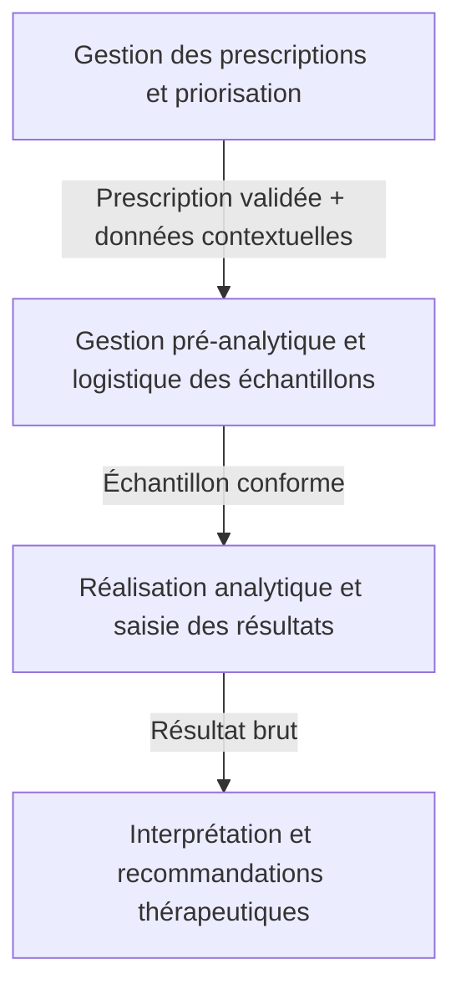
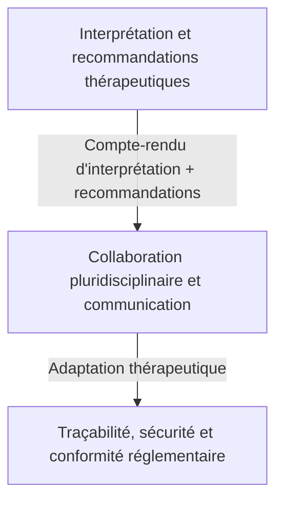
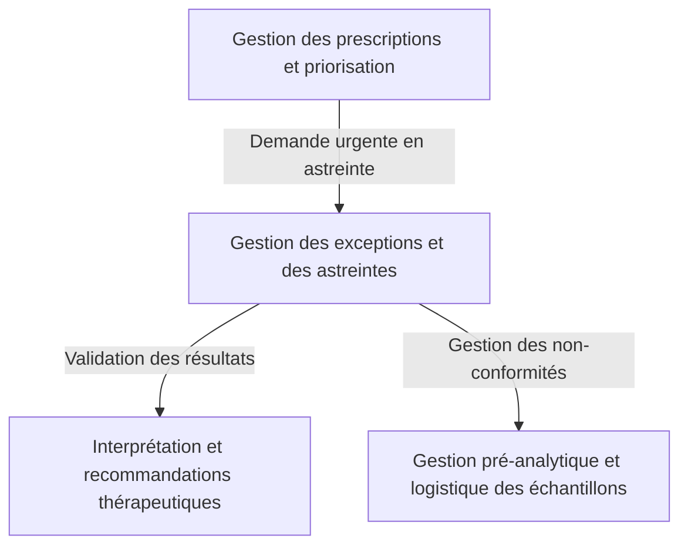
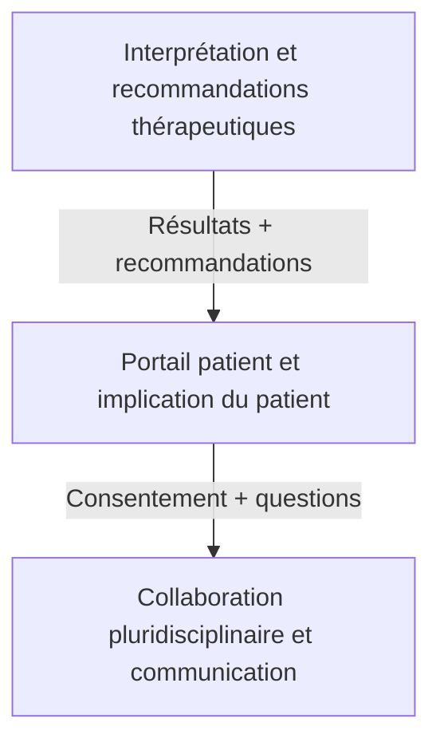

```markdown
# Interactions entre sous-domaines métier
**Gestion des demandes urgentes de dosage anti-Xa dans le SIL**
**Date** : [À compléter]
**Version** : 1.0
**Auteurs** : Analyste DDD
**Sources** : Livrables étape 1 et 2 (01_reformulation_du_besoin.md, 02_acteurs_du_domaine.md, 03_concepts_metier_initiaux.md, 04_contraintes_et_risques.md, 05_vision_globale_du_domaine.md, 01_cartographie_acteurs_responsabilites.md, 02_attentes_objectifs_acteurs.md, 03_decisions_informations_manipulees.md, 04_regles_metier.md, 05_priorites_exceptions_contraintes.md, 06_conflits_objectifs_arbitrages.md, 07_base_modelisation_comportementale.md)

---

## 1. Introduction
Ce document **décrit les interactions entre les sous-domaines proposés** pour le domaine des **demandes urgentes de dosage anti-Xa**, en mettant l'accent sur :
- Les **flux d'informations** échangés entre sous-domaines.
- Les **dépendances de décisions** entre sous-domaines.
- Les **règles métier partagées** ou transverses.
- Les **responsabilités communes** et points de synchronisation.
- Les **risques de couplage** ou de responsabilité ambiguë.
- Les **interactions à clarifier** avec les experts métier.

Cette cartographie reste **purement métier** et ne préjuge pas d'une architecture technique future. Elle vise à :
- **Comprendre les dépendances** entre les sous-domaines.
- **Identifier les points de synchronisation** critiques.
- **Anticiper les risques de couplage** ou de responsabilité floue.
- **Préparer l'étape 3** (modélisation comportementale) en identifiant les frontières potentielles entre sous-domaines.

---

## 2. Cartographie des interactions entre sous-domaines

### 2.1. Sous-domaines concernés
Les 8 sous-domaines identifiés précédemment sont :
1. **Gestion des prescriptions et priorisation** (Cœur stratégique)
2. **Gestion pré-analytique et logistique des échantillons** (Support)
3. **Réalisation analytique et saisie des résultats** (Support)
4. **Interprétation et recommandations thérapeutiques** (Cœur stratégique)
5. **Traçabilité, sécurité et conformité réglementaire** (Support)
6. **Gestion des exceptions et des astreintes** (Support)
7. **Collaboration pluridisciplinaire et communication** (Support)
8. **Portail patient et implication du patient** (Générique)

---

### 2.2. Interactions principales entre sous-domaines

#### **Flux 1 : De la prescription à l'analyse**


| **Sous-domaine source** | **Sous-domaine cible** | **Type d'interaction** | **Informations échangées** | **Décisions dépendantes** | **Règles métier partagées** | **Points de synchronisation** | **Risques de couplage** |
|-------------------------|------------------------|------------------------|---------------------------|---------------------------|-----------------------------|-------------------------------|-------------------------|
| **Gestion des prescriptions et priorisation** | **Gestion pré-analytique et logistique des échantillons** | **Flux de données contextuelles et décisionnel** | - Prescription validée (statut, niveau de priorité) <br> - Données contextuelles (type d'AOD, posologie, heure de dernière prise, clairance de la créatinine, contexte clinique) <br> - Justification du rejet (si applicable) | - Validation de la demande par le biologiste (RME-03) <br> - Priorisation automatique ou manuelle (RM-01, RM-02) | - **RME-01** : Prescription électronique obligatoire <br> - **RME-02** : Respect des protocoles locaux <br> - **RM-01** : Grille de priorisation automatique <br> - **RM-02** : Délais maximaux par niveau de priorité | - **Synchronisation des données contextuelles** entre SIL et DPI (si intégration automatique) <br> - **Validation en temps réel** des données saisies par le clinicien | - **Couplage fort** entre la prescription et la priorisation : une erreur dans la prescription (ex. : données manquantes) impacte directement la priorisation et la validation. <br> - **Responsabilité partagée** : Le clinicien et le biologiste doivent s'accorder sur la pertinence de la demande avant transmission au laboratoire. |
| **Gestion pré-analytique et logistique des échantillons** | **Réalisation analytique et saisie des résultats** | **Flux physique et décisionnel** | - Statut de conformité du tube (conforme/non conforme) <br> - Motif de rejet (si non conforme) <br> - Heure d'arrivée au laboratoire <br> - Température de transport | - Décision de rejeter ou non l'échantillon (RMP-02) <br> - Validation de la conformité par le biologiste (RMP-03) | - **RMP-01** : Critères de conformité des tubes <br> - **RMP-05** : Délais maximaux de transport <br> - **RMP-06** : Conditions de transport | - **Vérification en temps réel** de la conformité par le SIL (si automatisé) <br> - **Signalement immédiat** des non-conformités au biologiste | - **Couplage critique** : Un échantillon non conforme bloque l'analyse et retarde la prise en charge. <br> - **Responsabilité partagée** : Le technicien et le biologiste doivent valider la conformité avant analyse. |
| **Réalisation analytique et saisie des résultats** | **Interprétation et recommandations thérapeutiques** | **Flux de données analytiques** | - Résultat brut du dosage anti-Xa <br> - Identifiant de l'échantillon <br> - Identifiant du patient <br> - Statut de l'analyse (terminée/transmise) | - Validation des résultats par le biologiste (RMA-04) <br> - Interprétation du résultat (RMI-01) | - **RMA-03** : Intégration automatique entre analyseurs et SIL <br> - **RMI-01** : Grille d'interprétation par AOD <br> - **RMI-04** : Adaptation posologique en fonction de la fonction rénale | - **Transmission immédiate** des résultats au SIL <br> - **Double vérification** des résultats critiques | - **Couplage fort** : Une erreur de saisie ou de transmission des résultats impacte directement l'interprétation. <br> - **Dépendance critique** : L'interprétation ne peut commencer sans les résultats bruts. |

---

#### **Flux 2 : De l'analyse à l'adaptation thérapeutique**


| **Sous-domaine source** | **Sous-domaine cible** | **Type d'interaction** | **Informations échangées** | **Décisions dépendantes** | **Règles métier partagées** | **Points de synchronisation** | **Risques de couplage** |
|-------------------------|------------------------|------------------------|---------------------------|---------------------------|-----------------------------|-------------------------------|-------------------------|
| **Interprétation et recommandations thérapeutiques** | **Collaboration pluridisciplinaire et communication** | **Flux décisionnel et collaboratif** | - Compte-rendu d'interprétation (résultat, contexte clinique, fonction rénale) <br> - Recommandations thérapeutiques (adaptation de posologie, administration d'antidote) <br> - Seuil d'alerte (si applicable) | - Validation ou contestation des recommandations par le pharmacien (RMI-03) <br> - Adaptation du traitement par le clinicien (RMI-05) | - **RMI-02** : Recommandations thérapeutiques standardisées <br> - **RMI-03** : Collaboration pluridisciplinaire <br> - **RMI-05** : Délais critiques pour l'adaptation thérapeutique | - **Communication immédiate** des résultats et recommandations aux cliniciens et pharmaciens <br> - **Feedback des cliniciens** sur l'adaptation thérapeutique | - **Couplage critique** : Une erreur d'interprétation ou une recommandation inadaptée impacte directement l'adaptation thérapeutique. <br> - **Responsabilité partagée** : Le biologiste, le pharmacien et le clinicien doivent collaborer pour valider les recommandations. |
| **Collaboration pluridisciplinaire et communication** | **Traçabilité, sécurité et conformité réglementaire** | **Flux de traçabilité** | - Actions réalisées (prescription, validation, interprétation, adaptation) <br> - Utilisateurs impliqués <br> - Horodatages | - Enregistrement systématique des actions (RMT-01) <br> - Signature électronique des résultats validés (RMT-04) | - **RMT-01** : Traçabilité complète des actions <br> - **RMT-03** : Respect du RGPD <br> - **RMT-04** : Signature électronique | - **Journalisation en temps réel** de toutes les actions <br> - **Export des logs** pour les audits | - **Couplage fort** : Toute action non tracée ou non signée impacte la conformité réglementaire. <br> - **Dépendance critique** : La traçabilité dépend de la qualité de la communication entre acteurs. |

---

#### **Flux 3 : Gestion des exceptions et des astreintes**


| **Sous-domaine source** | **Sous-domaine cible** | **Type d'interaction** | **Informations échangées** | **Décisions dépendantes** | **Règles métier partagées** | **Points de synchronisation** | **Risques de couplage** |
|-------------------------|------------------------|------------------------|---------------------------|---------------------------|-----------------------------|-------------------------------|-------------------------|
| **Gestion des prescriptions et priorisation** | **Gestion des exceptions et des astreintes** | **Flux décisionnel et d'urgence** | - Demande urgente en dehors des heures ouvrables <br> - Niveau de priorité <br> - Données contextuelles | - Déclenchement de l'astreinte biologique (RMEX-02) <br> - Validation des résultats par le biologiste d'astreinte | - **RMEX-01** : Liste des services couverts par l'astreinte <br> - **RMEX-02** : Procédure de déclenchement de l'astreinte | - **Alerte automatique** via le SIL en cas de demande urgente en astreinte <br> - **Accès sécurisé** aux données patients pour le biologiste d'astreinte | - **Couplage critique** : Une mauvaise gestion de l'astreinte entraîne des retards dans la prise en charge des urgences. <br> - **Responsabilité partagée** : Le SIL et le biologiste d'astreinte doivent collaborer pour valider les demandes en dehors des heures ouvrables. |
| **Gestion des exceptions et des astreintes** | **Gestion pré-analytique et logistique des échantillons** | **Flux de gestion des non-conformités** | - Non-conformité détectée en astreinte <br> - Motif du rejet <br> - Demande de complément (nouveau prélèvement) | - Gestion des non-conformités en astreinte (RMEX-03) <br> - Relance du service prescripteur | - **RMP-02** : Procédure de gestion des non-conformités <br> - **RMP-04** : Signalement immédiat des non-conformités | - **Coordination immédiate** entre le personnel administratif et le biologiste d'astreinte <br> - **Suivi en temps réel** du statut des prélèvements | - **Couplage fort** : Une non-conformité non gérée en astreinte retarde la prise en charge du patient. <br> - **Responsabilité partagée** : Le personnel administratif et le biologiste d'astreinte doivent agir rapidement pour éviter les retards. |
| **Gestion des exceptions et des astreintes** | **Interprétation et recommandations thérapeutiques** | **Flux de validation et d'interprétation** | - Résultats validés en astreinte <br> - Recommandations thérapeutiques <br> - Contexte clinique | - Validation des résultats par le biologiste d'astreinte <br> - Interprétation du résultat (RMI-01) | - **RMI-01** : Grille d'interprétation par AOD <br> - **RMI-05** : Délais critiques pour l'adaptation thérapeutique | - **Communication immédiate** des résultats et recommandations aux cliniciens <br> - **Feedback des cliniciens** sur l'adaptation thérapeutique | - **Couplage critique** : Une erreur d'interprétation en astreinte impacte directement l'adaptation thérapeutique. <br> - **Responsabilité partagée** : Le biologiste d'astreinte et le clinicien doivent valider les recommandations avant adaptation. |

---

#### **Flux 4 : Implication du patient**


| **Sous-domaine source** | **Sous-domaine cible** | **Type d'interaction** | **Informations échangées** | **Décisions dépendantes** | **Règles métier partagées** | **Points de synchronisation** | **Risques de couplage** |
|-------------------------|------------------------|------------------------|---------------------------|---------------------------|-----------------------------|-------------------------------|-------------------------|
| **Interprétation et recommandations thérapeutiques** | **Portail patient et implication du patient** | **Flux d'information patient** | - Résultat du dosage anti-Xa <br> - Recommandations thérapeutiques <br> - Seuil d'alerte (si applicable) | - Accès sécurisé aux résultats par le patient (RPP-01) <br> - Consentement éclairé du patient (RPP-03) | - **RPP-01** : Données accessibles aux patients <br> - **RPP-03** : Respect du RGPD | - **Authentification forte** du patient pour accéder aux résultats <br> - **Messagerie sécurisée** pour les questions des patients | - **Couplage modéré** : Une erreur dans les résultats ou recommandations affichés peut induire en erreur le patient. <br> - **Responsabilité partagée** : Le biologiste et le clinicien doivent valider les informations avant affichage. |
| **Portail patient et implication du patient** | **Collaboration pluridisciplinaire et communication** | **Flux de feedback patient** | - Questions ou signalements du patient (ex. : effets indésirables) <br> - Consentement éclairé | - Transmission des questions au clinicien ou au biologiste <br> - Adaptation du traitement si nécessaire | - **RPP-02** : Formation des patients <br> - **RC-01** : Canaux de communication sécurisés | - **Transmission immédiate** des questions du patient aux cliniciens <br> - **Feedback des cliniciens** sur l'adaptation thérapeutique | - **Couplage faible** : Les questions des patients sont généralement mineures et n'impactent pas directement le circuit. <br> - **Responsabilité partagée** : Le clinicien doit répondre aux questions du patient et adapter le traitement si nécessaire. |

---

## 3. Règles métier transverses et partagées

### 3.1. Règles métier communes à plusieurs sous-domaines
| **Règle métier** | **Sous-domaines concernés** | **Description** | **Impact en cas de non-respect** |
|------------------|-----------------------------|-----------------|----------------------------------|
| **RME-01 : Prescription électronique obligatoire** | Gestion des prescriptions et priorisation, Traçabilité, sécurité et conformité réglementaire | Toute demande de dosage anti-Xa doit être formalisée via une prescription électronique dans le SIL. | Perte de traçabilité, erreurs de transcription, non-respect des protocoles. |
| **RME-02 : Respect des protocoles locaux** | Gestion des prescriptions et priorisation, Interprétation et recommandations thérapeutiques | La prescription doit respecter les indications définies par les protocoles de la CAI. | Prescriptions inappropriées, risques cliniques, sanctions réglementaires. |
| **RM-01 : Grille de priorisation automatique** | Gestion des prescriptions et priorisation, Gestion des exceptions et des astreintes | Classement automatique des demandes par niveau d'urgence (urgence absolue, haute, modérée, routine). | Retards dans les cas urgents, surcharge du laboratoire, frustration des cliniciens. |
| **RM-02 : Délais maximaux par niveau de priorité** | Gestion des prescriptions et priorisation, Interprétation et recommandations thérapeutiques, Gestion des exceptions et des astreintes | Respect des délais critiques pour chaque niveau de priorité (ex. : urgence absolue ≤ 1h). | Complications cliniques, aggravation de l'état du patient, sanctions réglementaires. |
| **RMT-01 : Traçabilité complète des actions** | Traçabilité, sécurité et conformité réglementaire, Collaboration pluridisciplinaire et communication | Enregistrement systématique de toutes les actions (prescription, validation, analyse, interprétation, adaptation). | Impossibilité de prouver la conformité en cas d'audit, sanctions réglementaires. |
| **RMT-03 : Respect du RGPD** | Traçabilité, sécurité et conformité réglementaire, Portail patient et implication du patient | Protection des données patients (authentification forte, droits d'accès différenciés, chiffrement). | Violation du RGPD, sanctions de la CNIL, perte de confiance des patients. |
| **RC-01 : Canaux de communication sécurisés** | Collaboration pluridisciplinaire et communication, Portail patient et implication du patient | Utilisation de messagerie sécurisée et de notifications automatiques pour la communication entre acteurs. | Fuites de données, erreurs de transmission, mauvaise prise en charge. |

---

### 3.2. Points de synchronisation critiques
| **Point de synchronisation** | **Sous-domaines concernés** | **Description** | **Risque en cas de dysfonctionnement** |
|-----------------------------|-----------------------------|-----------------|----------------------------------------|
| **Synchronisation des données contextuelles** | Gestion des prescriptions et priorisation ↔ Gestion pré-analytique et logistique des échantillons | Transmission des données contextuelles (type d'AOD, posologie, heure de dernière prise, clairance de la créatinine) du SIL au DPI et vice versa. | Données manquantes ou erronées → erreurs d'interprétation ou d'adaptation thérapeutique. |
| **Validation en temps réel des données** | Gestion des prescriptions et priorisation ↔ Gestion pré-analytique et logistique des échantillons | Vérification immédiate de la conformité des tubes et des données saisies par le clinicien. | Échantillons non conformes → résultats invalides, rejets d'échantillons. |
| **Transmission immédiate des résultats** | Réalisation analytique et saisie des résultats ↔ Interprétation et recommandations thérapeutiques | Transmission automatique des résultats bruts du SIL au module d'interprétation. | Retards dans l'interprétation, erreurs de saisie. |
| **Communication des recommandations** | Interprétation et recommandations thérapeutiques ↔ Collaboration pluridisciplinaire et communication | Transmission immédiate des recommandations thérapeutiques aux cliniciens et pharmaciens. | Retards dans l'adaptation thérapeutique, erreurs d'interprétation. |
| **Journalisation en temps réel** | Collaboration pluridisciplinaire et communication ↔ Traçabilité, sécurité et conformité réglementaire | Enregistrement systématique de toutes les actions et décisions dans le SIL. | Traçabilité incomplète → impossibilité de prouver la conformité en cas d'audit. |
| **Gestion des astreintes** | Gestion des exceptions et des astreintes ↔ Gestion des prescriptions et priorisation, Gestion pré-analytique et logistique des échantillons, Interprétation et recommandations thérapeutiques | Déclenchement automatique de l'astreinte biologique en cas de demande urgente en dehors des heures ouvrables. | Retards dans la prise en charge des urgences, perte de contexte clinique. |

---

## 4. Risques de couplage et responsabilités ambiguës

### 4.1. Couplages forts identifiés
| **Couplage** | **Sous-domaines concernés** | **Description** | **Risque** | **Solution proposée** |
|--------------|-----------------------------|-----------------|------------|-----------------------|
| **Prescription → Validation → Priorisation** | Gestion des prescriptions et priorisation ↔ Gestion pré-analytique et logistique des échantillons | Une erreur dans la prescription (ex. : données manquantes, protocoles non respectés) impacte directement la validation et la priorisation. | Prescriptions inappropriées, rejets d'échantillons, retards critiques. | - **Automatisation de la validation** : Le SIL doit rejeter automatiquement les demandes non conformes. <br> - **Feedback immédiat** au clinicien en cas de rejet. |
| **Conformité des tubes → Analyse** | Gestion pré-analytique et logistique des échantillons ↔ Réalisation analytique et saisie des résultats | Un échantillon non conforme bloque l'analyse et retarde la prise en charge. | Résultats invalides, rejets d'échantillons, retards critiques. | - **Vérification automatique** de la conformité par le SIL. <br> - **Signalement immédiat** au biologiste et au clinicien. |
| **Résultats → Interprétation** | Réalisation analytique et saisie des résultats ↔ Interprétation et recommandations thérapeutiques | Une erreur de saisie ou de transmission des résultats impacte directement l'interprétation. | Erreurs d'interprétation, recommandations inadaptées, erreurs thérapeutiques. | - **Double vérification** des résultats critiques. <br> - **Intégration automatique** entre analyseurs et SIL. |
| **Recommandations → Adaptation thérapeutique** | Interprétation et recommandations thérapeutiques ↔ Collaboration pluridisciplinaire et communication | Une erreur d'interprétation ou une recommandation inadaptée impacte directement l'adaptation thérapeutique. | Erreurs thérapeutiques, complications cliniques, sanctions réglementaires. | - **Collaboration pluridisciplinaire** obligatoire (biologiste, pharmacien, clinicien). <br> - **Validation des recommandations** avant adaptation. |
| **Traçabilité → Conformité réglementaire** | Collaboration pluridisciplinaire et communication ↔ Traçabilité, sécurité et conformité réglementaire | Toute action non tracée ou non signée impacte la conformité réglementaire. | Impossibilité de prouver la conformité en cas d'audit, sanctions réglementaires. | - **Journalisation en temps réel** de toutes les actions. <br> - **Signature électronique** obligatoire pour les résultats validés. |

---

### 4.2. Responsabilités partagées ou ambiguës
| **Responsabilité** | **Sous-domaines concernés** | **Acteurs impliqués** | **Description** | **Risque en cas d'ambiguïté** | **Solution proposée** |
|--------------------|-----------------------------|-----------------------|-----------------|-------------------------------|-----------------------|
| **Validation des demandes** | Gestion des prescriptions et priorisation ↔ Gestion pré-analytique et logistique des échantillons | Clinicien, Biologiste, Technicien de laboratoire | Le clinicien prescrit, le biologiste valide, et le technicien vérifie la conformité des tubes. | Prescriptions inappropriées, rejets d'échantillons, retards critiques. | - **Définir des critères de rejet clairs** et automatisés. <br> - **Feedback immédiat** au clinicien en cas de rejet. |
| **Gestion des non-conformités** | Gestion pré-analytique et logistique des échantillons ↔ Gestion des exceptions et des astreintes | Technicien de laboratoire, Personnel administratif, Biologiste d'astreinte | Le technicien signale une non-conformité, le personnel administratif relance le service prescripteur, et le biologiste d'astreinte gère le cas en dehors des heures ouvrables. | Non-conformités non gérées → résultats invalides, retards critiques. | - **Procédure standardisée** pour la gestion des non-conformités. <br> - **Alerte automatique** au clinicien et au biologiste. |
| **Interprétation des résultats** | Réalisation analytique et saisie des résultats ↔ Interprétation et recommandations thérapeutiques | Technicien de laboratoire, Biologiste | Le technicien saisit les résultats, et le biologiste les interprète en contexte clinique. | Erreurs de saisie, erreurs d'interprétation, recommandations inadaptées. | - **Double vérification** des résultats critiques. <br> - **Intégration automatique** entre analyseurs et SIL. |
| **Adaptation thérapeutique** | Interprétation et recommandations thérapeutiques ↔ Collaboration pluridisciplinaire et communication | Biologiste, Pharmacien, Clinicien | Le biologiste émet des recommandations, le pharmacien les valide, et le clinicien adapte le traitement. | Recommandations inadaptées, erreurs thérapeutiques, complications cliniques. | - **Collaboration pluridisciplinaire** obligatoire. <br> - **Validation des recommandations** avant adaptation. |
| **Traçabilité des actions** | Collaboration pluridisciplinaire et communication ↔ Traçabilité, sécurité et conformité réglementaire | Tous les acteurs | Toutes les actions (prescription, validation, analyse, interprétation, adaptation) doivent être tracées. | Traçabilité incomplète → impossibilité de prouver la conformité en cas d'audit. | - **Journalisation en temps réel** de toutes les actions. <br> - **Signature électronique** obligatoire. |

---

## 5. Interactions à clarifier avec les experts métier

### 5.1. Points de synchronisation critiques à valider
| **Point de synchronisation** | **Sous-domaines concernés** | **Question à poser aux experts** | **Impact en cas de mauvaise synchronisation** |
|-----------------------------|-----------------------------|----------------------------------|---------------------------------------------|
| **Synchronisation des données contextuelles** | Gestion des prescriptions et priorisation ↔ Gestion pré-analytique et logistique des échantillons | - Quelles données contextuelles doivent être **automatiquement synchronisées** entre le SIL et le DPI ? <br> - Quelle est la **précision requise** pour l'heure de la dernière prise (minutes ou heures) ? | Données manquantes ou erronées → erreurs d'interprétation ou d'adaptation thérapeutique. |
| **Validation en temps réel des données** | Gestion des prescriptions et priorisation ↔ Gestion pré-analytique et logistique des échantillons | - Quels sont les **critères exacts de conformité** des tubes (type, volume, délai de transport, température) ? <br> - Qui valide **définitivement** la conformité d'un tube (clinicien, technicien, biologiste, système automatisé) ? | Échantillons non conformes → résultats invalides, rejets d'échantillons, retards critiques. |
| **Transmission immédiate des résultats** | Réalisation analytique et saisie des résultats ↔ Interprétation et recommandations thérapeutiques | - Les analyseurs sont-ils **compatibles** avec le SIL actuel ? <br> - Quels sont les **seuils d'alerte** pour les résultats aberrants ? | Retards dans l'interprétation, erreurs de saisie, erreurs d'interprétation. |
| **Communication des recommandations** | Interprétation et recommandations thérapeutiques ↔ Collaboration plur