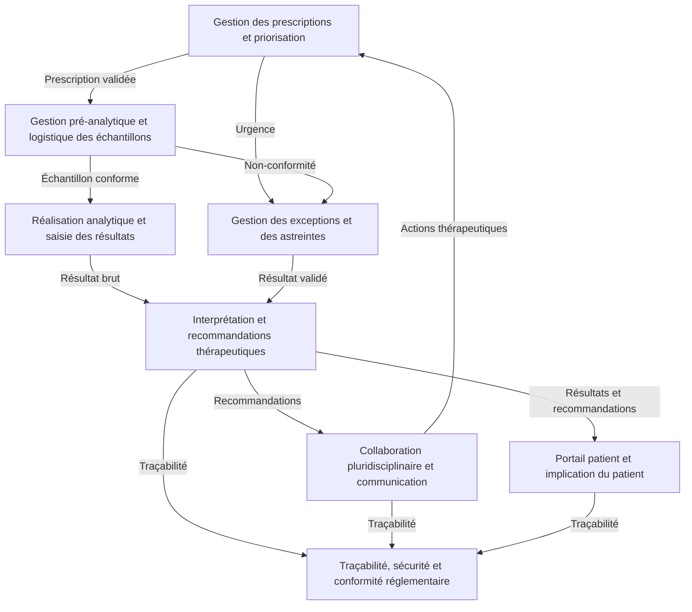
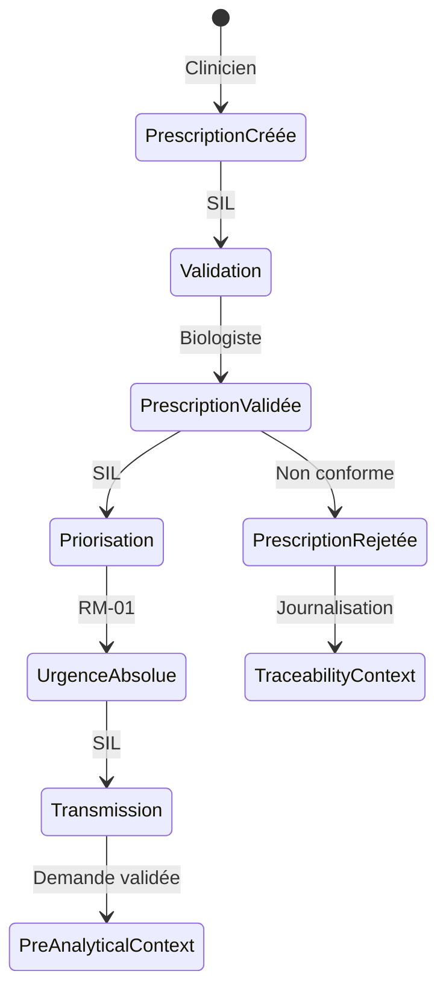
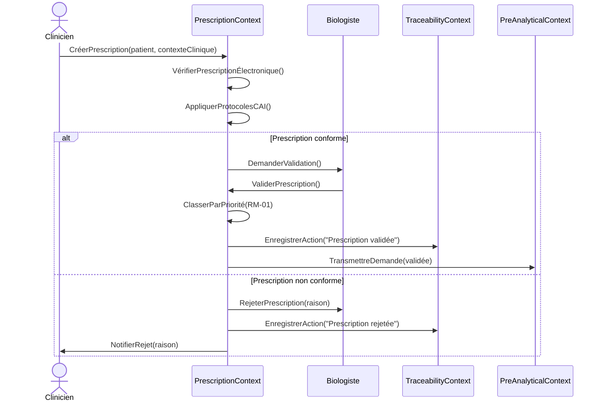

Voici une proposition structurée pour **poursuivre la démarche DDD** en intégrant les éléments clés du domaine des demandes urgentes de dosage anti-Xa, tout en préparant l'étape 5 (modélisation comportementale). Je vais organiser cela en **trois parties** : (1) **Synthèse des sous-domaines et de leurs interactions**, (2) **Proposition de bounded contexts et d'agrégats**, et (3) **Plan d'action pour l'étape 5**.

---

---

## **1. Synthèse des sous-domaines et de leurs interactions**
### **Tableau récapitulatif des sous-domaines**
| **Sous-domaine** | **Type** | **Finalité** | **Acteurs principaux** | **Règles métier critiques** | **Points à clarifier** |
|------------------|----------|--------------|------------------------|-----------------------------|------------------------|
| **Gestion des prescriptions et priorisation** | Cœur stratégique | Centraliser et valider les demandes, prioriser automatiquement | Cliniciens, Biologistes, CAI, SIL | RME-01, RME-02, RME-03, RM-01, RM-02 | Automatisation de la priorisation, critères de rejet |
| **Gestion pré-analytique et logistique des échantillons** | Support | Garantir la conformité des échantillons avant analyse | Techniciens, Cliniciens, SIL, Middleware | RMP-01, RMP-02, RMP-03, RMP-04, RMP-05, RMP-06 | Critères exacts de conformité, rôle du clinicien |
| **Réalisation analytique et saisie des résultats** | Support | Réaliser le dosage anti-Xa et transmettre les résultats bruts | Techniciens, Analyseurs, SIL, Middleware | RMA-01, RMA-02, RMA-03, RMA-04 | Compatibilité analyseurs-SIL, seuils d'alerte |
| **Interprétation et recommandations thérapeutiques** | Cœur stratégique | Interpréter les résultats et émettre des recommandations adaptées | Biologistes, Pharmaciens, Cliniciens, CAI | RMI-01, RMI-02, RMI-03, RMI-04, RMI-05 | Seuils d'interprétation par AOD, rôle du pharmacien |
| **Traçabilité, sécurité et conformité réglementaire** | Support | Garantir une traçabilité complète, une sécurité optimale et une conformité aux normes | SIL, DSI, Biologistes, Autorités réglementaires | RMT-01, RMT-02, RMT-03, RMT-04, RMT-05 | Mécanismes d'authentification, durée de conservation des logs |
| **Gestion des exceptions et des astreintes** | Support | Gérer les demandes urgentes en dehors des heures ouvrables et les cas exceptionnels | Biologistes d'astreinte, Personnel administratif, SIL | RMEX-01, RMEX-02, RMEX-03 | Services couverts par l'astreinte, procédure de déclenchement |
| **Collaboration pluridisciplinaire et communication** | Cœur stratégique | Faciliter la communication et la collaboration entre acteurs | Cliniciens, Biologistes, Pharmaciens, SIL | RC-01, RC-02, RC-03 | Canaux de communication sécurisés, feedback des cliniciens |
| **Portail patient et implication du patient** | Générique | Permettre au patient d'accéder à ses résultats et de participer à sa prise en charge | Patients, Cliniciens, SIL, DSI | RPP-01, RPP-02, RPP-03 | Données accessibles, consentement éclairé |

---

### **Flux d'informations critiques entre sous-domaines**


#### **Détails des flux** :
1. **Prescription → Validation → Analyse** :
   - Une **prescription validée** déclenche la vérification de la conformité de l'échantillon.
   - Un **échantillon conforme** est envoyé pour analyse.
   - Le **résultat brut** est transmis pour interprétation.

2. **Analyse → Interprétation → Adaptation thérapeutique** :
   - Le **résultat brut** est interprété en tenant compte du contexte clinique.
   - Les **recommandations thérapeutiques** sont communiquées aux cliniciens et pharmaciens.

3. **Collaboration → Traçabilité** :
   - Toutes les actions (prescription, validation, interprétation, adaptation) sont **traçables** pour la conformité réglementaire.

4. **Gestion des exceptions** :
   - Les **demandes urgentes en astreinte** ou les **non-conformités** sont gérées par les biologistes d'astreinte.
   - Les résultats validés en astreinte sont transmis pour interprétation.

5. **Portail patient** :
   - Les **résultats et recommandations** sont accessibles aux patients via un portail sécurisé.

---

### **Règles métier transverses et points de synchronisation**
| **Règle transverse** | **Sous-domaines concernés** | **Point de synchronisation** | **Risque si non respecté** |
|----------------------|-----------------------------|------------------------------|-----------------------------|
| **Prescription électronique obligatoire (RME-01)** | Gestion des prescriptions, Traçabilité | Synchronisation SIL-DPI pour récupérer les données patients | Prescriptions papier → erreurs, retards, non-traçabilité |
| **Validation biologique obligatoire (RME-03)** | Gestion des prescriptions, Gestion pré-analytique | Validation par le biologiste avant analyse | Analyse de demandes non conformes → résultats invalides |
| **Critères de conformité des tubes (RMP-01)** | Gestion pré-analytique, Réalisation analytique | Vérification automatique de la conformité par le SIL | Échantillons non conformes → résultats invalides |
| **Grille de priorisation automatique (RM-01)** | Gestion des prescriptions, Gestion des exceptions | Priorisation automatique basée sur le contexte clinique | Retards dans les cas urgents → complications cliniques |
| **Traçabilité complète (RMT-01)** | Tous les sous-domaines | Journalisation en temps réel de toutes les actions | Traçabilité incomplète → sanctions réglementaires |
| **Respect du RGPD (RMT-03)** | Traçabilité, Portail patient | Authentification forte, chiffrement des données | Violation du RGPD → sanctions de la CNIL |
| **Canaux de communication sécurisés (RC-01)** | Collaboration pluridisciplinaire, Portail patient | Messagerie intégrée au SIL, notifications automatiques | Fuites de données → erreurs thérapeutiques |

---

---

## **2. Proposition de bounded contexts et d'agrégats**
### **Hypothèses pour les bounded contexts**
Pour éviter un découpage trop précoce, je propose des **bounded contexts potentiels** basés sur les sous-domaines, en distinguant :
- **Contextes de cœur stratégique** (fortement liés à la valeur métier).
- **Contextes de support** (essentiels mais moins différenciants).
- **Contextes génériques** (réutilisables ou externalisables).

| **Bounded Context** | **Sous-domaines inclus** | **Justification** | **Risques de couplage** | **Suggestions d'agrégats** |
|---------------------|--------------------------|-------------------|-------------------------|----------------------------|
| **PrescriptionContext** | Gestion des prescriptions et priorisation | Centralise la validation et la priorisation des demandes. | Couplage fort avec TraçabilitéContext pour la journalisation. | - **Prescription** (ID, patient, service, contexte clinique, statut, priorité) <br> - **Protocole** (ID, nom, règles de conformité) <br> - **Validation** (ID, biologist, statut, commentaire) |
| **PreAnalyticalContext** | Gestion pré-analytique et logistique des échantillons | Gère la conformité des échantillons avant analyse. | Couplage avec RéalisationAnalytiqueContext pour le transfert des échantillons. | - **Échantillon** (ID, tube, volume, conformité, statut) <br> - **Transport** (ID, délai, température, statut) <br> - **NonConformité** (ID, raison, action) |
| **AnalyticalContext** | Réalisation analytique et saisie des résultats | Réalise le dosage anti-Xa et transmet les résultats bruts. | Couplage avec InterprétationContext pour le transfert des résultats. | - **Analyse** (ID, échantillon, résultat brut, statut) <br> - **ContrôleQualité** (ID, résultats, statut) <br> - **RésultatBrut** (ID, valeur, statut) |
| **InterpretationContext** | Interprétation et recommandations thérapeutiques | Interprète les résultats et émet des recommandations. | Couplage avec CollaborationContext pour la communication des recommandations. | - **Interprétation** (ID, résultat brut, contexte clinique, recommandation) <br> - **GrilleInterprétation** (ID, AOD, seuil bas/haut) <br> - **Recommandation** (ID, type, posologie, antidote) |
| **CollaborationContext** | Collaboration pluridisciplinaire et communication | Facilite la communication entre acteurs. | Couplage avec tous les contextes pour la transmission d'informations. | - **Message** (ID, expéditeur, destinataire, contenu, statut) <br> - **Alerte** (ID, priorité, destinataire, statut) <br> - **Feedback** (ID, clinicien, commentaire) |
| **TraceabilityContext** | Traçabilité, sécurité et conformité réglementaire | Garantit la traçabilité et la sécurité des données. | Couplage fort avec tous les autres contextes pour la journalisation. | - **Journal** (ID, action, utilisateur, horodatage, données) <br> - **Audit** (ID, rapport, statut) <br> - **Conformité** (ID, norme, statut) |
| **OnCallContext** | Gestion des exceptions et des astreintes | Gère les demandes urgentes en dehors des heures ouvrables. | Couplage avec PrescriptionContext et PreAnalyticalContext pour les urgences. | - **Astreinte** (ID, service, biologiste, statut) <br> - **Urgence** (ID, demande, statut) <br> - **NonConformitéUrgente** (ID, échantillon, action) |
| **PatientPortalContext** | Portail patient et implication du patient | Permet l'accès aux résultats et l'implication du patient. | Couplage avec InterpretationContext pour les résultats. | - **Patient** (ID, consentement, accès) <br> - **RésultatPatient** (ID, résultat, recommandation) <br> - **Notification** (ID, patient, contenu) |

---

### **Détails des agrégats proposés**
#### **1. PrescriptionContext**
- **Agrégat : Prescription**
  - **Entités** :
    - `Prescription` (ID, patient, servicePrescripteur, contexteClinique, statut, priorité)
    - `Protocole` (ID, nom, règlesDeConformité, CAI)
  - **Value Objects** :
    - `ContexteClinique` (type, hémorragieActive, chirurgieProgrammée)
    - `Priorité` (urgenceAbsolue, urgenceHaute, urgenceModérée, routine)
  - **Domain Events** :
    - `PrescriptionCréée`
    - `PrescriptionValidée`
    - `PrescriptionRejetée`
    - `PrioritéMiseÀJour`

#### **2. PreAnalyticalContext**
- **Agrégat : Échantillon**
  - **Entités** :
    - `Échantillon` (ID, tube, volume, conformité, statut)
    - `Transport` (ID, délai, température, statut)
  - **Value Objects** :
    - `Tube` (type, volumeMinimal, délaiMaximal)
    - `Conformité` (statut, raisonNonConformité)
  - **Domain Events** :
    - `TubeConforme`
    - `TubeNonConforme`
    - `TransportValidé`

#### **3. AnalyticalContext**
- **Agrégat : Analyse**
  - **Entités** :
    - `Analyse` (ID, échantillon, résultatBrut, statut)
    - `ContrôleQualité` (ID, résultats, statut)
  - **Value Objects** :
    - `RésultatBrut` (valeur, unité)
  - **Domain Events** :
    - `AnalyseTerminée`
    - `ContrôleQualitéValidé`

#### **4. InterpretationContext**
- **Agrégat : Interprétation**
  - **Entités** :
    - `Interprétation` (ID, résultatBrut, contexteClinique, recommandation)
    - `GrilleInterprétation` (ID, AOD, seuilBas, seuilHaut)
  - **Value Objects** :
    - `Recommandation` (type, posologie, antidote)
  - **Domain Events** :
    - `InterprétationTerminée`
    - `RecommandationÉmise`

#### **5. CollaborationContext**
- **Agrégat : Message**
  - **Entités** :
    - `Message` (ID, expéditeur, destinataire, contenu, statut)
    - `Alerte` (ID, priorité, destinataire, statut)
  - **Value Objects** :
    - `Contenu` (texte, données)
  - **Domain Events** :
    - `MessageEnvoyé`
    - `AlerteDéclenchée`

#### **6. TraceabilityContext**
- **Agrégat : Journal**
  - **Entités** :
    - `Journal` (ID, action, utilisateur, horodatage, données)
    - `Audit` (ID, rapport, statut)
  - **Value Objects** :
    - `Action` (type, détails)
  - **Domain Events** :
    - `ActionEnregistrée`
    - `AuditRéalisé`

#### **7. OnCallContext**
- **Agrégat : Astreinte**
  - **Entités** :
    - `Astreinte` (ID, service, biologiste, statut)
    - `Urgence` (ID, demande, statut)
  - **Value Objects** :
    - `ServiceCouvert` (nom, priorité)
  - **Domain Events** :
    - `AstreinteDéclenchée`
    - `UrgenceGérée`

#### **8. PatientPortalContext**
- **Agrégat : Patient**
  - **Entités** :
    - `Patient` (ID, consentement, accès)
    - `RésultatPatient` (ID, résultat, recommandation)
  - **Value Objects** :
    - `Consentement` (statut, date)
  - **Domain Events** :
    - `AccèsAutorisé`
    - `RésultatPartagé`

---

### **Points de couplage à surveiller**
| **Couplage** | **Risque** | **Solution proposée** |
|--------------|------------|-----------------------|
| **PrescriptionContext ↔ TraceabilityContext** | Journalisation des actions de prescription | Utiliser un **événement de domaine** (`PrescriptionValidée`) pour déclencher l'enregistrement dans le `Journal`. |
| **PreAnalyticalContext ↔ AnalyticalContext** | Transfert des échantillons conformes | Utiliser un **événement de domaine** (`TubeConforme`) pour déclencher l'analyse. |
| **AnalyticalContext ↔ InterpretationContext** | Transmission des résultats bruts | Utiliser un **événement de domaine** (`AnalyseTerminée`) pour déclencher l'interprétation. |
| **InterpretationContext ↔ CollaborationContext** | Communication des recommandations | Utiliser un **événement de domaine** (`RecommandationÉmise`) pour déclencher l'envoi de messages. |
| **Tous les contextes ↔ TraceabilityContext** | Journalisation des actions | Centraliser la journalisation dans un **service dédié** (ex. : `TraceabilityService`). |

---

---

## **3. Plan d'action pour l'étape 5 (Modélisation comportementale)**
### **Objectifs de l'étape 5**
- **Décrire les comportements attendus** pour chaque bounded context.
- **Identifier les événements et flux de travail** (ex. : prescription → validation → analyse → interprétation).
- **Définir les règles métier** à implémenter dans le futur système.
- **Préparer l'implémentation technique** en identifiant les dépendances et les points d'intégration.

---

### **Méthodologie proposée**
1. **Event Storming** :
   - Organiser des ateliers avec les experts métier pour identifier les **événements de domaine**, les **commandes**, et les **flux de travail**.
   - Exemple pour le **PrescriptionContext** :
     - **Commandes** : `CréerPrescription`, `ValiderPrescription`, `RejeterPrescription`.
     - **Événements** : `PrescriptionCréée`, `PrescriptionValidée`, `PrescriptionRejetée`.
     - **Flux** : Prescription → Validation → Priorisation → Transmission à PreAnalyticalContext.

2. **Définition des règles métier** :
   - Pour chaque bounded context, lister les **règles métier critiques** et les **décisions** à prendre.
   - Exemple pour le **InterpretationContext** :
     - **Règle** : Si `résultatBrut > seuilHaut` pour l'apixaban, alors `recommandation = "réduire posologie"`.
     - **Décision** : Qui valide la recommandation (biologiste, pharmacien, ou les deux) ?

3. **Modélisation des interactions** :
   - Utiliser des **diagrammes de séquence** pour décrire les interactions entre bounded contexts.
   - Exemple :
     ```mermaid
     sequenceDiagram
         actor Clinicien
         participant SIL as PrescriptionContext
         participant Lab as PreAnalyticalContext
         participant Analyseur as AnalyticalContext
         participant Biologiste as InterpretationContext
         participant Clinique as CollaborationContext

         Clinicien->>SIL: CréerPrescription(patient, contexte)
         SIL->>SIL: ValiderPrescription(protocole)
         SIL->>Lab: TransmettreDemande(validée)
         Lab->>Lab: VérifierConformitéTube()
         Lab->>Analyseur: EnvoyerÉchantillon()
         Analyseur->>Analyseur: RéaliserDosage()
         Analyseur->>Biologiste: RésultatBrut()
         Biologiste->>Biologiste: InterpréterRésultat()
         Biologiste->>Clinique: ÉmettreRecommandation()
         Clinique->>Clinicien: Notifier(clinicien, recommandation)
     ```

4. **Identification des points d'intégration** :
   - Définir les **APIs ou événements** nécessaires pour l'intégration entre bounded contexts.
   - Exemple :
     - **PrescriptionContext → PreAnalyticalContext** : Événement `PrescriptionValidée`.
     - **AnalyticalContext → InterpretationContext** : Événement `AnalyseTerminée`.
     - **InterpretationContext → CollaborationContext** : Événement `RecommandationÉmise`.

5. **Validation avec les experts métier** :
   - Présenter les **bounded contexts**, **agrégats**, et **flux de travail** aux experts pour validation.
   - Affiner les modèles en fonction des retours.

---

### **Livrables attendus pour l'étape 5**
| **Livrable** | **Contenu** | **Format** |
|---------------|-------------|------------|
| **Modèle comportemental** | Diagrammes de séquence, événements de domaine, flux de travail | Mermaid, PlantUML, ou outil de modélisation (ex. : Lucidchart) |
| **Règles métier détaillées** | Liste des règles par bounded context, décisions critiques | Tableau ou document structuré |
| **Spécifications d'intégration** | Points d'intégration entre bounded contexts, APIs ou événements | Document technique |
| **Plan de validation** | Liste des questions à valider avec les experts, priorités | Liste structurée |

---

### **Exemple de modélisation comportementale pour le PrescriptionContext**
#### **Événements de domaine**
| **Événement** | **Description** | **Acteur déclencheur** | **Acteur récepteur** |
|---------------|-----------------|------------------------|-----------------------|
| `PrescriptionCréée` | Une nouvelle prescription est créée. | Clinicien | PrescriptionContext |
| `PrescriptionValidée` | La prescription est validée par un biologiste. | Biologiste | PrescriptionContext |
| `PrescriptionRejetée` | La prescription est rejetée (non conforme). | Biologiste | PrescriptionContext, TraceabilityContext |
| `PrioritéMiseÀJour` | La priorité de la prescription est mise à jour. | PrescriptionContext | Tous les contextes concernés |

#### **Flux de travail principal**


#### **Règles métier associées**
| **Règle** | **Description** | **Décision** |
|-----------|-----------------|--------------|
| **RME-01** | Prescription électronique obligatoire. | Le SIL doit forcer la prescription électronique. |
| **RME-02** | Respect des protocoles locaux. | Le SIL doit vérifier la conformité avec les protocoles de la CAI. |
| **RME-03** | Validation biologique obligatoire. | Le biologiste doit valider la prescription avant analyse. |
| **RM-01** | Grille de priorisation automatique. | Le SIL doit classer automatiquement les demandes par priorité. |

---

### **Prochaines étapes concrètes**
1. **Organiser un atelier d'Event Storming** avec les experts métier pour :
   - Valider les **événements de domaine** et les **flux de travail**.
   - Affiner les **règles métier** et les **décisions critiques**.

2. **Créer les diagrammes de séquence** pour chaque bounded context en utilisant Mermaid ou PlantUML.

3. **Documenter les spécifications d'intégration** :
   - Définir les **APIs** ou **événements** nécessaires pour l'intégration entre bounded contexts.
   - Exemple : L'événement `PrescriptionValidée` doit déclencher la vérification de la conformité des échantillons dans le `PreAnalyticalContext`.

4. **Préparer un plan de validation** avec les experts pour :
   - Confirmer les **critères de rejet** des prescriptions.
   - Valider les **seuils d'interprétation** pour chaque AOD.
   - Clarifier les **rôles** dans la validation des recommandations (biologiste vs. pharmacien).

5. **Itérer sur les modèles** en fonction des retours des experts.

---
## **4. Questions clés à valider avec les experts métier**
Pour finaliser la modélisation comportementale, voici une liste de **questions prioritaires** à poser aux experts métier :

### **PrescriptionContext**
1. **Automatisation de la priorisation** :
   - Le SIL doit-il classer automatiquement les demandes par niveau d'urgence, ou cette classification doit-elle rester manuelle ?
   - Quels sont les **critères exacts** pour classer une demande en "urgence absolue" vs. "urgence haute" ?

2. **Critères de rejet** :
   - Quels sont les **critères exacts** pour rejeter une demande (ex. : données manquantes, non-respect des protocoles) ?
   - Qui valide définitivement une demande rejetée : le biologiste seul, ou une procédure collégiale avec la CAI ?

### **PreAnalyticalContext**
3. **Critères de conformité des tubes** :
   - Quels sont les **critères exacts** pour la conformité des tubes (type de tube, volume minimal, délai maximal entre prélèvement et analyse, température) ?
   - Qui valide définitivement la conformité d'un tube : le technicien, le biologiste, ou le système automatisé ?

4. **Gestion des non-conformités en astreinte** :
   - Qui gère les non-conformités en dehors des heures ouvrables (astreinte biologique) ?
   - Quelle est la **procédure exacte** pour déclencher l'astreinte ?

### **InterpretationContext**
5. **Seuils d'interprétation par AOD** :
   - Quels sont les **seuils exacts** pour chaque AOD (apixaban, rivaroxaban, édoxaban) ?
     - Exemple : Pour l'apixaban, à partir de quel résultat (`> 1.5 UI/mL`) faut-il adapter la posologie ?
   - Qui valide définitivement les recommandations émises par le biologiste : le pharmacien, le clinicien, ou les deux ?

6. **Collaboration pluridisciplinaire** :
   - Comment formaliser la **collaboration** entre cliniciens, biologistes et pharmaciens ?
     - Exemple : Réunions pluridisciplinaires, messagerie sécurisée intégrée au SIL.

### **Traçabilité et conformité**
7. **Mécanismes de sécurité** :
   - Quels sont les **mécanismes d'authentification et de chiffrement** déjà en place ?
   - Quelle est la **durée exacte** de conservation des logs d'audit (10 ans selon les normes, mais à confirmer) ?

### **Portail patient**
8. **Données accessibles aux patients** :
   - Quelles **données** doivent être accessibles aux patients via le portail ?
     - Exemple : Résultats bruts, recommandations, commentaires cliniques.
   - Comment gérer le **consentement éclairé** du patient pour les dosages urgents ?

---
## **5. Conclusion et livrables à produire**
### **Résumé des livrables pour l'étape 5**
| **Livrable** | **Contenu** | **Format** | **Date cible** |
|---------------|-------------|------------|----------------|
| **Document de modélisation comportementale** | Diagrammes de séquence, événements de domaine, flux de travail, règles métier | Markdown + Mermaid/PlantUML | J+7 |
| **Spécifications d'intégration** | Points d'intégration entre bounded contexts, APIs ou événements | Document technique | J+10 |
| **Plan de validation** | Liste des questions à valider avec les experts, priorités | Liste structurée | J+5 |
| **Présentation pour les experts** | Synthèse des bounded contexts, agrégats, et flux de travail | Slides ou document | J+14 |

---
### **Prochaine action immédiate**
1. **Organiser un atelier avec les experts métier** pour valider :
   - Les **critères de rejet** des prescriptions.
   - Les **seuils d'interprétation** par AOD.
   - Les **rôles** dans la validation des recommandations.
   - Les **critères de conformité** des tubes.

2. **Créer les diagrammes de séquence** pour chaque bounded context en utilisant Mermaid.

3. **Documenter les spécifications d'intégration** entre bounded contexts.

---
### **Message à transmettre aux experts métier**
> *"Bonjour,
>
> Dans le cadre de la refonte du circuit des demandes urgentes de dosage anti-Xa, nous finalisons la modélisation des sous-domaines métier et préparons l'étape 5 de la démarche DDD : la modélisation comportementale.
>
> **Objectif de l'atelier** :
> - Valider les **critères de rejet** des prescriptions et les **seuils d'interprétation** par AOD.
> - Clarifier les **rôles** dans la validation des recommandations (biologiste vs. pharmacien).
> - Affiner les **critères de conformité** des tubes et la **procédure d'astreinte**.
>
> **Format proposé** :
> - Présentation des bounded contexts et des flux de travail (15 min).
> - Atelier collaboratif pour valider les règles métier (45 min).
> - Synthèse des décisions (10 min).
>
> **Prochaines étapes** :
> - Modélisation comportementale (diagrammes de séquence).
> - Spécifications techniques pour l'intégration des systèmes.
>
> Merci de confirmer votre disponibilité pour un atelier d'1h30 la semaine prochaine.
>
> Cordialement,
> [Votre nom]"*

---
### **Exemple de diagramme de séquence pour le PrescriptionContext**


---
### **Points d'attention pour la suite**
1. **Éviter le couplage excessif** :
   - Privilégier les **événements de domaine** pour la communication entre bounded contexts.
   - Centraliser la **journalisation** dans un seul contexte (ex. : `TraceabilityContext`).

2. **Flexibilité pour les règles métier** :
   - Prévoir des **mécanismes de configuration** pour les règles (ex. : seuils d'interprétation, grilles de priorisation).

3. **Sécurité et conformité** :
   - Intégrer les **mécanismes RGPD** dès la conception (ex. : consentement patient, chiffrement des données).

---
**Prochaine étape** : Valider les questions clés avec les experts métier et organiser l'atelier d'Event Storming pour finaliser la modélisation comportementale.