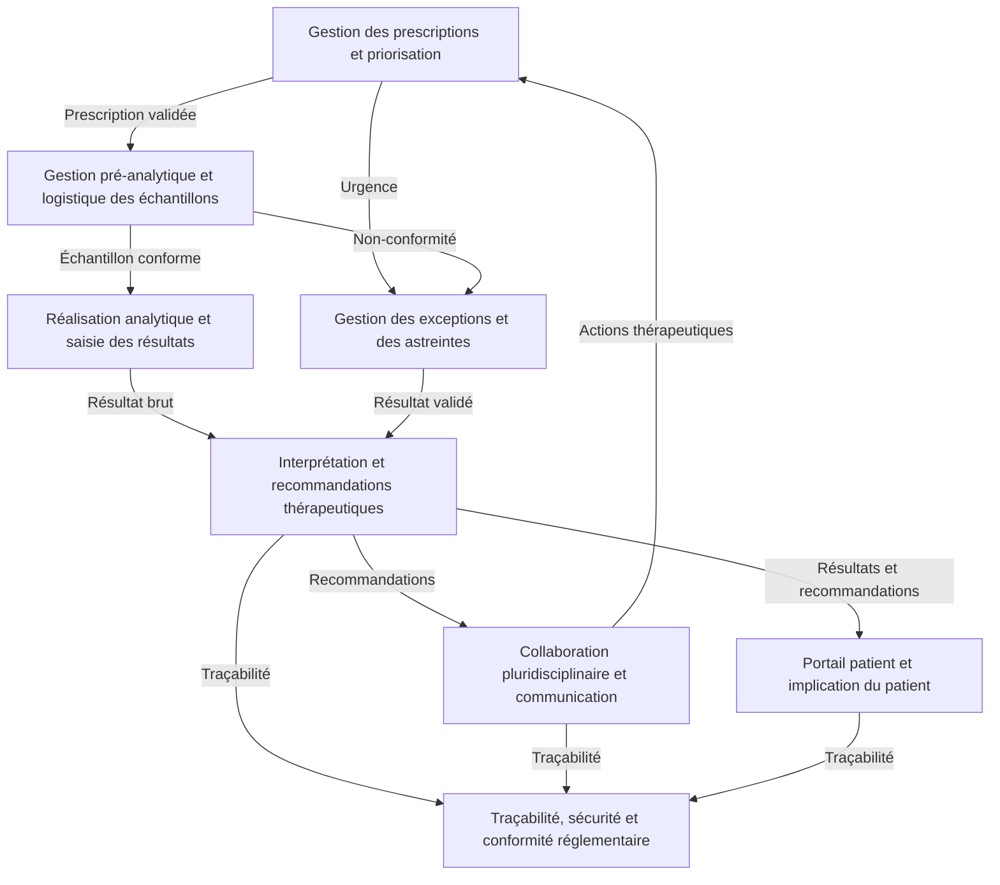

```markdown
# Synthèse du découpage en sous-domaines métier
**Gestion des demandes urgentes de dosage anti-Xa dans le SIL**
**Date** : [À compléter]
**Version** : 1.0
**Auteurs** : Analyste DDD
**Sources** : Livrables étape 1 et 2 (01_reformulation_du_besoin.md, 02_acteurs_du_domaine.md, 03_concepts_metier_initiaux.md, 04_contraintes_et_risques.md, 05_vision_globale_du_domaine.md, 01_cartographie_acteurs_responsabilites.md, 02_attentes_objectifs_acteurs.md, 03_decisions_informations_manipulees.md, 04_regles_metier.md, 05_priorites_exceptions_contraintes.md, 06_conflits_objectifs_arbitrages.md, 07_base_modelisation_comportementale.md)

---

## 1. Introduction
Ce document synthétise les **8 sous-domaines métier** identifiés pour le domaine des **demandes urgentes de dosage anti-Xa**, en s’appuyant sur une analyse approfondie des livrables des étapes 1 et 2. Il propose une **vision consolidée** du découpage du domaine global, en distinguant :
- Les **finalités métier** de chaque sous-domaine.
- Les **acteurs principaux** impliqués.
- Les **décisions et informations structurantes**.
- Les **règles métier spécifiques** ou probables.
- Les **interactions majeures** entre sous-domaines.
- La **classification** des sous-domaines en **cœur stratégique**, **support** et **générique**.
- Les **priorités de conception** pour les étapes suivantes.
- Les **hypothèses** et **points à clarifier** avec les experts métier.

Cette synthèse sert de **base fiable** pour l’étape 3 (modélisation comportementale) et garantit que le futur système répondra aux besoins métier tout en respectant les contraintes réglementaires et organisationnelles.

---

## 2. Carte synthétique des sous-domaines proposés



---

## 3. Classification des sous-domaines

### 3.1. Sous-domaines de cœur stratégique
**Définition** : Sous-domaines directement liés à la **valeur métier centrale** du domaine (prise en charge optimale des patients sous AOD) et à la **différenciation concurrentielle** du système d’information. Ils impactent directement la **qualité des soins**, la **sécurité des patients** et la **réputation de l’établissement**.

| **Sous-domaine** | **Finalité métier** | **Acteurs principaux** | **Règles métier critiques** | **Criticité** | **Différenciation** |
|------------------|---------------------|------------------------|-----------------------------|----------------|---------------------|
| **Gestion des prescriptions et priorisation** | Garantir que toute demande de dosage anti-Xa est **prescrite de manière conforme**, **validée cliniquement** et **priorisée automatiquement** avant toute analyse, afin d’éviter les prescriptions inappropriées, les erreurs de tri et les retards critiques. | Cliniciens prescripteurs, Biologistes médicaux, CAI, SIL | - **RME-01** : Prescription électronique obligatoire. <br> - **RME-02** : Respect des protocoles locaux. <br> - **RME-03** : Validation biologique obligatoire avant analyse. <br> - **RM-01** : Grille de priorisation automatique basée sur le contexte clinique. <br> - **RM-02** : Délais maximaux acceptables par niveau de priorité. | **Critique** (niveau 1) | **Élevée** (niveau 3) |
| **Interprétation et recommandations thérapeutiques** | Garantir que l’**interprétation des résultats** est **précise, contextualisée et sécurisée**, en tenant compte des données cliniques du patient (type d’AOD, posologie, heure de la dernière prise, fonction rénale) et en émettant des **recommandations thérapeutiques adaptées** pour une prise en charge optimale. | Biologistes médicaux, Pharmaciens hospitaliers, Cliniciens prescripteurs, CAI | - **RMI-01** : Grille d’interprétation par AOD. <br> - **RMI-02** : Recommandations thérapeutiques standardisées. <br> - **RMI-03** : Collaboration pluridisciplinaire. <br> - **RMI-04** : Adaptation posologique en fonction de la fonction rénale. <br> - **RMI-05** : Délais critiques pour l’adaptation thérapeutique. | **Critique** (niveau 1) | **Élevée** (niveau 3) |
| **Collaboration pluridisciplinaire et communication** | Faciliter la **communication et la collaboration** entre les différents acteurs (cliniciens, biologistes, pharmaciens, personnel administratif) pour une **prise en charge coordonnée et optimale** des patients sous AOD, en évitant les retards, les erreurs de transmission et les malentendus. | Cliniciens prescripteurs, Biologistes médicaux, Pharmaciens hospitaliers, Personnel administratif, SIL | - **RC-01** : Canaux de communication sécurisés. <br> - **RC-02** : Feedback des cliniciens. <br> - **RC-03** : Rôle du pharmacien dans l’urgence hémorragique. | **Critique** (niveau 1) | **Moyenne** (niveau 2) |

---

### 3.2. Sous-domaines de support
**Définition** : Sous-domaines **essentiels au bon fonctionnement** du circuit, mais qui ne sont pas directement liés à la valeur métier centrale. Ils assurent la **fiabilité**, la **traçabilité** et la **conformité** du système.

| **Sous-domaine** | **Finalité métier** | **Acteurs principaux** | **Règles métier critiques** | **Criticité** | **Différenciation** |
|------------------|---------------------|------------------------|-----------------------------|----------------|---------------------|
| **Gestion pré-analytique et logistique des échantillons** | Garantir que **tous les échantillons biologiques** (tubes de prélèvement) respectent les **exigences pré-analytiques strictes** avant analyse, et que leur **transport est optimisé** pour éviter les résultats invalides, les rejets d’échantillons et les retards critiques. | Techniciens de laboratoire, Cliniciens prescripteurs, Personnel administratif, SIL, Middleware | - **RMP-01** : Critères de conformité des tubes. <br> - **RMP-02** : Procédure de gestion des non-conformités. <br> - **RMP-03** : Archivage des échantillons non conformes. <br> - **RMP-04** : Signalement immédiat des non-conformités. <br> - **RMP-05** : Délais maximaux de transport. <br> - **RMP-06** : Conditions de transport. | **Critique** (niveau 1) | **Moyenne** (niveau 2) |
| **Réalisation analytique et saisie des résultats** | Garantir que **l’analyse du dosage anti-Xa** est réalisée avec **précision, rapidité et traçabilité**, en respectant les procédures analytiques et en évitant les erreurs de saisie ou de transmission des résultats. | Techniciens de laboratoire, Analyseurs de laboratoire, SIL, Middleware | - **RMA-01** : Respect des procédures analytiques. <br> - **RMA-02** : Contrôle qualité. <br> - **RMA-03** : Intégration automatique entre analyseurs et SIL. <br> - **RMA-04** : Double vérification des résultats critiques. | **Critique** (niveau 1) | **Moyenne** (niveau 2) |
| **Traçabilité, sécurité et conformité réglementaire** | Garantir une **traçabilité complète**, une **sécurité optimale des données** et une **conformité stricte** aux normes réglementaires (ISO 15189, RGPD) pour l’ensemble du circuit des demandes urgentes de dosage anti-Xa, depuis la prescription jusqu’à l’archivage. | SIL, DSI, Biologistes médicaux, Autorités réglementaires | - **RMT-01** : Traçabilité complète des actions. <br> - **RMT-02** : Conservation des logs pendant 10 ans. <br> - **RMT-03** : Respect du RGPD. <br> - **RMT-04** : Signature électronique pour les résultats validés. <br> - **RMT-05** : Audit interne/extern. | **Critique** (niveau 1) | **Faible** (niveau 1) |
| **Gestion des exceptions et des astreintes** | Garantir la **prise en charge des demandes urgentes en dehors des heures ouvrables** (nuit, week-end, jours fériés) et la **gestion des cas particuliers** (ex. : non-conformités, urgences vitales) pour éviter les retards critiques et les complications cliniques. | Biologistes d’astreinte, Personnel administratif, SIL, Équipe de gestion des risques | - **RMEX-01** : Liste des services couverts par l’astreinte. <br> - **RMEX-02** : Procédure de déclenchement de l’astreinte. <br> - **RMEX-03** : Gestion des non-conformités en astreinte. | **Critique** (niveau 1) | **Faible** (niveau 1) |

---
### 3.3. Sous-domaine générique
**Définition** : Sous-domaine **standardisé et réutilisable** dans d’autres contextes, souvent externalisable ou intégré via des solutions existantes.

| **Sous-domaine** | **Finalité métier** | **Acteurs principaux** | **Règles métier critiques** | **Criticité** | **Différenciation** |
|------------------|---------------------|------------------------|-----------------------------|----------------|---------------------|
| **Portail patient et implication du patient** | Permettre au **patient d’accéder à ses résultats** et de participer activement à sa prise en charge, en améliorant l’**adhésion au traitement** et la **transparence**, tout en garantissant la **confidentialité** et le **respect du RGPD**. | Patients, Cliniciens prescripteurs, SIL, DSI | - **RPP-01** : Données accessibles aux patients. <br> - **RPP-02** : Formation des patients. <br> - **RPP-03** : Respect du RGPD. | **Non critique** (niveau 2) | **Faible** (niveau 1) |

---

## 4. Finalités et responsabilités détaillées par sous-domaine

---

### 4.1. Gestion des prescriptions et priorisation (Cœur stratégique)
**Finalité métier** :
Garantir que **toute demande de dosage anti-Xa** est **prescrite de manière conforme aux protocoles**, **validée cliniquement** et **priorisée automatiquement** avant toute analyse, afin d’éviter les prescriptions inappropriées, les erreurs de tri et les retards critiques.

**Acteurs principaux** :
- **Cliniciens prescripteurs** (urgentistes, réanimateurs, chirurgiens, services extérieurs).
- **Biologistes médicaux** (validation biologique).
- **Commission des Anti-infectieux et des Anticoagulants (CAI)** (définition des protocoles).
- **Système d’Information de Laboratoire (SIL)** (enregistrement, priorisation, traçabilité).

**Décisions clés** :
| **Décision** | **Acteur responsable** | **Informations nécessaires** | **Informations produites** | **Règles métier associées** |
|--------------|------------------------|------------------------------|---------------------------|-----------------------------|
| Prescrire un dosage anti-Xa en urgence | Clinicien prescripteur | - Identité du patient <br> - Service prescripteur <br> - Contexte clinique (ex. : hémorragie active) <br> - Protocoles locaux ou recommandations HAS/ANSM <br> - Historique des traitements en cours | - Prescription électronique (obligatoire) <br> - Statut de la demande : "en attente" <br> - Données contextuelles saisies (type d’AOD, posologie, heure de dernière prise, clairance de la créatinine) | **RME-01** : Prescription électronique obligatoire <br> **RME-02** : Respect des protocoles locaux |
| Valider ou rejeter une demande de dosage | Biologiste médical | - Demande reçue dans le SIL <br> - Données contextuelles complètes <br> - Protocoles locaux | - Statut de la demande : "validée" ou "rejetée" <br> - Justification du rejet (si applicable) | **RME-03** : Validation biologique obligatoire avant analyse <br> **RME-04** : Rejet des demandes non conformes |
| Classer une demande par niveau d’urgence | Biologiste médical (ou SIL si automatisé) | - Niveau d’urgence clinique (hémorragie active, chirurgie en urgence, etc.) <br> - Délais critiques définis <br> - Disponibilité des ressources | - Niveau de priorité attribué (urgence absolue, haute, modérée, routine) <br> - Ordonnancement des analyses | **RM-01** : Grille de priorisation automatique basée sur le contexte clinique <br> **RM-02** : Délais maximaux acceptables par niveau de priorité |

**Règles métier spécifiques** :
- **RME-01** : Toute demande de dosage anti-Xa doit être formalisée via une **prescription électronique obligatoire** dans le SIL.
  - *Source* : 02_acteurs_du_domaine.md, 03_concepts_metier_initiaux.md.
  - *Justification* : Éviter les erreurs de transcription et garantir la traçabilité.
- **RME-02** : La prescription doit respecter les **indications définies par les protocoles de la CAI**.
  - *Source* : 02_acteurs_du_domaine.md.
  - *Justification* : Respecter les bonnes pratiques et éviter les prescriptions inappropriées.
- **RME-03** : Toute demande de dosage anti-Xa doit être **validée par un biologiste** avant analyse.
  - *Source* : 02_acteurs_du_domaine.md.
  - *Justification* : Garantir la pertinence clinique et éviter les analyses inutiles.
- **RM-01** : **Grille de priorisation automatique** basée sur le contexte clinique.
  - *Exemples* :
    - Hémorragie active → urgence absolue (délai ≤ 1h).
    - Chirurgie programmée → urgence haute (délai ≤ 4h).
    - Contrôle systématique → urgence modérée (délai ≤ 24h).
    - Routine → délai ≤ 48h.
  - *Source* : 01_reformulation_du_besoin.md, 03_concepts_metier_initiaux.md, 05_priorites_exceptions_contraintes.md.
  - *Justification* : Optimiser les ressources et réduire les risques cliniques.
- **RM-02** : **Délais maximaux acceptables par niveau de priorité**.
  - *Exemples* :
    - Urgence absolue : ≤ 1h.
    - Urgence haute : ≤ 4h.
    - Urgence modérée : ≤ 24h.
    - Routine : ≤ 48h.
  - *Source* : 04_contraintes_et_risques.md, 05_priorites_exceptions_contraintes.md.
  - *Justification* : Garantir une prise en charge thérapeutique optimale.

**Interactions majeures** :
- **Prescription → Validation → Priorisation** : Une prescription validée déclenche la priorisation et la transmission au laboratoire.
- **Traçabilité** : Toutes les actions (prescription, validation, priorisation) sont tracées pour la conformité réglementaire.

**Points à clarifier** :
1. **Automatisation de la priorisation** :
   - Le SIL doit-il classer automatiquement les demandes, ou cette tâche reste-t-elle manuelle pour les biologistes ?
2. **Critères exacts de rejet** :
   - Quels sont les seuils pour rejeter une demande (ex. : non-respect des protocoles, données manquantes) ?
3. **Rôle de la CAI dans la validation** :
   - La CAI valide-t-elle les protocoles, ou participe-t-elle aussi à la validation des demandes ?

---

### 4.2. Gestion pré-analytique et logistique des échantillons (Support)
**Finalité métier** :
Garantir que **tous les échantillons biologiques** (tubes de prélèvement) respectent les **exigences pré-analytiques strictes** avant analyse, et que leur **transport est optimisé** pour éviter les résultats invalides, les rejets d’échantillons et les retards critiques.

**Acteurs principaux** :
- **Techniciens de laboratoire** (vérification de la conformité, préparation des échantillons).
- **Cliniciens prescripteurs** (vérification initiale des tubes avant envoi).
- **Personnel administratif** (coordination du transport).
- **Système d’Information de Laboratoire (SIL)** (vérification automatique des conformités).
- **Middleware de laboratoire** (routage et vérification des échantillons).

**Décisions clés** :
| **Décision** | **Acteur responsable** | **Informations nécessaires** | **Informations produites** | **Règles métier associées** |
|--------------|------------------------|------------------------------|---------------------------|-----------------------------|
| Vérifier la conformité d’un tube | Technicien de laboratoire (assisté par le SIL) | - Type de tube (citraté 3.2%) <br> - Volume minimal requis <br> - Délai maximal entre prélèvement et analyse (< 4h) <br> - Conditions de transport (température 15-25°C, protection de la lumière) | - Statut de conformité : "conforme" ou "non conforme" <br> - Alerte au biologiste si non conforme | **RMP-01** : Critères de conformité des tubes <br> **RMP-02** : Procédure de gestion des non-conformités |
| Signaler une non-conformité ou un résultat aberrant | Technicien de laboratoire | - Détection d’une non-conformité ou d’un résultat aberrant <br> - Procédure de gestion des non-conformités | - Alerte au biologiste <br> - Demande de complément (nouveau prélèvement) si nécessaire <br> - Archivage de l’échantillon non conforme avec motif | **RMP-03** : Archivage des échantillons non conformes <br> **RMP-04** : Signalement immédiat des non-conformités |
| Coordonner le transport des échantillons | Personnel administratif | - Statut des prélèvements (en attente, en cours, terminés) <br> - Alertes de non-conformité ou de retard | - Relance du service prescripteur <br> - Mise à jour du statut dans le SIL | **RMP-05** : Délais maximaux de transport <br> **RMP-06** : Conditions de transport |

**Règles métier spécifiques** :
- **RMP-01** : **Critères de conformité des tubes**.
  - *Exemples* :
    - Type de tube : citraté 3.2% (ex. : BD Vacutainer 9NC 3.2%).
    - Volume minimal : 1.8 mL à 2.7 mL (selon l’analyseur).
    - Délai maximal entre prélèvement et analyse : < 4 heures.
    - Conditions de transport : température entre 15°C et 25°C, protection de la lumière.
  - *Source* : 04_contraintes_et_risques.md, 03_concepts_metier_initiaux.md.
  - *Justification* : Garantir la validité des résultats et éviter les rejets.
- **RMP-02** : **Procédure de gestion des non-conformités**.
  - *Exemples* :
    - Refus systématique de l’échantillon.
    - Demande de complément (nouveau prélèvement).
    - Escalade vers le biologiste pour décision.
  - *Source* : 04