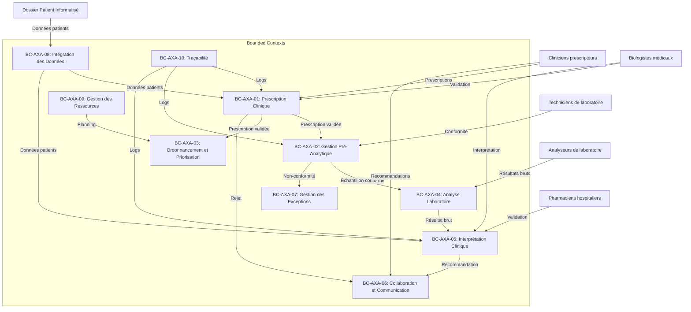

Voici une synthèse structurée et une proposition d'itération pour finaliser la définition des **Bounded Contexts** et leurs interactions, en mettant l'accent sur les **frontières claires**, les **contrats d'échange**, et les **points de validation critiques**. Je vais organiser cela en **3 parties** : **1) Validation des hypothèses et ambiguïtés**, **2) Formalisation des contrats**, et **3) Préparation pour la modélisation comportementale**.

---

## **1. Validation des Hypothèses et Ambiguïtés**
### **Points à valider avec les experts métier**
Ces questions doivent être clarifiées pour éviter des erreurs de conception ou des risques réglementaires :

| **ID** | **Hypothèse/Ambiguïté** | **Contexte** | **Questions pour les experts** | **Impact potentiel** |
|--------|--------------------------|--------------|-------------------------------|----------------------|
| **H1** | **Autorité en cas de désaccord** | BC-AXA-01 (Prescription Clinique) et BC-AXA-03 (Ordonnancement) | Qui tranche en cas de désaccord entre un clinicien et un biologiste sur la pertinence d'une prescription ? Existe-t-il une procédure d'escalade formalisée ? | Risque de retard ou de non-respect des protocoles CAI. |
| **H2** | **Flexibilité des protocoles CAI** | BC-AXA-01 | Les protocoles de la CAI sont-ils stricts ou peuvent-ils être adaptés par les cliniciens en cas de besoin ? Si oui, comment ces adaptations sont-elles documentées ? | Non-respect des recommandations HAS/ANSM → risque médico-légal. |
| **H3** | **Gestion des données manquantes** | BC-AXA-01 | Que faire si des données contextuelles sont manquantes (ex. : heure de la dernière prise d'AOD) ? Le SIL doit-il bloquer automatiquement la prescription ou permettre une validation conditionnelle ? | Résultats ininterprétables ou erreurs d'interprétation. |
| **H4** | **Critères de conformité pré-analytique par AOD** | BC-AXA-02 | Les exigences pour les tubes (type, volume, délai) varient-elles selon le type d'AOD (apixaban vs. rivaroxaban) ? Si oui, comment ces critères sont-ils affichés dans le SIL pour guider les techniciens ? | Rejet injustifié d'échantillons valides ou analyse de tubes non conformes. |
| **H5** | **Seuils d'interprétation** | BC-AXA-05 | Les seuils d'alerte pour les résultats aberrants (ex. : apixaban >1.5 UI/mL) sont-ils les mêmes pour tous les contextes cliniques (ex. : insuffisance rénale vs. hémorragie active) ? | Recommandations thérapeutiques inappropriées. |
| **H6** | **Responsabilité des non-conformités en astreinte** | BC-AXA-07 | Qui est responsable du suivi des échantillons non conformes en dehors des heures ouvrables ? Comment le biologiste d'astreinte est-il notifié ? | Perte de traçabilité ou retard dans la prise en charge. |
| **H7** | **Intégration DPI-Analyseurs-SIL** | BC-AXA-08 | Le SIL actuel est-il compatible avec le DPI et les analyseurs (ex. : ACL TOP, STA R Max) ? Quels formats de données sont utilisés (HL7 FHIR, API REST) ? | Erreurs de saisie manuelle ou perte de données. |
| **H8** | **Gestion des urgences hors protocole** | BC-AXA-03 et BC-AXA-07 | Comment gérer une demande urgente qui ne rentre pas dans les protocoles CAI (ex. : pédiatrie, volume <1 mL) ? | Retard dans la prise en charge ou non-respect des bonnes pratiques. |

---

## **2. Formalisation des Contrats entre Bounded Contexts**
### **Contrats d'échange (Data/Events) par contexte**
Chaque contrat doit inclure :
- **Données échangées** (format, exemple).
- **Fréquence** (temps réel, batch, événementiel).
- **Validation** (qui valide les données ?).
- **Risques** (que se passe-t-il en cas d'échec ?).

#### **Tableau des contrats**
| **Source** | **Cible** | **Données/Événements** | **Format** | **Fréquence** | **Validation** | **Risques** | **Exemple** |
|------------|-----------|-------------------------|------------|---------------|----------------|-------------|-------------|
| **BC-AXA-01** | **BC-AXA-02** | Prescription validée (avec contexte clinique) | JSON (SIL → SIL) | Temps réel | Biologiste valide la prescription | Non-conformité → rejet de l'échantillon | `{ "prescriptionId": "P123", "patientId": "PAT001", "aodType": "Apixaban", "lastDoseTime": "14:30", "creatinineClearance": "45 mL/min", "clinicalContext": "ActiveHemorrhage" }` |
| **BC-AXA-01** | **BC-AXA-03** | Prescription validée (avec niveau d'urgence) | JSON (SIL → SIL) | Temps réel | SIL classe automatiquement l'urgence | Mauvaise classification → retard critique | `{ "prescriptionId": "P123", "urgencyLevel": "Absolute", "maxDeadline": "2024-06-10T16:00:00Z" }` |
| **BC-AXA-02** | **BC-AXA-04** | Échantillon conforme (avec statut) | JSON (SIL → SIL) | Temps réel | Technicien valide la conformité | Échantillon non conforme → rejet | `{ "sampleId": "S456", "status": "Conforme", "tubeType": "Citrate3.2%", "volume": "2.0 mL", "transportTime": "3h" }` |
| **BC-AXA-04** | **BC-AXA-05** | Résultat brut (avec données de l'analyseur) | JSON (Analyseur → SIL) | Temps réel | SIL transmet les données brutes | Données corrompues → erreur d'interprétation | `{ "resultId": "R789", "antiXaValue": "1.2 UI/mL", "analyzerId": "ACL_TOP_01", "timestamp": "2024-06-10T15:45:00Z" }` |
| **BC-AXA-05** | **BC-AXA-06** | Recommandation thérapeutique (validée) | Message structuré (SIL → Cliniciens) | Immédiat | Pharmacien valide la recommandation | Recommandation non suivie → risque clinique | `{ "patientId": "PAT001", "recommendation": "Dose réduite à 2.5mg/12h", "validatedBy": "Pharmacien01", "timestamp": "2024-06-10T15:50:00Z" }` |
| **BC-AXA-01** | **BC-AXA-06** | Motif de rejet ou demande d'informations supplémentaires | Message structuré (SIL → Cliniciens) | Immédiat | Biologiste justifie le rejet | Prescription non corrigée → retard | `{ "prescriptionId": "P124", "reason": "MissingLastDoseTime", "actionRequired": "Update prescription" }` |
| **BC-AXA-08** | **Tous les contextes** | Données patients (clairance de la créatinine, traitements en cours) | HL7 FHIR (DPI → SIL) | Batch (toutes les 4h) ou temps réel | SIL valide les données | Données obsolètes → interprétation erronée | `{ "patientId": "PAT001", "creatinineClearance": "45 mL/min", "currentTreatments": ["Apixaban 5mg/12h"] }` |
| **Tous les contextes** | **BC-AXA-10** | Logs d'audit (actions, décisions, timestamps) | JSON (SIL) | Temps réel | SIL archive les logs | Perte de traçabilité → non-conformité ISO 15189 | `{ "action": "PrescriptionValidated", "userId": "Biologiste01", "timestamp": "2024-06-10T15:30:00Z", "data": { ... } }` |

---

### **Règles de validation inter-contextes**
Ces règles doivent être **automatisées** dans le SIL pour éviter les erreurs humaines :

| **Règle** | **Contexte Source** | **Contexte Cible** | **Description** | **Exemple** |
|-----------|---------------------|--------------------|-----------------|-------------|
| **R-VAL-01** | BC-AXA-01 | BC-AXA-02 | Une prescription ne peut être transmise à BC-AXA-02 que si elle est **validée biologiquement**. | Si `prescription.status != "validated"`, bloquer l'envoi à BC-AXA-02. |
| **R-VAL-02** | BC-AXA-02 | BC-AXA-04 | Un échantillon ne peut être analysé que s'il est **conforme**. | Si `sample.status != "conforme"`, bloquer l'analyse et notifier BC-AXA-06. |
| **R-VAL-03** | BC-AXA-03 | BC-AXA-04 | Une analyse ne peut être planifiée que si une **prescription validée et un échantillon conforme** existent. | Vérifier la présence des deux avant de lancer l'analyse. |
| **R-VAL-04** | BC-AXA-05 | BC-AXA-06 | Une recommandation thérapeutique ne peut être envoyée que si elle est **validée par un pharmacien**. | Si `recommendation.status != "validated"`, bloquer l'envoi. |
| **R-VAL-05** | BC-AXA-08 | Tous les contextes | Les données patients (ex. : clairance de la créatinine) doivent être **à jour** (<24h). | Si `creatinineClearance.timestamp > 24h`, rafraîchir les données avant interprétation. |

---

## **3. Préparation pour la Modélisation Comportementale (Étape 5)**
### **Prochaines étapes pour affiner les Bounded Contexts**
#### **Étape 5.1 : Identifier les Aggregates et Entités**
Pour chaque contexte, définir :
- **Aggregates** (racines de cohérence transactionnelle).
- **Entités** (objets avec identité).
- **Value Objects** (objets sans identité, immuables).

| **Context** | **Aggregate** | **Entités** | **Value Objects** |
|-------------|---------------|-------------|-------------------|
| **BC-AXA-01** | `Prescription` | Clinician, Biologist, CAIProtocol | PrescriptionStatus, ClinicalContext |
| **BC-AXA-02** | `Sample` | Technician, Biologist | SampleStatus, TubeType, Volume |
| **BC-AXA-03** | `Request` | Biologist, SIL | UrgencyLevel, MaxDeadline |
| **BC-AXA-04** | `Analysis` | Technician, Analyzer | ResultStatus, AnalyzerId |
| **BC-AXA-05** | `Interpretation` | Biologist, Pharmacist | InterpretationGrid, AlertThreshold |
| **BC-AXA-06** | `Communication` | Clinician, Biologist, Pharmacist | MessageStatus, Priority |
| **BC-AXA-07** | `OnCallSchedule` | Biologist, Administrator | OnCallShift, ExceptionType |
| **BC-AXA-08** | `DataIntegration` | DSI, Middleware | DataFormat, IntegrationStatus |
| **BC-AXA-10** | `AuditLog` | SIL | LogEntry, RetentionPeriod |

#### **Étape 5.2 : Définir les Domain Events**
Les événements doivent être **asynchrones** et **idempotents** pour éviter les doublons.

| **Contexte** | **Événement** | **Payload** | **Destinataires** |
|--------------|---------------|-------------|-------------------|
| BC-AXA-01 | `PrescriptionValidated` | prescriptionId, validatedBy | BC-AXA-02, BC-AXA-03 |
| BC-AXA-01 | `PrescriptionRejected` | prescriptionId, reason | BC-AXA-06 |
| BC-AXA-02 | `SampleConformityVerified` | sampleId, status | BC-AXA-04 |
| BC-AXA-02 | `SampleNonConformityDetected` | sampleId, reason | BC-AXA-06, BC-AXA-07 |
| BC-AXA-03 | `UrgentRequestDetected` | requestId, urgencyLevel | BC-AXA-04 |
| BC-AXA-04 | `ResultAvailable` | resultId, antiXaValue | BC-AXA-05 |
| BC-AXA-05 | `InterpretationCompleted` | interpretationId, recommendation | BC-AXA-06 |
| BC-AXA-07 | `OnCallActivated` | shiftId, exceptionType | BC-AXA-02, BC-AXA-03 |

#### **Étape 5.3 : Concevoir les Services Domaines**
Exemples de services à implémenter :

| **Contexte** | **Service Domaine** | **Responsabilité** |
|--------------|---------------------|--------------------|
| BC-AXA-01 | `PrescriptionValidationService` | Valider une prescription selon les protocoles CAI. |
| BC-AXA-02 | `SampleConformityService` | Vérifier la conformité d'un échantillon. |
| BC-AXA-03 | `PrioritizationService` | Classer une demande par niveau d'urgence. |
| BC-AXA-05 | `InterpretationGridService` | Appliquer les grilles d'interprétation pour un AOD donné. |
| BC-AXA-07 | `OnCallManagementService` | Gérer les astreintes et les exceptions. |

---
## **4. Recommandations pour la Suite**
### **Pour les équipes techniques**
1. **Architecture Technique Proposée** :
   - **Frontend** : Interface SIL pour les cliniciens et biologistes.
   - **Backend** :
     - **Microservices** pour chaque Bounded Context (ex. : `prescription-service`, `sample-service`).
     - **Event-Driven Architecture** (Kafka/RabbitMQ) pour les échanges asynchrones.
     - **Base de données par contexte** (ou schéma dédié) pour éviter les couplages.
   - **Intégration** :
     - **HL7 FHIR** pour les échanges avec le DPI.
     - **API REST** pour les interactions entre microservices.
     - **Middleware** pour la gestion des files d'attente (ex. : Apache Kafka).

2. **Sécurité et Conformité** :
   - **Chiffrement** des données sensibles (ex. : résultats de dosage).
   - **Authentification forte** (ex. : carte CPS pour les biologistes).
   - **Journalisation centralisée** (ex. : ELK Stack) pour la traçabilité.

3. **Tests et Validation** :
   - **Tests unitaires** pour les règles métier (ex. : validation des prescriptions).
   - **Tests d'intégration** pour les contrats entre contextes.
   - **Tests de charge** pour les pics d'activité (ex. : épidémie).

### **Pour les équipes métier**
1. **Formation et Adoption** :
   - Former les cliniciens à la **prescription électronique** et aux **protocoles CAI**.
   - Former les techniciens à la **vérification pré-analytique** et aux **critères de conformité**.
   - Former les biologistes à la **priorisation** et à l'**interprétation des résultats**.

2. **Gestion du Changement** :
   - Impliquer les **utilisateurs finaux** (cliniciens, techniciens) dans les ateliers de conception.
   - Prévoir une **période de transition** avec double saisie (ancien système + nouveau SIL).

3. **Amélioration Continue** :
   - Mettre en place un **comité de pilotage** pour ajuster les protocoles CAI et les grilles d'interprétation.
   - Recueillir des **retours terrain** pour affiner les règles métier.

---
## **5. Livrables à Produire**
| **Livrable** | **Description** | **Responsable** | **Échéance** |
|---------------|-----------------|-----------------|--------------|
| **Document de synthèse des Bounded Contexts** | Version finale des BCs avec frontières, contrats, et règles. | Analyste DDD | J+7 |
| **Spécifications techniques des contrats** | Détails des formats, protocoles, et validations pour chaque échange. | Architecte Logiciel | J+14 |
| **Maquettes des interfaces SIL** | Prototype des écrans pour les cliniciens et biologistes. | UX/UI Designer | J+21 |
| **Plan de tests** | Stratégie de tests (unitaires, intégration, charge). | Testeur QA | J+28 |
| **Plan de formation** | Supports et sessions pour les utilisateurs. | Responsable Formation | J+35 |

---
## **6. Points de Vigilance**
1. **Couplage entre contextes** :
   - Éviter que **BC-AXA-01** (Prescription) ne dépende directement de **BC-AXA-05** (Interprétation).
   - Utiliser des **contrats asynchrones** (événements) plutôt que des appels synchrones.

2. **Évolutivité** :
   - Prévoir des **mécanismes de re-priorisation** en cas de pic d'activité (ex. : épidémie).
   - Concevoir les **grilles d'interprétation** pour être facilement modifiables (ex. : par AOD).

3. **Conformité réglementaire** :
   - Vérifier que le système respecte **ISO 15189** (traçabilité, contrôle qualité).
   - Documenter les **procédures d'escalade** pour les exceptions (ex. : non-conformités en astreinte).

---
## **7. Exemple de Diagramme de Contexte (Context Map)**

---
## **8. Prochaine Action : Atelier de Validation**
**Objectif** : Valider avec les experts métier :
1. Les **frontières des Bounded Contexts**.
2. Les **contrats d'échange** (données/événements).
3. Les **règles métier** (ex. : seuils d'interprétation).
4. Les **hypothèses critiques** (ex. : autorité en cas de désaccord).

**Participants** :
- Cliniciens prescripteurs.
- Biologistes médicaux.
- Techniciens de laboratoire.
- Pharmaciens hospitaliers.
- Représentants de la CAI.
- Équipe DSI.

**Durée** : 2 heures (format : présentation + questions/réponses).

---
### **Synthèse des Actions Immédiates**
| **Action** | **Responsable** | **Échéance** | **Livrable** |
|------------|-----------------|--------------|--------------|
| Organiser l'atelier de validation | Analyste DDD | J+2 | Compte-rendu avec décisions |
| Mettre à jour le document des BCs | Analyste DDD | J+3 | Version 2.0 |
| Finaliser les spécifications techniques | Architecte Logiciel | J+7 | Document d'architecture |
| Concevoir les maquettes SIL | UX/UI Designer | J+10 | Prototype Figma |

---
**Question pour toi** :
Veux-tu que je détaille davantage un point spécifique (ex. : exemple de code pour un service domaine, ou un template pour le compte-rendu d'atelier) ? Ou préfères-tu passer directement à la modélisation comportementale (Étape 5) ?