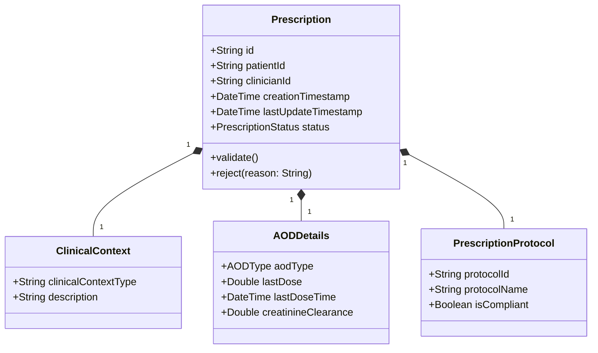
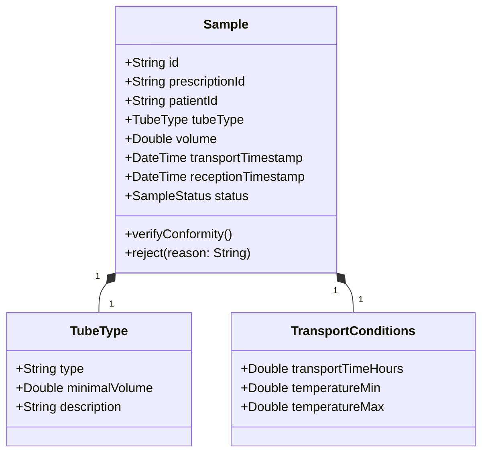
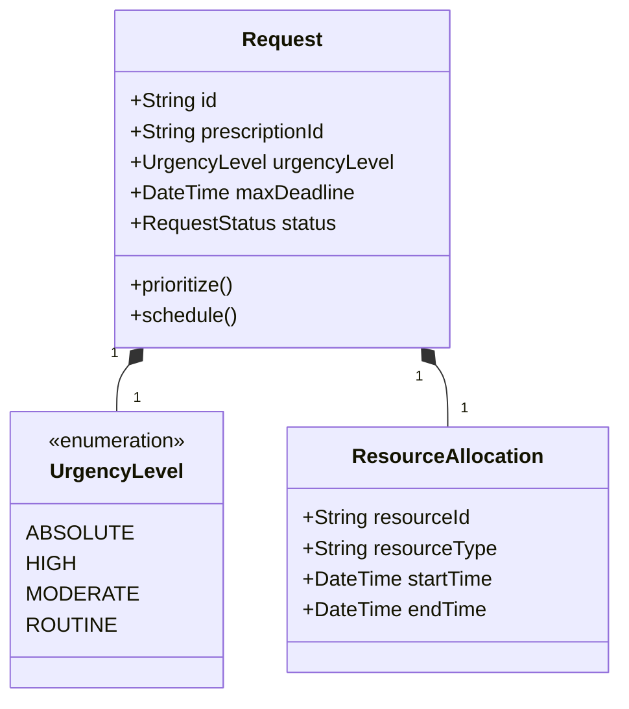
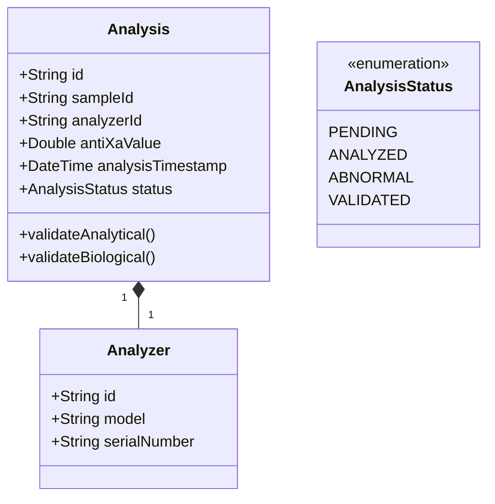
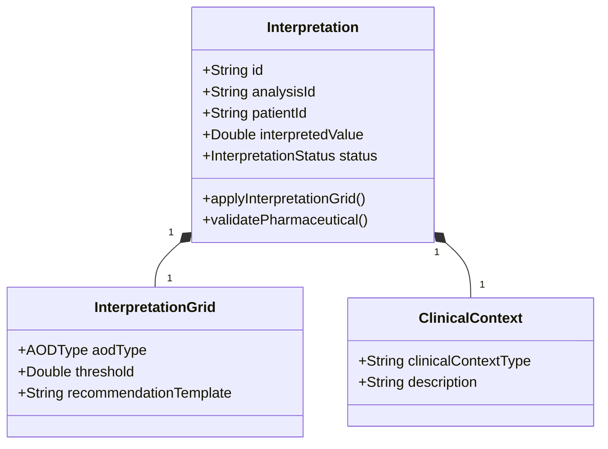
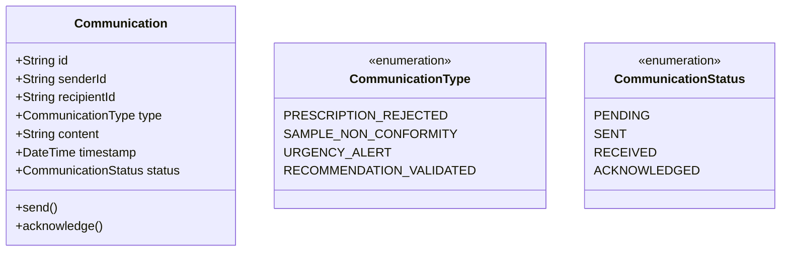
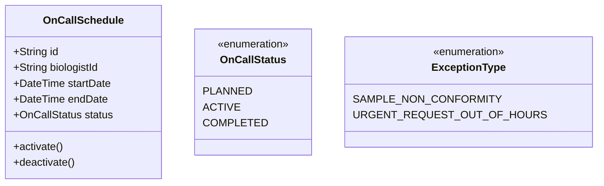
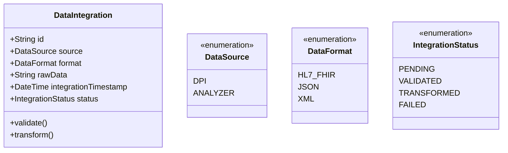
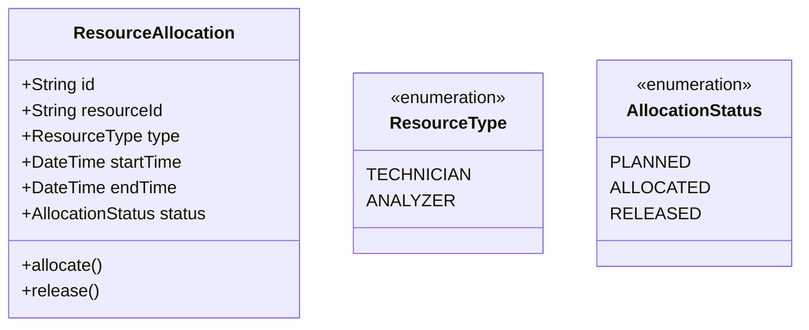
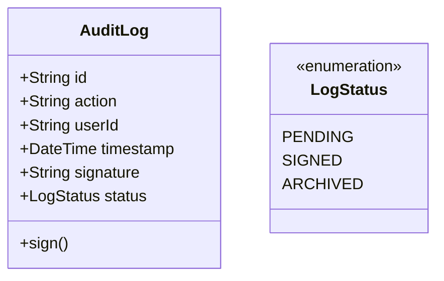

# **Agrégats et Entités du Domaine**
**Domaine métier** : Gestion des demandes urgentes de dosage anti-Xa dans le SIL
**Date** : 2024-06-15
**Version** : 1.0
**Auteurs** : Architecte DDD
**Sources** : Livrables étape 5 (`01_contextes_candidats.md`, `02_frontieres_responsabilites_contextes.md`, `03_vocabulaire_modeles_par_contexte.md`, `04_dependances_contrats_contextes.md`, `05_risques_arbitrages_contextes.md`, `06_cartographie_bounded_contexts.md`, `07_synthese_bounded_contexts.md`)

---

---

## **1. Introduction**
Ce document formalise la **modélisation comportementale** des **Bounded Contexts (BCs)** identifiés pour le domaine des **demandes urgentes de dosage anti-Xa** dans le SIL. Il se concentre sur :
- L'identification des **agrégats** (racines de cohérence transactionnelle) et de leurs **entités**.
- La définition des **attributs principaux** et des **identifiants métiers** pour chaque entité.
- La description du **cycle de vie métier** des agrégats.
- La justification des **périmètres de cohérence** choisis.
- La mise en évidence des **entités partagées ou ambiguës** entre contextes.

**Objectifs** :
- Fournir un **modèle métier formel** exploitable par les experts et les développeurs.
- Clarifier les **frontières de responsabilité** des agrégats.
- Identifier les **invariants** et les **règles métier** à sécuriser.
- Préparer la conception des **services de domaine** et des **événements de domaine**.

**Méthodologie** :
- Chaque BC est analysé indépendamment, en respectant ses frontières sémantiques.
- Les **agrégats** sont identifiés comme des grappes d'objets traités comme une unité de cohérence, avec une **racine d'agrégat** unique.
- Les **entités** sont définies par leur **identité métier** et leur **cycle de vie**.
- Les **objets valeur** sont utilisés pour encapsuler des propriétés immuables (ex: `UrgencyLevel`, `TubeType`).
- Les **invariants** sont explicitement documentés pour chaque agrégat.

---

---

## **2. BC-AXA-01 : Prescription Clinique**
**Type** : Cœur stratégique
**Responsabilité principale** :
Gérer la **prescription électronique** des dosages anti-Xa en urgence et valider leur **pertinence clinique** selon les protocoles locaux (CAI) et les recommandations HAS/ANSM.

---

### **2.1. Agrégats et Entités**

#### **Agrégat : `Prescription`**
- **Racine d'agrégat** : `Prescription`
- **Périmètre de cohérence** :
  - Une prescription est une **unité transactionnelle** : elle ne peut être modifiée ou validée que dans son ensemble.
  - Les **données contextuelles** (type d'AOD, posologie, heure de dernière prise, fonction rénale) sont **indissociables** de la prescription pour garantir une validation pertinente.
  - **Invariant** : Une prescription doit être **validée biologiquement** avant d'être transmise à BC-AXA-02 (Gestion Pré-Analytique) ou BC-AXA-03 (Ordonnancement).
- **Cycle de vie métier** :
  1. **Création** : Saisie par le clinicien via le SIL.
  2. **Validation partielle** : Vérification automatique des données obligatoires (ex: type d'AOD, heure de dernière prise).
  3. **Validation biologique** : Validation par un biologiste (statut `validated` ou `rejected`).
  4. **Transmission** : Si validée, transmission à BC-AXA-02 et BC-AXA-03.
  5. **Archivage** : Conservation pendant 10 ans pour conformité réglementaire.

---

#### **Entités de l'agrégat `Prescription`**

| **Entité** | **Identifiant métier** | **Attributs principaux** | **Cycle de vie** | **Rôle dans l'agrégat** |
|------------|------------------------|--------------------------|------------------|-------------------------|
| **Prescription** | `id` (UUID) | `patientId`, `clinicianId`, `creationTimestamp`, `lastUpdateTimestamp`, `status` | Création → Validation → Transmission → Archivage | Racine de l'agrégat. Gère les opérations de validation et de rejet. |
| **ClinicalContext** | `clinicalContextType` (enum: `ActiveHemorrhage`, `PreSurgery`, `PostSurgery`, `RoutineMonitoring`) | `description` | Création → Archivage | Décrit le contexte clinique justifiant la prescription. |
| **AODDetails** | `aodType` (enum: `Apixaban`, `Rivaroxaban`, `Edoxaban`) | `lastDose`, `lastDoseTime`, `creatinineClearance` | Création → Archivage | Détaille les informations spécifiques à l'AOD prescrit. |
| **PrescriptionProtocol** | `protocolId` | `protocolName`, `isCompliant` | Création → Archivage | Indique si la prescription est conforme aux protocoles CAI. |

---

#### **Objets Valeur**
| **Objet Valeur** | **Description** | **Exemple** |
|------------------|-----------------|-------------|
| **PrescriptionStatus** | Statut de la prescription. | `pending`, `validated`, `rejected` |
| **AODType** | Type d'anticoagulant oral direct. | `Apixaban`, `Rivaroxaban`, `Edoxaban` |
| **ClinicalContextType** | Type de contexte clinique. | `ActiveHemorrhage`, `PreSurgery` |

---

#### **Invariants de l'agrégat `Prescription`**
1. **Données obligatoires** :
   - Une prescription doit contenir :
     - `patientId` (identifiant du patient).
     - `aodType` (type d'AOD).
     - `lastDoseTime` (heure de la dernière prise).
     - `creatinineClearance` (clairance de la créatinine).
     - `clinicalContextType` (contexte clinique).
   - **Violation** : La prescription est marquée comme `incomplete` et bloquée pour validation.

2. **Validation biologique** :
   - Une prescription ne peut être transmise à BC-AXA-02 ou BC-AXA-03 que si son `status` est `validated`.
   - **Violation** : La prescription est rejetée avec un motif (`reason`).

3. **Conformité aux protocoles CAI** :
   - Le champ `isCompliant` de `PrescriptionProtocol` doit être `true` pour que la prescription soit validée.
   - **Violation** : La prescription est marquée comme `nonCompliant` et nécessite une justification manuelle du biologiste.

---

#### **Événements de Domaine**
| **Événement** | **Payload** | **Destinataires** |
|---------------|-------------|-------------------|
| `PrescriptionCreated` | `{ "prescriptionId": "P123", "patientId": "PAT001", "aodType": "Apixaban" }` | BC-AXA-01 (interne) |
| `PrescriptionValidated` | `{ "prescriptionId": "P123", "validatedBy": "Biologiste01" }` | BC-AXA-02, BC-AXA-03 |
| `PrescriptionRejected` | `{ "prescriptionId": "P124", "reason": "MissingLastDoseTime" }` | BC-AXA-06 (cliniciens) |

---

#### **Points à Clarifier**
| **Ambiguïté** | **Question** | **Impact potentiel** |
|---------------|--------------|----------------------|
| **Autorité en cas de désaccord** | Qui tranche si un clinicien conteste un rejet de prescription ? | Retard dans la prise en charge ou non-respect des protocoles. |
| **Flexibilité des protocoles CAI** | Les protocoles sont-ils stricts ou peuvent-ils être adaptés ? | Non-respect des recommandations HAS/ANSM. |
| **Gestion des données manquantes** | Que faire si `lastDoseTime` est manquant ? | Prescription incomplète → blocage. |

---

---

## **3. BC-AXA-02 : Gestion Pré-Analytique**
**Type** : Support
**Responsabilité principale** :
Vérifier la **conformité des échantillons biologiques** (tubes) avant analyse et gérer les **non-conformités** selon les exigences réglementaires (ISO 15189, RGPD).

---

### **3.1. Agrégats et Entités**

#### **Agrégat : `Sample`**
- **Racine d'agrégat** : `Sample`
- **Périmètre de cohérence** :
  - Un échantillon est une **unité transactionnelle** : son statut (conforme/non conforme) détermine s'il peut être analysé.
  - Les **données de conformité** (type de tube, volume, délai de transport) sont **indissociables** de l'échantillon.
  - **Invariant** : Un échantillon non conforme ne peut pas être transmis à BC-AXA-04 (Analyse Laboratoire).
- **Cycle de vie métier** :
  1. **Réception** : Arrivée de l'échantillon au laboratoire.
  2. **Vérification pré-analytique** : Contrôle du type de tube, du volume, et du délai de transport.
  3. **Validation** : Validation par le technicien (statut `conforme` ou `nonConforme`).
  4. **Transmission** : Si conforme, transmission à BC-AXA-04.
  5. **Gestion des non-conformités** : Archivage avec motif si non conforme.
  6. **Archivage** : Conservation pendant 10 ans pour conformité réglementaire.

---

#### **Entités de l'agrégat `Sample`**

| **Entité** | **Identifiant métier** | **Attributs principaux** | **Cycle de vie** | **Rôle dans l'agrégat** |
|------------|------------------------|--------------------------|------------------|-------------------------|
| **Sample** | `id` (UUID) | `prescriptionId`, `patientId`, `tubeType`, `volume`, `transportTimestamp`, `receptionTimestamp`, `status` | Réception → Vérification → Validation → Archivage | Racine de l'agrégat. Gère les opérations de vérification et de rejet. |
| **TubeType** | `type` (enum: `Citrate3.2%`, `EDTA`, `Heparin`) | `minimalVolume`, `description` | Création → Archivage | Définit le type de tube et le volume minimal requis. |
| **TransportConditions** | `transportTimeHours` | `temperatureMin`, `temperatureMax` | Création → Archivage | Décrit les conditions de transport de l'échantillon. |

---
#### **Objets Valeur**
| **Objet Valeur** | **Description** | **Exemple** |
|------------------|-----------------|-------------|
| **SampleStatus** | Statut de l'échantillon. | `pending`, `conforme`, `nonConforme` |
| **TubeType** | Type de tube de prélèvement. | `Citrate3.2%`, `EDTA` |

---
#### **Invariants de l'agrégat `Sample`**
1. **Type de tube** :
   - Le `tubeType` doit être `Citrate3.2%`.
   - **Violation** : L'échantillon est marqué comme `nonConforme` avec le motif `incorrectTubeType`.

2. **Volume minimal** :
   - Le `volume` doit être ≥ `minimalVolume` du `TubeType`.
   - **Violation** : L'échantillon est marqué comme `nonConforme` avec le motif `insufficientVolume`.

3. **Délai de transport** :
   - Le `transportTimeHours` doit être ≤ 4 heures.
   - **Violation** : L'échantillon est marqué comme `nonConforme` avec le motif `transportTimeExceeded`.

4. **Conditions de transport** :
   - La température doit être entre 15°C et 25°C.
   - **Violation** : L'échantillon est marqué comme `nonConforme` avec le motif `temperatureOutOfRange`.

---
#### **Événements de Domaine**
| **Événement** | **Payload** | **Destinataires** |
|---------------|-------------|-------------------|
| `SampleReceived` | `{ "sampleId": "S456", "prescriptionId": "P123" }` | BC-AXA-02 (interne) |
| `SampleConformityVerified` | `{ "sampleId": "S456", "status": "conforme" }` | BC-AXA-04 |
| `SampleNonConformityDetected` | `{ "sampleId": "S457", "reason": "insufficientVolume" }` | BC-AXA-06, BC-AXA-07 |

---
#### **Points à Clarifier**
| **Ambiguïté** | **Question** | **Impact potentiel** |
|---------------|--------------|----------------------|
| **Critères de conformité par AOD** | Les exigences pour les tubes varient-elles selon l'AOD ? | Rejet injustifié d'échantillons valides ou analyse de tubes non conformes. |
| **Responsabilité en cas de non-conformité** | Qui notifie le clinicien en cas de tube non conforme ? | Perte de traçabilité ou retard dans la prise en charge. |

---

---

## **4. BC-AXA-03 : Ordonnancement et Priorisation**
**Type** : Cœur stratégique
**Responsabilité principale** :
Classer les **demandes de dosage anti-Xa** par **niveau d'urgence clinique** et ordonnancer les analyses en fonction des **ressources disponibles** (techniciens, analyseurs) et des **délais critiques**.

---
### **4.1. Agrégats et Entités**

#### **Agrégat : `Request`**
- **Racine d'agrégat** : `Request`
- **Périmètre de cohérence** :
  - Une demande est une **unité transactionnelle** : son niveau de priorité détermine son ordonnancement.
  - Les **données de priorisation** (niveau d'urgence, délai critique) sont **indissociables** de la demande.
  - **Invariant** : Une demande doit être **priorisée** avant d'être transmise à BC-AXA-04 (Analyse Laboratoire).
- **Cycle de vie métier** :
  1. **Réception** : Arrivée de la demande validée depuis BC-AXA-01.
  2. **Priorisation automatique** : Classement par niveau d'urgence (absolu, haute, modérée, routine).
  3. **Ordonnancement** : Planification en fonction des ressources disponibles.
  4. **Transmission** : Transmission à BC-AXA-04 si priorisée.
  5. **Archivage** : Conservation pendant 10 ans pour conformité réglementaire.

---
#### **Entités de l'agrégat `Request`**

| **Entité** | **Identifiant métier** | **Attributs principaux** | **Cycle de vie** | **Rôle dans l'agrégat** |
|------------|------------------------|--------------------------|------------------|-------------------------|
| **Request** | `id` (UUID) | `prescriptionId`, `urgencyLevel`, `maxDeadline`, `status` | Réception → Priorisation → Ordonnancement → Archivage | Racine de l'agrégat. Gère les opérations de priorisation et d'ordonnancement. |
| **UrgencyLevel** | `urgencyLevel` (enum) | - | Création → Archivage | Définit le niveau d'urgence de la demande. |
| **ResourceAllocation** | `resourceId` | `resourceType`, `startTime`, `endTime` | Création → Archivage | Décrit l'allocation des ressources pour l'analyse. |

---
#### **Objets Valeur**
| **Objet Valeur** | **Description** | **Exemple** |
|------------------|-----------------|-------------|
| **UrgencyLevel** | Niveau d'urgence de la demande. | `ABSOLUTE`, `HIGH`, `MODERATE`, `ROUTINE` |
| **RequestStatus** | Statut de la demande. | `pending`, `prioritized`, `scheduled`, `completed` |

---
#### **Invariants de l'agrégat `Request`**
1. **Niveau d'urgence** :
   - Le `urgencyLevel` doit être défini selon les critères CAI (ex: `ABSOLUTE` pour une hémorragie active).
   - **Violation** : La demande est marquée comme `invalid` et nécessite une intervention manuelle.

2. **Délai critique** :
   - Le `maxDeadline` doit être calculé en fonction du `urgencyLevel` (ex: 1 heure pour `ABSOLUTE`).
   - **Violation** : Une alerte est déclenchée pour notifier le biologiste.

3. **Ordonnancement** :
   - Une demande ne peut être transmise à BC-AXA-04 que si son `status` est `scheduled`.
   - **Violation** : La demande reste en attente jusqu'à ce que les ressources soient disponibles.

---
#### **Événements de Domaine**
| **Événement** | **Payload** | **Destinataires** |
|---------------|-------------|-------------------|
| `RequestReceived` | `{ "requestId": "R789", "prescriptionId": "P123", "urgencyLevel": "ABSOLUTE" }` | BC-AXA-03 (interne) |
| `RequestPrioritized` | `{ "requestId": "R789", "urgencyLevel": "ABSOLUTE", "maxDeadline": "2024-06-10T16:00:00Z" }` | BC-AXA-04 |
| `UrgencyAlertTriggered` | `{ "requestId": "R790", "urgencyLevel": "HIGH" }` | BC-AXA-06 |

---
#### **Points à Clarifier**
| **Ambiguïté** | **Question** | **Impact potentiel** |
|---------------|--------------|----------------------|
| **Critères exacts d'urgence absolue** | Quels sont les critères cliniques pour classer une demande en `ABSOLUTE` ? | Retard dans la prise en charge des urgences critiques. |
| **Autorité en cas de conflit de priorité** | Qui tranche si deux demandes ont le même niveau d'urgence ? | Retard ou erreur d'ordonnancement. |

---

---

## **5. BC-AXA-04 : Analyse Laboratoire**
**Type** : Support
**Responsabilité principale** :
Réaliser les **dosages anti-Xa** sur les échantillons conformes et transmettre les **résultats bruts** de manière fiable et traçable au SIL.

---
### **5.1. Agrégats et Entités**

#### **Agrégat : `Analysis`**
- **Racine d'agrégat** : `Analysis`
- **Périmètre de cohérence** :
  - Une analyse est une **unité transactionnelle** : son résultat brut détermine si elle peut être interprétée.
  - Les **données de l'analyseur** (ID, timestamp) sont **indissociables** du résultat.
  - **Invariant** : Un résultat aberrant doit être **validé manuellement** par un biologiste avant transmission à BC-AXA-05.
- **Cycle de vie métier** :
  1. **Lancement** : Transmission de l'échantillon conforme depuis BC-AXA-02.
  2. **Exécution** : Réalisation de l'analyse par l'analyseur.
  3. **Validation analytique** : Vérification automatique de la cohérence du résultat.
  4. **Validation biologique** : Validation manuelle par un biologiste si résultat aberrant.
  5. **Transmission** : Transmission du résultat brut à BC-AXA-05.
  6. **Archivage** : Conservation pendant 10 ans pour conformité réglementaire.

---
#### **Entités de l'agrégat `Analysis`**

| **Entité** | **Identifiant métier** | **Attributs principaux** | **Cycle de vie** | **Rôle dans l'agrégat** |
|------------|------------------------|--------------------------|------------------|-------------------------|
| **Analysis** | `id` (UUID) | `sampleId`, `analyzerId`, `antiXaValue`, `analysisTimestamp`, `status` | Lancement → Exécution → Validation → Archivage | Racine de l'agrégat. Gère les opérations de validation et de transmission. |
| **Analyzer** | `id` | `model`, `serialNumber` | Création → Archivage | Définit l'analyseur utilisé pour l'analyse. |

---
#### **Objets Valeur**
| **Objet Valeur** | **Description** | **Exemple** |
|------------------|-----------------|-------------|
| **AnalysisStatus** | Statut de l'analyse. | `PENDING`, `ANALYZED`, `ABNORMAL`, `VALIDATED` |

---
#### **Invariants de l'agrégat `Analysis`**
1. **Résultat aberrant** :
   - Si `antiXaValue` > seuil d'alerte (ex: 1.5 UI/mL pour l'apixaban), le statut passe à `ABNORMAL`.
   - **Violation** : Le résultat doit être validé manuellement par un biologiste avant transmission.

2. **Validation analytique** :
   - Le résultat doit être cohérent avec les contrôles qualité de l'analyseur.
   - **Violation** : L'analyse est marquée comme `INVALID` et relancée.

3. **Transmission** :
   - Un résultat ne peut être transmis à BC-AXA-05 que si son `status` est `VALIDATED`.
   - **Violation** : Le résultat reste en attente jusqu'à validation manuelle.

---
#### **Événements de Domaine**
| **Événement** | **Payload** | **Destinataires** |
|---------------|-------------|-------------------|
| `AnalysisStarted` | `{ "analysisId": "A123", "sampleId": "S456" }` | BC-AXA-04 (interne) |
| `AnalysisCompleted` | `{ "analysisId": "A123", "antiXaValue": "1.2" }` | BC-AXA-05 |
| `AbnormalResultDetected` | `{ "analysisId": "A124", "antiXaValue": "1.6" }` | BC-AXA-05, BC-AXA-06 |

---
#### **Points à Clarifier**
| **Ambiguïté** | **Question** | **Impact potentiel** |
|---------------|--------------|----------------------|
| **Seuils d'alerte par AOD** | Quels sont les seuils exacts pour chaque AOD (ex: apixaban vs. rivaroxaban) ? | Erreur d'interprétation des résultats. |
| **Compatibilité des analyseurs** | Les analyseurs sont-ils tous compatibles avec le SIL ? | Erreurs de transmission ou perte de données. |

---

---

## **6. BC-AXA-05 : Interprétation Clinique**
**Type** : Cœur stratégique
**Responsabilité principale** :
Interpréter les **résultats du dosage anti-Xa** en contexte clinique et thérapeutique, et émettre des **recommandations thérapeutiques validées**.

---
### **6.1. Agrégats et Entités**

#### **Agrégat : `Interpretation`**
- **Racine d'agrégat** : `Interpretation`
- **Périmètre de cohérence** :
  - Une interprétation est une **unité transactionnelle** : sa recommandation dépend du contexte clinique et des grilles d'interprétation.
  - Les **données contextuelles** (fonction rénale, dernière prise d'AOD) sont **indissociables** du résultat interprété.
  - **Invariant** : Une recommandation ne peut être émise que si l'interprétation est **validée par un pharmacien**.
- **Cycle de vie métier** :
  1. **Réception** : Arrivée du résultat brut depuis BC-AXA-04.
  2. **Application des grilles** : Interprétation du résultat en fonction du contexte clinique.
  3. **Validation pharmaceutique** : Validation de la recommandation par un pharmacien.
  4. **Transmission** : Transmission de la recommandation à BC-AXA-06.
  5. **Archivage** : Conservation pendant 10 ans pour conformité réglementaire.

---
#### **Entités de l'agrégat `Interpretation`**

| **Entité** | **Identifiant métier** | **Attributs principaux** | **Cycle de vie** | **Rôle dans l'agrégat** |
|------------|------------------------|--------------------------|------------------|-------------------------|
| **Interpretation** | `id` (UUID) | `analysisId`, `patientId`, `interpretedValue`, `status` | Réception → Interprétation → Validation → Archivage | Racine de l'agrégat. Gère les opérations d'interprétation et de validation. |
| **InterpretationGrid** | `aodType` | `threshold`, `recommendationTemplate` | Création → Archivage | Définit les grilles d'interprétation pour chaque AOD. |
| **ClinicalContext** | `clinicalContextType` | `description` | Création → Archivage | Décrit le contexte clinique pour l'interprétation. |

---
#### **Objets Valeur**
| **Objet Valeur** | **Description** | **Exemple** |
|------------------|-----------------|-------------|
| **InterpretationStatus** | Statut de l'interprétation. | `PENDING`, `INTERPRETED`, `VALIDATED` |

---
#### **Invariants de l'agrégat `Interpretation`**
1. **Application des grilles** :
   - Le `interpretedValue` doit être calculé en fonction de la grille d'interprétation pour le type d'AOD et le contexte clinique.
   - **Violation** : L'interprétation est marquée comme `INVALID` et nécessite une intervention manuelle.

2. **Validation pharmaceutique** :
   - Une recommandation ne peut être émise que si le `status` est `VALIDATED`.
   - **Violation** : La recommandation reste en attente jusqu'à validation par un pharmacien.

3. **Recommandation thérapeutique** :
   - La recommandation doit être **structurée et standardisée** (ex: "Dose réduite à 2.5mg/12h").
   - **Violation** : La recommandation est rejetée et nécessite une reformulation.

---
#### **Événements de Domaine**
| **Événement** | **Payload** | **Destinataires** |
|---------------|-------------|-------------------|
| `InterpretationStarted` | `{ "interpretationId": "I123", "analysisId": "A123" }` | BC-AXA-05 (interne) |
| `InterpretationCompleted` | `{ "interpretationId": "I123", "recommendation": "Dose réduite à 2.5mg/12h" }` | BC-AXA-06 |
| `RecommendationValidated` | `{ "interpretationId": "I123", "validatedBy": "Pharmacien01" }` | BC-AXA-06 |

---
#### **Points à Clarifier**
| **Ambiguïté** | **Question** | **Impact potentiel** |
|---------------|--------------|----------------------|
| **Seuils exacts par AOD et contexte** | Quels sont les seuils pour chaque AOD (ex: apixaban avec insuffisance rénale) ? | Recommandations thérapeutiques inappropriées. |
| **Rôle du pharmacien** | Qui valide définitivement les recommandations ? | Erreur d'adaptation thérapeutique. |

---

---

## **7. BC-AXA-06 : Collaboration et Communication**
**Type** : Support
**Responsabilité principale** :
Faciliter la **communication sécurisée et structurée** entre les acteurs (cliniciens, biologistes, pharmaciens) pour une prise en charge coordonnée.

---
### **7.1. Agrégats et Entités**

#### **Agrégat : `Communication`**
- **Racine d'agrégat** : `Communication`
- **Périmètre de cohérence** :
  - Une communication est une **unité transactionnelle** : son contenu et sa priorité déterminent son traitement.
  - Les **métadonnées** (expéditeur, destinataire, timestamp) sont **indissociables** du message.
  - **Invariant** : Une communication critique (ex: alerte sur un résultat aberrant) doit être **archivée et notifiée immédiatement**.
- **Cycle de vie métier** :
  1. **Création** : Génération d'un message depuis BC-AXA-01, BC-AXA-02, BC-AXA-05, ou BC-AXA-07.
  2. **Validation** : Vérification de la conformité du message (ex: destinataire valide).
  3. **Transmission** : Envoi sécurisé au destinataire.
  4. **Archivage** : Conservation pendant 10 ans pour conformité réglementaire.

---
#### **Entités de l'agrégat `Communication`**

| **Entité** | **Identifiant métier** | **Attributs principaux** | **Cycle de vie** | **Rôle dans l'agrégat** |
|------------|------------------------|--------------------------|------------------|-------------------------|
| **Communication** | `id` (UUID) | `senderId`, `recipientId`, `type`, `content`, `timestamp`, `status` | Création → Validation → Transmission → Archivage | Racine de l'agrégat. Gère les opérations d'envoi et de notification. |
| **CommunicationType** | `type` (enum) | - | Création → Archivage | Définit le type de communication (ex: alerte, rejet). |
| **CommunicationStatus** | `status` (enum) | - | Création → Archivage | Définit le statut de la communication. |

---
#### **Objets Valeur**
| **Objet Valeur** | **Description** | **Exemple** |
|------------------|-----------------|-------------|
| **CommunicationType** | Type de communication. | `PRESCRIPTION_REJECTED`, `URGENCY_ALERT` |
| **CommunicationStatus** | Statut de la communication. | `PENDING`, `SENT`, `RECEIVED`, `ACKNOWLEDGED` |

---
#### **Invariants de l'agrégat `Communication`**
1. **Validation des destinataires** :
   - Le `recipientId` doit correspondre à un acteur valide (ex: clinicien, biologiste).
   - **Violation** : La communication est marquée comme `INVALID` et nécessite une correction.

2. **Transmission sécurisée** :
   - Les communications critiques (ex: `URGENCY_ALERT`) doivent être **chiffrées** et **horodatées**.
   - **Violation** : La communication est rejetée et nécessite une retransmission.

3. **Archivage** :
   - Toutes les communications doivent être **archivées** pendant 10 ans.
   - **Violation** : Non-conformité réglementaire (RGPD, ISO 15189).

---
#### **Événements de Domaine**
| **Événement** | **Payload** | **Destinataires** |
|---------------|-------------|-------------------|
| `CommunicationSent` | `{ "communicationId": "C123", "type": "URGENCY_ALERT", "recipientId": "Clinicien01" }` | BC-AXA-06 (interne) |
| `CommunicationAcknowledged` | `{ "communicationId": "C123", "acknowledgedBy": "Clinicien01" }` | BC-AXA-10 |

---
#### **Points à Clarifier**
| **Ambiguïté** | **Question** | **Impact potentiel** |
|---------------|--------------|----------------------|
| **Canaux de communication** | Quels canaux sont utilisés actuellement (ex: SMS, email, messagerie sécurisée) ? | Perte de messages ou retard dans la prise en charge. |
| **Gestion des communications en astreinte** | Comment gérer les communications en dehors des heures ouvrables ? | Non-respect des délais critiques. |

---

---

## **8. BC-AXA-07 : Gestion des Exceptions**
**Type** : Support
**Responsabilité principale** :
Gérer les **cas particuliers** (non-conformités, urgences hors heures ouvrables) et organiser les **astreintes** pour assurer la continuité du service 24/7.

---
### **8.1. Agrégats et Entités**

#### **Agrégat : `OnCallSchedule`**
- **Racine d'agrégat** : `OnCallSchedule`
- **Périmètre de cohérence** :
  - Un planning d'astreinte est une **unité transactionnelle** : son activation dépend des exceptions détectées.
  - Les **données d'astreinte** (biologiste de garde, période) sont **indissociables** du planning.
  - **Invariant** : Une astreinte doit être **activée automatiquement** en cas d'urgence hors heures ouvrables.
- **Cycle de vie métier** :
  1. **Planification** : Définition des plannings d'astreinte (ex: semaine 1 : Biologiste A, semaine 2 : Biologiste B).
  2. **Activation** : Activation automatique en cas d'urgence (ex: demande `ABSOLUTE` en dehors des heures ouvrables).
  3. **Gestion des exceptions** : Gestion des non-conformités en astreinte (ex: échantillon non conforme en urgence).
  4. **Archivage** : Conservation pendant 10 ans pour conformité réglementaire.

---
#### **Entités de l'agrégat `OnCallSchedule`**

| **Entité** | **Identifiant métier** | **Attributs principaux** | **Cycle de vie** | **Rôle dans l'agrégat** |
|------------|------------------------|--------------------------|------------------|-------------------------|
| **OnCallSchedule** | `id` (UUID) | `biologistId`, `startDate`, `endDate`, `status` | Planification → Activation → Archivage | Racine de l'agrégat. Gère les opérations d'activation et de désactivation. |
| **OnCallStatus** | `status` (enum) | - | Création → Archivage | Définit le statut du planning d'astreinte. |
| **ExceptionType** | `exceptionType` (enum) | - | Création → Archivage | Définit le type d'exception à gérer. |

---
#### **Objets Valeur**
| **Objet Valeur** | **Description** | **Exemple** |
|------------------|-----------------|-------------|
| **OnCallStatus** | Statut du planning d'astreinte. | `PLANNED`, `ACTIVE`, `COMPLETED` |
| **ExceptionType** | Type d'exception. | `SAMPLE_NON_CONFORMITY`, `URGENT_REQUEST_OUT_OF_HOURS` |

---
#### **Invariants de l'agrégat `OnCallSchedule`**
1. **Activation automatique** :
   - Une astreinte doit être **activée automatiquement** si une demande `ABSOLUTE` arrive en dehors des heures ouvrables.
   - **Violation** : Retard dans la prise en charge de l'urgence.

2. **Gestion des exceptions** :
   - Les non-conformités en astreinte doivent être **traitées immédiatement** par le biologiste de garde.
   - **Violation** : Non-respect des délais critiques.

3. **Désactivation** :
   - Une astreinte doit être **désactivée automatiquement** à la fin de la période planifiée.
   - **Violation** : Surcharge inutile des équipes.

---
#### **Événements de Domaine**
| **Événement** | **Payload** | **Destinataires** |
|---------------|-------------|-------------------|
| `OnCallActivated` | `{ "scheduleId": "O123", "biologistId": "Biologiste01", "startDate": "2024-06-10T20:00:00Z" }` | BC-AXA-07 (interne) |
| `ExceptionDetected` | `{ "scheduleId": "O123", "exceptionType": "SAMPLE_NON_CONFORMITY" }` | BC-AXA-02, BC-AXA-06 |

---
#### **Points à Clarifier**
| **Ambiguïté** | **Question** | **Impact potentiel** |
|---------------|--------------|----------------------|
| **Services couverts par l'astreinte** | Quels services sont couverts par l'astreinte (ex: biologie, pharmacie) ? | Non-respect des délais critiques. |
| **Règles de déclenchement** | Quels sont les critères exacts pour activer une astreinte ? | Retard dans la prise en charge. |

---

---

## **9. BC-AXA-08 : Intégration des Données**
**Type** : Générique/Technique
**Responsabilité principale** :
Assurer l'**intégration fluide** des données patients (DPI) et des résultats (analyseurs) avec le SIL pour éviter les **erreurs de saisie** et garantir la **cohérence**.

---
### **9.1. Agrégats et Entités**

#### **Agrégat : `DataIntegration`**
- **Racine d'agrégat** : `DataIntegration`
- **Périmètre de cohérence** :
  - Une intégration de données est une **unité transactionnelle** : sa validité dépend de la cohérence des données sources.
  - Les **métadonnées d'intégration** (format, timestamp, statut) sont **indissociables** des données intégrées.
  - **Invariant** : Les données patients doivent être **à jour** (<24h) avant toute interprétation.
- **Cycle de vie métier** :
  1. **Réception** : Arrivée de données depuis le DPI ou les analyseurs.
  2. **Validation** : Vérification de la cohérence et de la complétude des données.
  3. **Transformation** : Conversion des données dans le format requis par le SIL.
  4. **Transmission** : Transmission des données validées au SIL.
  5. **Archivage** : Conservation pendant 10 ans pour conformité réglementaire.

---
#### **Entités de l'agrégat `DataIntegration`**

| **Entité** | **Identifiant métier** | **Attributs principaux** | **Cycle de vie** | **Rôle dans l'agrégat** |
|------------|------------------------|--------------------------|------------------|-------------------------|
| **DataIntegration** | `id` (UUID) | `source`, `format`, `rawData`, `integrationTimestamp`, `status` | Réception → Validation → Transformation → Archivage | Racine de l'agrégat. Gère les opérations de validation et de transformation. |
| **DataSource** | `source` (enum) | - | Création → Archivage | Définit la source des données (DPI, analyseur). |
| **DataFormat** | `format` (enum) | - | Création → Archivage | Définit le format des données (HL7 FHIR, JSON). |
| **IntegrationStatus** | `status` (enum) | - | Création → Archivage | Définit le statut de l'intégration. |

---
#### **Objets Valeur**
| **Objet Valeur** | **Description** | **Exemple** |
|------------------|-----------------|-------------|
| **DataSource** | Source des données. | `DPI`, `ANALYZER` |
| **DataFormat** | Format des données. | `HL7_FHIR`, `JSON` |
| **IntegrationStatus** | Statut de l'intégration. | `PENDING`, `VALIDATED`, `TRANSFORMED`, `FAILED` |

---
#### **Invariants de l'agrégat `DataIntegration`**
1. **Données à jour** :
   - Les données patients (ex: clairance de la créatinine) doivent avoir un `timestamp` ≤ 24h.
   - **Violation** : Les données sont marquées comme `STALE` et nécessitent un rafraîchissement.

2. **Validation des données** :
   - Les données doivent être **complètes** et **cohérentes** avant transformation.
   - **Violation** : L'intégration est marquée comme `FAILED` et nécessite une correction manuelle.

3. **Transformation** :
   - Les données doivent être converties dans un format standardisé (ex: HL7 FHIR).
   - **Violation** : Les données ne peuvent pas être transmises au SIL.

---
#### **Événements de Domaine**
| **Événement** | **Payload** | **Destinataires** |
|---------------|-------------|-------------------|
| `DataReceived` | `{ "integrationId": "D123", "source": "DPI", "format": "HL7_FHIR" }` | BC-AXA-08 (interne) |
| `DataValidated` | `{ "integrationId": "D123", "status": "VALIDATED" }` | BC-AXA-01, BC-AXA-05 |
| `DataTransformationFailed` | `{ "integrationId": "D124", "reason": "INVALID_FORMAT" }` | BC-AXA-10 |

---
#### **Points à Clarifier**
| **Ambiguïté** | **Question** | **Impact potentiel** |
|---------------|--------------|----------------------|
| **Compatibilité DPI-Analyseurs-SIL** | Le SIL est-il compatible avec le DPI et les analyseurs ? | Erreurs de saisie ou perte de données. |
| **Formats de données** | Quels formats sont utilisés pour les échanges (ex: HL7 FHIR, JSON) ? | Incompatibilité entre systèmes. |

---

---

## **10. BC-AXA-09 : Gestion des Ressources**
**Type** : Support
**Responsabilité principale** :
Optimiser l'**utilisation des ressources critiques** (techniciens, analyseurs) pour garantir la **réactivité** du laboratoire.

---
### **10.1. Agrégats et Entités**

#### **Agrégat : `ResourceAllocation`**
- **Racine d'agrégat** : `ResourceAllocation`
- **Périmètre de cohérence** :
  - Une allocation de ressources est une **unité transactionnelle** : son statut dépend de la disponibilité des ressources.
  - Les **métadonnées d'allocation** (ressource, période, statut) sont **indissociables** de l'allocation.
  - **Invariant** : Une ressource ne peut être allouée que si elle est **disponible**.
- **Cycle de vie métier** :
  1. **Planification** : Définition des plannings de ressources (ex: technicien A de 8h à 16h).
  2. **Allocation** : Allocation d'une ressource à une demande prioritaire.
  3. **Libération** : Libération de la ressource après utilisation.
  4. **Archivage** : Conservation pendant 10 ans pour conformité réglementaire.

---
#### **Entités de l'agrégat `ResourceAllocation`**

| **Entité** | **Identifiant métier** | **Attributs principaux** | **Cycle de vie** | **Rôle dans l'agrégat** |
|------------|------------------------|--------------------------|------------------|-------------------------|
| **ResourceAllocation** | `id` (UUID) | `resourceId`, `type`, `startTime`, `endTime`, `status` | Planification → Allocation → Libération → Archivage | Racine de l'agrégat. Gère les opérations d'allocation et de libération. |
| **ResourceType** | `type` (enum) | - | Création → Archivage | Définit le type de ressource (technicien, analyseur). |
| **AllocationStatus** | `status` (enum) | - | Création → Archivage | Définit le statut de l'allocation. |

---
#### **Objets Valeur**
| **Objet Valeur** | **Description** | **Exemple** |
|------------------|-----------------|-------------|
| **ResourceType** | Type de ressource. | `TECHNICIAN`, `ANALYZER` |
| **AllocationStatus** | Statut de l'allocation. | `PLANNED`, `ALLOCATED`, `RELEASED` |

---
#### **Invariants de l'agrégat `ResourceAllocation`**
1. **Disponibilité des ressources** :
   - Une ressource ne peut être allouée que si elle est **disponible** pendant la période demandée.
   - **Violation** : L'allocation est marquée comme `FAILED` et nécessite une réaffectation.

2. **Allocation prioritaire** :
   - Les ressources doivent être allouées en priorité aux demandes `ABSOLUTE` ou `HIGH`.
   - **Violation** : Retard dans la prise en charge des urgences.

3. **Libération** :
   - Une ressource doit être **libérée automatiquement** après utilisation.
   - **Violation** : Surcharge inutile des équipes.

---
#### **Événements de Domaine**
| **Événement** | **Payload** | **Destinataires** |
|---------------|-------------|-------------------|
| `ResourceAllocated` | `{ "allocationId": "R123", "resourceId": "Technicien01", "startTime": "2024-06-10T14:00:00Z" }` | BC-AXA-09 (interne) |
| `ResourceReleased` | `{ "allocationId": "R123", "endTime": "2024-06-10T16:00:00Z" }` | BC-AXA-03 |

---
#### **Points à Clarifier**
| **Ambiguïté** | **Question** | **Impact potentiel** |
|---------------|--------------|----------------------|
| **Règles de réaffectation** | Comment gérer les pics d'activité (ex: épidémie) ? | Retard dans la prise en charge. |
| **Optimisation des ressources** | Quels algorithmes sont utilisés pour l'allocation ? | Surcharge des équipes ou sous-utilisation des ressources. |

---

---

## **11. BC-AXA-10 : Traçabilité et Conformité**
**Type** : Générique/Technique
**Responsabilité principale** :
Enregistrer **systématiquement toutes les actions** du circuit et garantir la **sécurité des données**, la **traçabilité complète** et la **conformité réglementaire**.

---
### **11.1. Agrégats et Entités**

#### **Agrégat : `AuditLog`**
- **Racine d'agrégat** : `AuditLog`
- **Périmètre de cohérence** :
  - Un log d'audit est une **unité transactionnelle** : son intégrité dépend de l'horodatage et de la signature électronique.
  - Les **métadonnées d'audit** (action, utilisateur, timestamp) sont **indissociables** du log.
  - **Invariant** : Tous les logs critiques (ex: validation d'une prescription) doivent être **signés électroniquement**.
- **Cycle de vie métier** :
  1. **Génération** : Enregistrement automatique d'une action (ex: validation d'une prescription).
  2. **Signature** : Signature électronique du log par l'acteur responsable.
  3. **Archivage** : Conservation pendant 10 ans pour conformité réglementaire.

---
#### **Entités de l'agrégat `AuditLog`**

| **Entité** | **Identifiant métier** | **Attributs principaux** | **Cycle de vie** | **Rôle dans l'agrégat** |
|------------|------------------------|--------------------------|------------------|-------------------------|
| **AuditLog** | `id` (UUID) | `action`, `userId`, `timestamp`, `signature`, `status` | Génération → Signature → Archivage | Racine de l'agrégat. Gère les opérations de signature et d'archivage. |
| **LogStatus** | `status` (enum) | - | Création → Archivage | Définit le statut du log. |

---
#### **Objets Valeur**
| **Objet Valeur** | **Description** | **Exemple** |
|------------------|-----------------|-------------|
| **LogStatus** | Statut du log. | `PENDING`, `SIGNED`, `ARCHIVED` |

---
#### **Invariants de l'agrégat `AuditLog`**
1. **Signature électronique** :
   - Tous les logs critiques (ex: validation d'une prescription) doivent être **signés électroniquement**.
   - **Violation** : Le log est marqué comme `INVALID` et nécessite une resaisie.

2. **Archivage** :
   - Tous les logs doivent être **archivés** pendant 10 ans.
   - **Violation** : Non-conformité réglementaire (RGPD, ISO 15189).

3. **Intégrité des données** :
   - Les logs ne doivent pas être **modifiables** après signature.
   - **Violation** : Perte de traçabilité et risque réglementaire.

---
#### **Événements de Domaine**
| **Événement** | **Payload** | **Destinataires** |
|---------------|-------------|-------------------|
| `LogGenerated` | `{ "logId": "L123", "action": "PrescriptionValidated", "userId": "Biologiste01" }` | BC-AXA-10 (interne) |
| `LogSigned` | `{ "logId": "L123", "signature": "SIG123" }` | BC-AXA-10 |

---
#### **Points à Clarifier**
| **Ambiguïté** | **Question** | **Impact potentiel** |
|---------------|--------------|----------------------|
| **Durées de conservation** | Quelles sont les durées de conservation pour chaque type de log ? | Non-conformité réglementaire. |
| **Niveau de signature requis** | Quels logs nécessitent une signature électronique ? | Perte de traçabilité. |

---

---

## **12. Synthèse des Entités Partagées ou Ambiguës**
| **Entité/Concept** | **BCs Concernés** | **Ambiguïté** | **Solution Proposée** |
|--------------------|-------------------|---------------|-----------------------|
| **Prescription** | BC-AXA-01, BC-AXA-03 | Dans BC-AXA-01 = acte médical formel. Dans BC-AXA-03 = demande classée par urgence. | Renommer en **Demande validée** dans BC-AXA-03. Utiliser un identifiant commun (`prescriptionId`). |
| **Non-conformité** | BC-AXA-02, BC-AXA-07 | Dans BC-AXA-02 = rejet de l'échantillon. Dans BC-AXA-07 = alerte sur un résultat aberrant. | Clarifier les termes : **Échantillon non conforme** (BC-AXA-02) vs. **Résultat aberrant** (BC-AXA-07). |
| **Résultat** | BC-AXA-04, BC-AXA-05 | Dans BC-AXA-04 = résultat brut de l'analyseur. Dans BC-AXA-05 = interprétation clinique. | Renommer en **Résultat brut** (BC-AXA-04) et **Résultat interprété** (BC-AXA-05). |
| **Urgence** | BC-AXA-01, BC-AXA-03 | Dans BC-AXA-01 = contexte clinique. Dans BC-AXA-03 = niveau de priorité attribué. | Utiliser **Niveau de priorité** dans BC-AXA-03 et **Contexte clinique** dans BC-AXA-01. |
| **Validation** | BC-AXA-01, BC-AXA-02, BC-AXA-04, BC-AXA-05 | Qui valide ? Biologiste, technicien, SIL ? | Définir une **matrice RACI** pour clarifier les responsabilités. |
| **Traçabilité** | Tous les BCs | Comment garantir la traçabilité complète ? | Centraliser dans BC-AXA-10 (`AuditLog`). |

---

---
## **13. Recommandations Finales**
1. **Valider les arbitrages** avec les experts métier (cliniciens, biologistes, CAI) avant de finaliser les modèles.
2. **Documenter les invariants** et les règles métier dans un **glossaire partagé** pour éviter les ambiguïtés.
3. **Tester les contrats d'échange** avec des **scénarios de crise** (ex: panne du SIL, absence du biologiste).
4. **Automatiser les décisions simples** (ex: rejet automatique des échantillons non conformes) pour réduire les erreurs humaines.
5. **Former les équipes** aux nouvelles responsabilités et aux outils (ex: prescription électronique, gestion des astreintes).
6. **Planifier des revues régulières** des modèles pour s'assurer qu'ils restent alignés avec les besoins métiers.

---
**Prochaine étape** :
- Organiser un **atelier de validation** avec les experts pour finaliser les arbitrages.
- Mettre à jour les **contrats d'échange** entre BCs.
- Préparer la **modélisation technique** (services de domaine, événements, repositories).