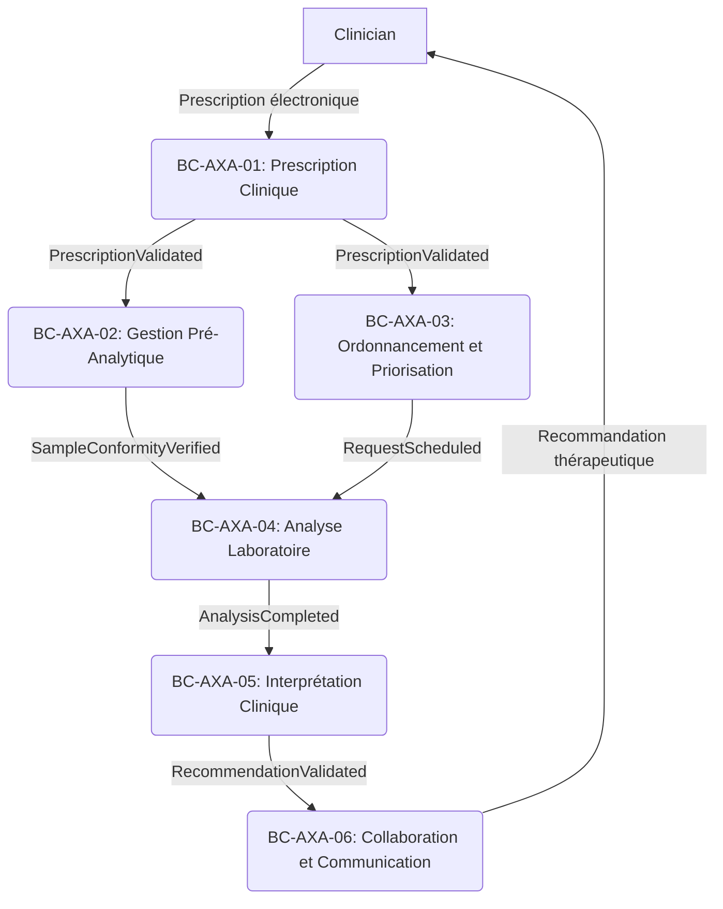
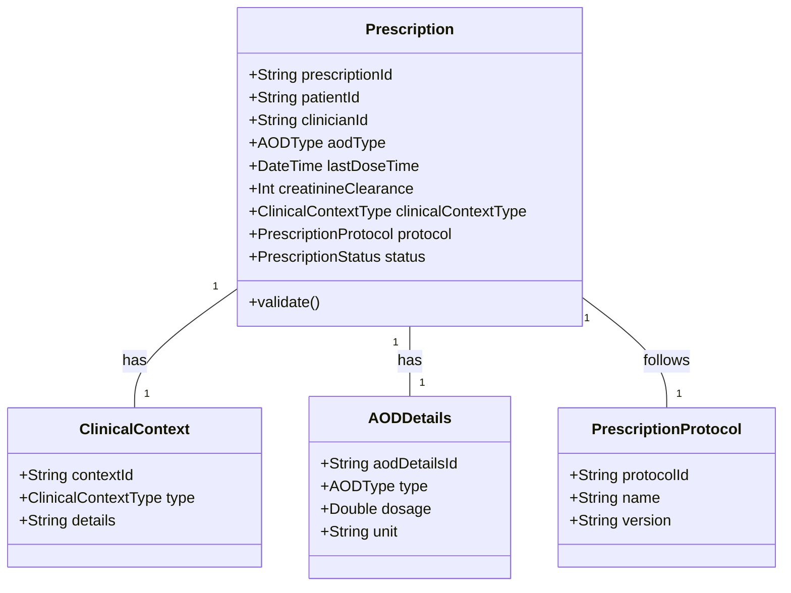
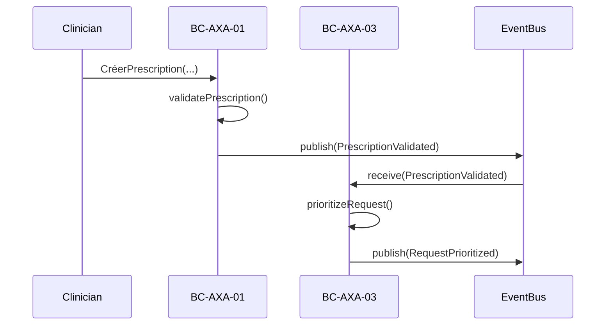

Voici la modélisation comportementale formelle pour les **Bounded Contexts du cœur stratégique** (BC-AXA-01, BC-AXA-03, BC-AXA-05), incluant les **agrégats**, **entités**, **objets valeur**, **services de domaine**, **événements de domaine**, et **invariants**. Cette modélisation respecte les principes DDD et intègre les règles métier critiques identifiées.

---

---

## **1. BC-AXA-01 : Prescription Clinique**
**Responsabilité** :
Gérer la prescription électronique des dosages anti-Xa et valider leur pertinence clinique selon les protocoles CAI et les recommandations HAS/ANSM.

---

### **1.1. Agrégat : Prescription**
**Racine d'agrégat** : `Prescription` (entité racine avec identité `prescriptionId`).

#### **1.1.1. Entités**
| **Entité** | **Identifiant** | **Attributs Principaux** | **Cycle de Vie (États)** | **Invariants** |
|------------|-----------------|--------------------------|---------------------------|----------------|
| `Prescription` | `prescriptionId` | `patientId`, `clinicianId`, `aodType`, `lastDoseTime`, `creatinineClearance`, `clinicalContextType`, `prescriptionProtocol`, `status` | `pending`, `validated`, `rejected`, `incomplete` | - **INV-PRE-01** : Exhaustivité des données (`patientId`, `aodType`, etc.). <br> - **INV-PRE-02** : Respect des protocoles CAI (`prescriptionProtocol` doit être conforme). <br> - **INV-PRE-03** : Validation biologique obligatoire avant transmission. |
| `ClinicalContext` | `contextId` (lié à `Prescription`) | `contextType`, `details` (ex: `ActiveHemorrhage`) | `active`, `inactive` | - **INV-PRE-04** : Contexte clinique valide (ex: `ActiveHemorrhage` nécessite une prescription `ABSOLUTE`). |
| `AODDetails` | `aodDetailsId` (lié à `Prescription`) | `aodType`, `dosage`, `unit` | `active`, `inactive` | - **INV-PRE-05** : Dosage et unité cohérents avec le type d'AOD (ex: apixaban en mg/12h). |
| `PrescriptionProtocol` | `protocolId` (lié à `Prescription`) | `protocolName`, `version`, `rules` | `active`, `inactive` | - **INV-PRE-02** : Protocole CAI applicable et à jour. |

---

#### **1.1.2. Objets Valeur**
| **Objet Valeur** | **Description** | **Règles d'Égalité/Comparaison** | **Contraintes de Validité** |
|------------------|-----------------|----------------------------------|-----------------------------|
| `PrescriptionStatus` | Statut de la prescription. | Deux prescriptions sont égales si leurs `prescriptionId` et `status` sont identiques. | - Valeurs : `pending`, `validated`, `rejected`, `incomplete`. |
| `AODType` | Type d'anticoagulant oral direct. | Comparaison basée sur le nom (ex: `Apixaban` = `Apixaban`). | - Valeurs : `Apixaban`, `Rivaroxaban`, `Edoxaban`. |
| `ClinicalContextType` | Contexte clinique du patient. | Comparaison basée sur le nom (ex: `ActiveHemorrhage` = `ActiveHemorrhage`). | - Valeurs : `ActiveHemorrhage`, `PreSurgery`, `PostSurgery`, `RoutineMonitoring`. |
| `DosageUnit` | Unité de dosage (ex: mg/12h). | Comparaison basée sur la chaîne de caractères. | - Format : `<dose> <unit>/<interval>` (ex: "2.5 mg/12h"). |

---

#### **1.1.3. Services de Domaine**
| **Service** | **Responsabilité** | **Entrées** | **Sorties** | **Règles Portées** | **Événements Émis** |
|-------------|--------------------|-------------|-------------|--------------------|---------------------|
| `PrescriptionValidationService` | Valider une prescription selon les protocoles CAI. | `prescriptionId`, `biologistId` | `ValidationResult` (`validated`/`rejected`) | - **RBC-01-02** : Respect des protocoles CAI. <br> - **RBC-01-03** : Validation biologique obligatoire. | `PrescriptionValidated`, `PrescriptionRejected` |
| `PrescriptionCompletionService` | Compléter les données manquantes d'une prescription. | `prescriptionId`, `missingData` | `Prescription` mise à jour | - **INV-PRE-01** : Exhaustivité des données. | `PrescriptionUpdated` |
| `PrescriptionRejectionService` | Rejeter une prescription non conforme. | `prescriptionId`, `rejectionReason`, `clinicianId` | `Prescription` marquée `rejected` | - **RBC-01-01** : Prescription électronique obligatoire. | `PrescriptionRejected` |

---

#### **1.1.4. Événements de Domaine**
| **Événement** | **Données Portées** | **Porteur** | **Consommateurs** | **Description** |
|---------------|---------------------|-------------|-------------------|-----------------|
| `PrescriptionCreated` | `prescriptionId`, `patientId`, `clinicianId`, `timestamp` | `Prescription` | BC-AXA-08 (Intégration des Données) | Une nouvelle prescription est créée. |
| `PrescriptionValidated` | `prescriptionId`, `validatedBy`, `urgencyLevel`, `timestamp` | `PrescriptionValidationService` | BC-AXA-02 (Gestion Pré-Analytique), BC-AXA-03 (Ordonnancement) | Une prescription est validée et prête pour la priorisation. |
| `PrescriptionRejected` | `prescriptionId`, `rejectionReason`, `rejectedBy`, `timestamp` | `PrescriptionRejectionService` | BC-AXA-06 (Collaboration), Cliniciens | Une prescription est rejetée avec motif. |
| `PrescriptionUpdated` | `prescriptionId`, `updatedFields`, `updatedBy`, `timestamp` | `PrescriptionCompletionService` | BC-AXA-08 (Intégration des Données) | Une prescription est mise à jour (ex: données manquantes complétées). |

---

#### **1.1.5. Invariants Clés**
| **ID** | **Nom** | **Description** | **Violation Handling** |
|--------|---------|-----------------|------------------------|
| **INV-PRE-01** | Exhaustivité des données | Une prescription doit contenir : `patientId`, `aodType`, `lastDoseTime`, `creatinineClearance`, `clinicalContextType`. | Marquer la prescription comme `incomplete` et bloquer la validation. |
| **INV-PRE-02** | Respect des protocoles CAI | La prescription doit respecter les protocoles CAI (ex: hémorragie active = urgence absolue). | Rejeter la prescription avec motif (`rejectionReason = "Non-conformité protocole CAI"`). |
| **INV-PRE-03** | Validation biologique obligatoire | Une prescription ne peut être transmise que si son `status` est `validated`. | Bloquer la transmission et notifier le biologiste (`PrescriptionRejected`). |
| **INV-PRE-04** | Contexte clinique valide | Le `clinicalContextType` doit être cohérent avec l'AOD (ex: `ActiveHemorrhage` avec apixaban). | Rejeter la prescription avec motif (`rejectionReason = "Contexte clinique invalide"`). |
| **INV-PRE-05** | Dosage et unité cohérents | Le dosage et l'unité doivent correspondre au type d'AOD (ex: apixaban en mg/12h). | Rejeter la prescription avec motif (`rejectionReason = "Dosage invalide"`). |

---

---

## **2. BC-AXA-03 : Ordonnancement et Priorisation**
**Responsabilité** :
Classer les demandes par niveau d'urgence et ordonnancer les analyses en fonction des ressources disponibles.

---

### **2.1. Agrégat : Request**
**Racine d'agrégat** : `Request` (entité racine avec identité `requestId`).

#### **2.1.1. Entités**
| **Entité** | **Identifiant** | **Attributs Principaux** | **Cycle de Vie (États)** | **Invariants** |
|------------|-----------------|--------------------------|---------------------------|----------------|
| `Request` | `requestId` | `prescriptionId`, `urgencyLevel`, `maxDeadline`, `status`, `resourceAllocation` | `pending`, `prioritized`, `scheduled`, `completed` | - **INV-REQ-01** : Classement par urgence avant ordonnancement. <br> - **INV-REQ-02** : Délai critique respecté (`maxDeadline`). <br> - **INV-REQ-03** : Allocation des ressources en fonction de la priorité. |
| `UrgencyLevel` | `urgencyId` (lié à `Request`) | `level`, `priorityScore`, `description` | `ABSOLUTE`, `HIGH`, `MODERATE`, `ROUTINE` | - **RBC-03-01** : Niveau d'urgence calculé selon la grille CAI. |
| `ResourceAllocation` | `allocationId` (lié à `Request`) | `technicianId`, `analyzerId`, `startTime`, `endTime` | `allocated`, `released` | - **INV-REQ-03** : Ressources disponibles et compatibles avec la demande. |

---

#### **2.1.2. Objets Valeur**
| **Objet Valeur** | **Description** | **Règles d'Égalité/Comparaison** | **Contraintes de Validité** |
|------------------|-----------------|----------------------------------|-----------------------------|
| `UrgencyLevel` | Niveau d'urgence de la demande. | Comparaison basée sur le `priorityScore` (ex: `ABSOLUTE` > `HIGH`). | - Valeurs : `ABSOLUTE`, `HIGH`, `MODERATE`, `ROUTINE`. <br> - **RBC-03-01** : Grille CAI appliquée. |
| `MaxDeadline` | Délai critique pour traiter la demande. | Comparaison basée sur la durée (ex: `1h` pour `ABSOLUTE`). | - Format : `<duration> <unit>` (ex: "1h", "4h"). |
| `PriorityScore` | Score calculé pour prioriser les demandes. | Comparaison numérique (ex: `100` pour `ABSOLUTE`, `75` pour `HIGH`). | - Calculé selon la grille CAI. |

---
#### **2.1.3. Services de Domaine**
| **Service** | **Responsabilité** | **Entrées** | **Sorties** | **Règles Portées** | **Événements Émis** |
|-------------|--------------------|-------------|-------------|--------------------|---------------------|
| `PrioritizationService` | Classer une demande par niveau d'urgence. | `requestId`, `clinicalContextType`, `aodType` | `UrgencyLevel`, `priorityScore` | - **RBC-03-01** : Application de la grille CAI. | `RequestPrioritized` |
| `SchedulingService` | Ordonnancer une demande en fonction des ressources. | `requestId`, `resourceAllocation` | `Request` marquée `scheduled` | - **INV-REQ-02** : Délai critique respecté. <br> - **INV-REQ-03** : Ressources disponibles. | `RequestScheduled` |
| `UrgencyAlertService` | Déclencher une alerte si le délai critique est dépassé. | `requestId`, `currentTime` | `Alert` générée | - **RBC-03-02** : Alerte si `currentTime > maxDeadline`. | `UrgencyAlertTriggered` |

---
#### **2.1.4. Événements de Domaine**
| **Événement** | **Données Portées** | **Porteur** | **Consommateurs** | **Description** |
|---------------|---------------------|-------------|-------------------|-----------------|
| `RequestReceived` | `requestId`, `prescriptionId`, `timestamp` | `Request` | BC-AXA-08 (Intégration des Données) | Une nouvelle demande est reçue. |
| `RequestPrioritized` | `requestId`, `urgencyLevel`, `priorityScore`, `timestamp` | `PrioritizationService` | BC-AXA-04 (Analyse Laboratoire) | Une demande est classée par urgence. |
| `RequestScheduled` | `requestId`, `resourceAllocation`, `startTime`, `endTime`, `timestamp` | `SchedulingService` | BC-AXA-04 (Analyse Laboratoire) | Une demande est ordonnancée. |
| `UrgencyAlertTriggered` | `requestId`, `exceededDeadline`, `alertType`, `timestamp` | `UrgencyAlertService` | BC-AXA-06 (Collaboration), BC-AXA-07 (Gestion des Exceptions) | Une alerte est déclenchée pour un délai critique dépassé. |

---
#### **2.1.5. Invariants Clés**
| **ID** | **Nom** | **Description** | **Violation Handling** |
|--------|---------|-----------------|------------------------|
| **INV-REQ-01** | Classement par urgence avant ordonnancement | Une demande doit être classée (`prioritized`) avant d'être ordonnancée. | Bloquer l'ordonnancement et notifier le biologiste (`RequestPrioritized` requis). |
| **INV-REQ-02** | Délai critique respecté | La demande doit être traitée avant `maxDeadline`. | Déclencher une alerte (`UrgencyAlertTriggered`) si le délai est dépassé. |
| **INV-REQ-03** | Allocation des ressources | Les ressources (technicien, analyseur) doivent être disponibles et compatibles. | Rejeter l'ordonnancement avec motif (`allocationFailed`). |

---
---

## **3. BC-AXA-05 : Interprétation Clinique**
**Responsabilité** :
Interpréter les résultats des dosages anti-Xa en contexte clinique et émettre des recommandations thérapeutiques validées par un pharmacien.

---

### **3.1. Agrégat : Interpretation**
**Racine d'agrégat** : `Interpretation` (entité racine avec identité `interpretationId`).

#### **3.1.1. Entités**
| **Entité** | **Identifiant** | **Attributs Principaux** | **Cycle de Vie (États)** | **Invariants** |
|------------|-----------------|--------------------------|---------------------------|----------------|
| `Interpretation` | `interpretationId` | `analysisId`, `clinicalContextType`, `antiXaValue`, `interpretationGrid`, `recommendation`, `status` | `pending`, `interpreted`, `validated` | - **INV-INT-01** : Application des grilles d'interprétation. <br> - **INV-INT-02** : Recommandation pharmaceutique obligatoire. |
| `InterpretationGrid` | `gridId` (lié à `Interpretation`) | `aodType`, `clinicalContextType`, `thresholds`, `recommendations` | `active`, `inactive` | - **RBC-05-01** : Grille CAI applicable et à jour. |
| `ClinicalContext` | `contextId` (lié à `Interpretation`) | `contextType`, `details` | `active`, `inactive` | - **INV-INT-03** : Contexte clinique valide (ex: fonction rénale à jour). |

---
#### **3.1.2. Objets Valeur**
| **Objet Valeur** | **Description** | **Règles d'Égalité/Comparaison** | **Contraintes de Validité** |
|------------------|-----------------|----------------------------------|-----------------------------|
| `AlertThreshold` | Seuil d'alerte pour un AOD et un contexte clinique. | Comparaison basée sur `aodType` et `clinicalContextType`. | - Format : `{ "aodType": "Apixaban", "contextType": "ActiveHemorrhage", "threshold": 1.5 }`. |
| `TherapeuticRecommendation` | Recommandation thérapeutique structurée. | Comparaison basée sur le texte. | - Format : `<action> <dosage> <interval> <duration>` (ex: "Réduire la dose à 2.5 mg/12h pendant 7 jours"). |
| `InterpretationStatus` | Statut de l'interprétation. | Comparaison basée sur l'état. | - Valeurs : `pending`, `interpreted`, `validated`. |

---
#### **3.1.3. Services de Domaine**
| **Service** | **Responsabilité** | **Entrées** | **Sorties** | **Règles Portées** | **Événements Émis** |
|-------------|--------------------|-------------|-------------|--------------------|---------------------|
| `InterpretationService` | Interpréter un résultat en contexte clinique. | `analysisId`, `clinicalContextType`, `antiXaValue` | `Interpretation` avec `recommendation` | - **RBC-05-01** : Application des grilles d'interprétation. | `InterpretationCompleted` |
| `PharmaceuticalValidationService` | Valider une recommandation thérapeutique. | `interpretationId`, `pharmacistId` | `Interpretation` marquée `validated` | - **RBC-05-02** : Validation pharmaceutique obligatoire. | `RecommendationValidated` |

---
#### **3.1.4. Événements de Domaine**
| **Événement** | **Données Portées** | **Porteur** | **Consommateurs** | **Description** |
|---------------|---------------------|-------------|-------------------|-----------------|
| `AnalysisCompleted` | `analysisId`, `antiXaValue`, `status`, `timestamp` | BC-AXA-04 (Analyse Laboratoire) | `InterpretationService` | Un résultat brut est disponible pour interprétation. |
| `InterpretationCompleted` | `interpretationId`, `recommendation`, `status`, `timestamp` | `InterpretationService` | BC-AXA-06 (Collaboration), BC-AXA-08 (Intégration des Données) | Une interprétation est terminée et prête pour validation pharmaceutique. |
| `RecommendationValidated` | `interpretationId`, `validatedBy`, `timestamp` | `PharmaceuticalValidationService` | BC-AXA-06 (Collaboration), Cliniciens | Une recommandation thérapeutique est validée et prête pour transmission. |

---
#### **3.1.5. Invariants Clés**
| **ID** | **Nom** | **Description** | **Violation Handling** |
|--------|---------|-----------------|------------------------|
| **INV-INT-01** | Application des grilles d'interprétation | L'interprétation doit utiliser la grille CAI applicable à l'AOD et au contexte clinique. | Rejeter l'interprétation avec motif (`gridNotFound`). |
| **INV-INT-02** | Recommandation pharmaceutique obligatoire | Une recommandation ne peut être transmise que si son `status` est `validated`. | Bloquer la transmission et notifier le pharmacien (`RecommendationValidated` requis). |
| **INV-INT-03** | Contexte clinique valide | Le `clinicalContextType` doit inclure des données à jour (ex: fonction rénale < 24h). | Rejeter l'interprétation avec motif (`contextDataExpired`). |

---
---

## **4. Synthèse des Échanges entre BCs**
### **4.1. Contrats d'Échange (Exemples)**
| **Source** | **Cible** | **Données Échangées** | **Format** | **Sécurité** |
|------------|-----------|-----------------------|------------|--------------|
| **BC-AXA-01** | **BC-AXA-02** | `PrescriptionValidated` (`prescriptionId`, `urgencyLevel`) | JSON | AES-256, CPS |
| **BC-AXA-01** | **BC-AXA-03** | `PrescriptionValidated` (`prescriptionId`, `clinicalContextType`, `aodType`) | JSON | AES-256, CPS |
| **BC-AXA-02** | **BC-AXA-04** | `SampleConformityVerified` (`sampleId`, `status`) | HL7 FHIR | AES-256, CPS |
| **BC-AXA-03** | **BC-AXA-04** | `RequestScheduled` (`requestId`, `resourceAllocation`) | JSON | AES-256, CPS |
| **BC-AXA-04** | **BC-AXA-05** | `AnalysisCompleted` (`analysisId`, `antiXaValue`) | HL7 FHIR | AES-256, CPS |
| **BC-AXA-05** | **BC-AXA-06** | `RecommendationValidated` (`interpretationId`, `recommendation`) | JSON | AES-256, CPS |

---
### **4.2. Flux de Travail (Workflow)**


---
### **4.3. Gestion des Exceptions**
- **Non-conformité d'un échantillon** (`BC-AXA-02`) :
  - Événement : `SampleNonConformityDetected` → Transmission à `BC-AXA-07` (Gestion des Exceptions).
  - Action : Activation de l'astreinte (`OnCallActivated`) ou rejet avec motif.
- **Délai critique dépassé** (`BC-AXA-03`) :
  - Événement : `UrgencyAlertTriggered` → Notification aux cliniciens et biologistes (`BC-AXA-06`).
- **Recommandation non validée** (`BC-AXA-05`) :
  - Événement : `RecommendationValidationFailed` → Escalade vers le pharmacien en chef.

---
---

## **5. Points de Vigilance et Clarifications Nécessaires**
| **Ambiguïté/Question** | **Impact Potentiel** | **Solution Proposée** | **À Valider avec** |
|------------------------|----------------------|-----------------------|--------------------|
| **Autorité en cas de désaccord** (ex: prescription rejetée) | Retard dans la prise en charge ou non-respect des protocoles. | Définir une **matrice RACI** et centraliser les décisions critiques dans BC-AXA-01. | CAI, Biologistes |
| **Flexibilité des protocoles CAI** (ex: exceptions pour pédiatrie) | Non-conformité réglementaire ou erreur thérapeutique. | Documenter les **exceptions autorisées** et les intégrer dans les grilles d'interprétation. | CAI, Pharmaciens |
| **Seuils d'alerte par AOD** (ex: apixaban vs. rivaroxaban) | Erreur d'interprétation → thérapie inappropriée. | Créer un **tableau de bord des seuils** partagé entre BC-AXA-01 et BC-AXA-05. | CAI, Biologistes |
| **Gestion des urgences hors protocole** (ex: astreinte) | Retard dans la prise en charge. | Intégrer un **mode "astreinte"** dans BC-AXA-07 avec des règles simplifiées. | Cliniciens, Biologistes |
| **Compatibilité DPI-Analyseurs-SIL** | Erreurs de saisie ou perte de données. | Valider les **formats d'échange** (HL7 FHIR) et tester l'intégration. | DSI, Fournisseurs d'analyseurs |

---
---

## **6. Prochaines Étapes (Validation et Implémentation)**
1. **Validation avec les Experts Métier** :
   - Organiser un **atelier de 2h** avec :
     - Cliniciens : Autorité en cas de désaccord, flexibilité des protocoles.
     - Biologistes : Validation des prescriptions, gestion des non-conformités.
     - Techniciens : Critères de conformité pré-analytique.
     - CAI : Seuils d'alerte, grilles d'interprétation.
     - DSI : Compatibilité technique, formats d'échange.
   - **Livrable** : Compte-rendu avec décisions validées et matrice RACI mise à jour.

2. **Finalisation des Contrats d'Échange** :
   - Documenter les **contrats explicites** (JSON/HL7 FHIR) pour chaque interaction inter-BCs.
   - Valider les **champs obligatoires** et les **règles de cohérence**.

3. **Préparation de l'Architecture Technique** :
   - Concevoir les **microservices** par BC (ex: `prescription-service`, `sample-service`).
   - Définir les **APIs** (REST/Event-Driven) pour les échanges inter-BCs.
   - Planifier l'**intégration** avec le DPI (HL7 FHIR) et les analyseurs.

4. **Tests et Déploiement** :
   - **Tests unitaires** : Valider les règles métier (ex: `PrescriptionValidationService`).
   - **Tests d'intégration** : Vérifier les contrats entre BCs (ex: `PrescriptionValidated` → `SampleConformityVerified`).
   - **Tests de charge** : Simuler des pics d'activité (ex: épidémie).
   - **Déploiement progressif** : Commencer par un service pilote (ex: BC-AXA-01).

---
---
## **7. Annexes**
### **7.1. Exemple de Code (Pseudo-Code)**
#### **Service de Validation de Prescription (BC-AXA-01)**
```java
class PrescriptionValidationService {
    public ValidationResult validatePrescription(Prescription prescription, Biologist biologist) {
        // INV-PRE-01: Exhaustivité des données
        if (!prescription.isComplete()) {
            return ValidationResult.incomplete("Données manquantes");
        }

        // INV-PRE-02: Respect des protocoles CAI
        if (!prescription.compliesWithCAIProtocols()) {
            return ValidationResult.rejected("Non-conformité protocole CAI");
        }

        // INV-PRE-03: Validation biologique obligatoire
        if (!biologist.isAuthorized()) {
            return ValidationResult.rejected("Biologiste non autorisé");
        }

        // Validation réussie
        prescription.markAsValidated(biologist.getId());
        eventBus.publish(new PrescriptionValidated(prescription.getId(), biologist.getId()));
        return ValidationResult.validated();
    }
}
```

#### **Service de Priorisation (BC-AXA-03)**
```java
class PrioritizationService {
    public UrgencyLevel prioritizeRequest(Request request) {
        // RBC-03-01: Application de la grille CAI
        UrgencyLevel level = CAIGrid.getUrgencyLevel(
            request.getClinicalContextType(),
            request.getAODType()
        );

        request.setUrgencyLevel(level);
        request.setPriorityScore(level.getPriorityScore());
        eventBus.publish(new RequestPrioritized(request.getId(), level));
        return level;
    }
}
```

---
### **7.2. Diagrammes UML (Mermaid)**
#### **Agrégat Prescription (BC-AXA-01)**


#### **Flux Événementiel (BC-AXA-01 → BC-AXA-03)**


---
---
**Document finalisé le [Date] par [Votre Nom], Architecte DDD.**
**Prochaine étape** : Validation avec les experts métier et préparation de l'architecture technique.